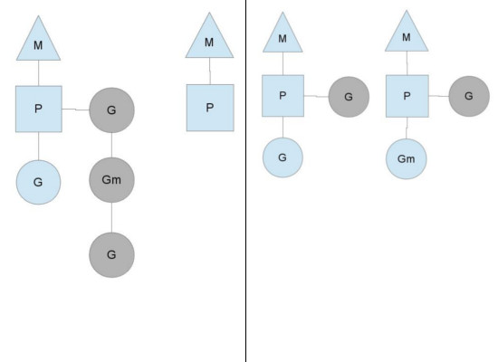

## GO专家编程

#### 数据类型

##### slice

- 底层实现是数组
- 增长规则  2倍—(1024)—>1.25倍
- append会触发扩容，copy深层拷贝两个切片不会扩容

##### map

- 底层实现是哈希表，一个哈希表中有多个哈希表节点

```go
type hmap struct {
    count     int // 当前保存的元素个数
    ...
    B         uint8  // 指示bucket数组的大小
    ...
    buckets    unsafe.Pointer // bucket数组指针，数组的大小为2^B
    ...
}
```

```go
type bmap struct {
    tophash [8]uint8 //存储哈希值的高8位，遇到哈希值低位相同的key将其高位存储在该数组中一遍后续匹配
    data    byte[1]  //key value数据:key/key/key/.../value/value/value...
    overflow *bmap   //溢出bucket的地址
}
```

- 哈希冲突，链地址法 overflow保存冲突的kv存储的bucket
- 负载因子 = 键数量 / bucket数量，go中负载因子为6.5 (redis中为1)
  - 哈希因子过小，说明空间利用率低
  - 哈希因子过大，说明冲突严重，存取效率低
- 渐进扩容：
  - 扩容条件：1.负载因子＞6.5  2.溢出bucket数量＞2^15
  - 增量扩容：当负载因子过大则新建一个bucket其长度为原来的两倍，然后逐步每次搬迁2个键值对
- 等量扩容，平摊键值对
- 查找过程
  - 跟据key值算出哈希值
  - 取哈希值低位与hmpa.B取模确定bucket位置
  - 取哈希值高位在tophash数组中查询
  - 如果tophash[i]中存储值也哈希值相等，则去找到该bucket中的key值进行比较
  - 当前bucket没有找到，则继续从下个overflow的bucket中查找。
  - 如果当前处于搬迁过程，则优先从oldbuckets查找
- 插入过程
  - 跟据key值算出哈希值
  - 取哈希值低位与hmap.B取模确定bucket位置
  - 查找该key是否已经存在，如果存在则直接更新值
  - 如果没找到将key，将key插入

##### string

- []byte转换成string不需要拷贝内存的场景，直接返回string.str指针指向[]byte内存
  - 使用m[string(b)]来查找map（map是string为key，临时把切片b转成string）；
  - 字符串拼接，如”<” + “string(b)” + “>”；
  - 字符串比较：string(b) == “foo”

##### channel

- 有缓存的channel采用环形队列作为缓冲区

- hchan结构中的recvq和sendq保存读写goroutine队列

  - 读取缓冲为空或者无缓冲会阻塞，此时读的goroutine会被写goroutine唤醒；
  - 写入缓冲满或者无缓冲会阻塞，此时写goroutine会被读gorouting唤醒；

- hchan结构中的elemtype和elemsize保存类型和类型大小

- 写数据流程

  如果recvq等待接收队列不空说明缓冲没有数据或没有缓冲区，则直接取来一个等待队列中的G唤醒写入数据；如果缓冲区有空余，将数据写入缓冲区；如果缓冲区满则将数据写入G并把G加入到sendq队列

- 读数据流程

  如果sendq不为空，且没有缓冲则从sendq取出一个G写入唤醒，如果sendq不空且有缓冲区则取出buf首元素再从sendq拿一个G写入唤醒；sendq为空将当前G加入recv队列等待唤醒

- 关闭channel会唤醒全部recvq的G，引发panic的场景有：

  - 关闭值为nil的channel  (读取为nil的信道会永远阻塞)
  - 关闭已经关闭的channel
  - 向关闭的channel中写数据

#### 流程控制

##### defer规则

- 延迟函数的参数在defer语句出现时就已经确定下来了
- 延迟函数执行按后进先出顺序执行，即先出现的defer最后执行
- 延迟函数可能操作主函数的具名返回值

- 函数返回过程：1.返回值存入栈(具名返回值会进行赋值)  2.defer函数  3.执行跳转
  - 注意当返回值为匿名返回值，返回字面值时defer不会影响返回值

##### select实现原理

```go
case数据结构
type scase struct {
    c           *hchan         // chan
    kind        uint16				// 表示case类型有caseRecv、caseSend和caseDefault三种类型
    elem        unsafe.Pointer // data element
}
```

```go
func selectgo(cas0 *scase, order0 *uint16, ncases int) (int, bool){
  	//1. 锁定scase语句中所有的channel
    //2. 按照随机顺序检测scase中的channel是否ready
    //   2.1 如果case可读，则读取channel中数据，解锁所有的channel，然后返回(case index, true)
    //   2.2 如果case可写，则将数据写入channel，解锁所有的channel，然后返回(case index, false)
    //   2.3 所有case都未ready，则解锁所有的channel，然后返回（default index, false）
    //3. 所有case都未ready，且没有default语句
    //   3.1 将当前协程加入到所有channel的等待队列
    //   3.2 当将协程转入阻塞，等待被唤醒
    //4. 唤醒后返回channel对应的case index
    //   4.1 如果是读操作，解锁所有的channel，然后返回(case index, true)
    //   4.2 如果是写操作，解锁所有的channel，然后返回(case index, false)
}
case elem, ok := <-chan1: // 通过ok来判断当前channel是否被关闭 关闭的channel可以返回此时ok==false
```

参数列表：

- cas0为scase数组的首地址，selectgo()就是从这些scase中找出一个返回。
- order0为一个两倍cas0数组长度的buffer，保存scase随机序列pollorder和scase中channel地址序列lockorder
- pollorder：每次selectgo执行都会把scase序列打乱，以达到随机检测case的目的。
- lockorder：所有case语句中channel序列，以达到去重防止对channel加锁时重复加锁的目的。
- ncases表示scase数组的长度

##### range

- 遍历**slice**前会先获以slice的长度len_temp作为循环次数，循环体中，每次循环会先获取元素值，如果for-range中接收index和value的话，则会对index和value进行一次赋值。由于循环开始前循环次数就已经确定了，所以循环过程中新添加的元素是没办法遍历到的。
- 遍历**map**时没有指定循环次数，循环体与遍历slice类似。由于map底层实现与slice不同，map底层使用hash表实现，插入数据位置是随机的，所以遍历过程中新插入的数据不能保证遍历到
- channel遍历是依次从channel中读取数据,读取前是不知道里面有多少个元素的。如果channel中没有元素，则会阻塞等待，如果channel已被关闭，则会解除阻塞并退出循环。

##### mutex

```go
type Mutex struct {
    state int32
    sema  uint32
}
```

- Mutex.state表示互斥锁的状态，比如是否被锁定等。
- Mutex.sema表示信号量，协程阻塞等待该信号量，解锁的协程释放信号量从而唤醒等待信号量的协程。


- Locked: 表示该Mutex是否已被锁定，0：没有锁定 1：已被锁定。
- Woken: 表示是否有协程已被唤醒，0：没有协程唤醒 1：已有协程唤醒，正在加锁过程中。
- Starving：表示该Mutex是否处理饥饿状态， 0：没有饥饿 1：饥饿状态，说明有协程阻塞了超过1ms。
- Waiter: 表示阻塞等待锁的协程个数，协程解锁时根据此值来判断是否需要释放信号量。
- 自旋：加锁时，如果当前Locked位为1，说明该锁当前由其他协程持有，尝试加锁的协程并不是马上转入阻塞，而是会持续的探测Locked位是否变为0，这个过程即为自旋过程
- 自旋必须满足以下所有条件：
  - 自旋次数要足够小，通常为4，即自旋最多4次
  - CPU核数要大于1，否则自旋没有意义，因为此时不可能有其他协程释放锁
  - 协程调度机制中的Process数量要大于1，比如使用GOMAXPROCS()将处理器设置为1就不能启用自旋
  - 协程调度机制中的可运行队列必须为空，否则会延迟协程调度
- Mutex的两种模式 starving
  - normal	默认情况下，Mutex的模式为normal。该模式下，协程如果加锁不成功不会立即转入阻塞排队，而是判断是否满足自旋的条件，如果满足则会启动自旋过程，尝试抢锁。
  - starvation   被唤醒的协程得到CPU后开始运行，此时发现锁已被抢占了，自己只好再次阻塞，不过阻塞前会判断自上次阻塞到这次阻塞经过了多长时间，如果超过1ms的话，会将Mutex标记为”饥饿”模式，然后再阻塞。处于饥饿模式下，也即一旦有协程释放了锁，那么一定会唤醒协程，被唤醒的协程将会成功获取锁，同时也会把等待计数减1。
- woken
  - Woken状态用于加锁和解锁过程的通信，举个例子，同一时刻，两个协程一个在加锁，一个在解锁，在加锁的协程可能在自旋过程中，此时把Woken标记为1，用于通知解锁协程不必释放信号量了
- 重复解锁引发panic
  - Unlock过程分为将Locked置为0，然后判断Waiter值，如果值>0，则释放信号量。多次unlock会释放多个信号量进而唤醒多个协程去抢锁，应该使用defer来避免死锁

##### RWMutex

```go
type RWMutex struct {
    w           Mutex  //用于控制多个写锁，获得写锁首先要获取该锁，如果有一个写锁在进行，那么再到来的写锁将会阻塞于此
    writerSem   uint32 //写阻塞等待的信号量，最后一个读者释放锁时会释放信号量
    readerSem   uint32 //读阻塞的协程等待的信号量，持有写锁的协程释放锁后会释放信号量
    readerCount int32  //记录读者个数
    readerWait  int32  //记录写阻塞时读者个数
}
```

- 写锁如何阻止读操作
  - 我们知道RWMutex.readerCount是个整型值，用于表示读者数量，不考虑写操作的情况下，每次读锁定将该值+1，每次解除读锁定将该值-1，所以readerCount取值为[0, N]，N为读者个数，最大可支持2^30个并发读者。当写锁定进行时，会先将readerCount减去2^30，从而readerCount变成了负值，此时再有读锁定到来时检测到readerCount为负值，便知道有写操作在进行，只好阻塞等待。而真实的读操作个数并不会丢失，只需要将readerCount加上2^30即可获得。写操作将readerCount变成负值来阻止读操作的。
- 写操作不会被饿死的保证
  - 写操作到来时，会把RWMutex.readerCount值拷贝到RWMutex.readerWait中，用于标记排在写操作前面的读者个数。前面的读操作结束后，除了会递减RWMutex.readerCount，还会递减RWMutex.readerWait值，当RWMutex.readerWait值变为0时唤醒写操作。

#### 内存管理


- arena的大小为512G，为了方便管理把arena区域划分成一个个的page，每个page为8KB,一共有512GB/8KB个页；

- spans区域存放span的指针，每个指针对应一个page，所以span区域的大小为(512GB/8KB)*指针大小8byte = 512M

- bitmap区域，不过主要用于GC。

- span数据结构

  ```go
  type mspan struct {
      next *mspan            //链表前向指针，用于将span链接起来
      prev *mspan            //链表前向指针，用于将span链接起来
      startAddr uintptr // 起始地址，也即所管理页的地址
      npages    uintptr // 管理的页数
      nelems uintptr // 块个数，也即有多少个块可供分配
      allocBits  *gcBits //分配位图，每一位代表一个块是否已分配
      allocCount  uint16     // 已分配块的个数
      spanclass   spanClass  // class表中的class ID
      elemsize    uintptr    // class表中的对象大小，也即块大小
  }
  ```

##### Cache 

线程私有资源，为每个线程分配的span缓存

```go
type mcache struct {
    alloc [67*2]*mspan // 按class分组的mspan列表
}
```

每种class类型都有两组span列表，第一组列表中所表示的对象中包含了指针，第二组列表中所表示的对象不含有指针，这么做是为了提高GC扫描性能，对于不包含指针的span列表，没必要去扫描。

##### central 

全局资源，为多个线程服务，当某个线程内存不足时会向central申请，当某个线程释放内存时又会回收进central。

```go
type mcentral struct {
    lock      mutex     //互斥锁
    spanclass spanClass // span class ID
    nonempty  mSpanList // non-empty 指还有空闲块的span列表
    empty     mSpanList // 指没有空闲块的span列表
    nmalloc uint64      // 已累计分配的对象个数
}
```

- lock: 线程间互斥锁，防止多线程读写冲突
- spanclass : 每个mcentral管理着一组有相同class的span列表
- nonempty: 指还有内存可用的span列表
- empty: 指没有内存可用的span列表
- nmalloc: 指累计分配的对象个数
- 获取过程
  - 加锁
  - 从nonempty列表获取一个可用span，并将其从链表中删除
  - 将取出的span放入empty链表
  - 将span返回给线程
  - 解锁
  - 线程将该span缓存进cache
- 释放过程
  - 加锁
  - 将span从empty列表删除
  - 将span加入noneempty列表
  - 解锁

##### mheap

每个mcentral对象只管理特定的class规格的span。所有的class对应的mcentral构成的集合存放于mheap数据结构中。

```go
type mheap struct {
    lock      mutex
    spans []*mspan
    bitmap        uintptr     //指向bitmap首地址，bitmap是从高地址向低地址增长的
    arena_start uintptr        //指示arena区首地址
    arena_used  uintptr        //指示arena区已使用地址位置
    central [67*2]struct {
        mcentral mcentral
        pad      [sys.CacheLineSize - unsafe.Sizeof(mcentral{})%sys.CacheLineSize]byte
    }
}
```

- lock： 互斥锁
- spans: 指向spans区域，用于映射span和page的关系
- bitmap：bitmap的起始地址
- arena_start: arena区域首地址
- arena_used: 当前arena已使用区域的最大地址
- central: 每种class对应的两个mcentral

##### 内存分配过程

1. 获取当前线程的私有缓存mcache
2. 跟据size计算出适合的class的ID
3. 从mcache的alloc[class]链表中查询可用的span
4. 如果mcache没有可用的span则从mcentral申请一个新的span加入mcache中
5. 如果mcentral中也没有可用的span则从mheap中申请一个新的span加入mcentral
6. 从该span中获取到空闲对象地址并返回

#### GC

常见垃圾回收算法：引用计数、标记清楚和分代回收

- 引用计数

  - 优点：对象可以很快的被回收，不会出现内存耗尽或达到某个阀值时才回收。
  - 缺点：不能很好的处理循环引用，而且实时维护引用计数，有也一定的代价。
  - 代表语言：Python、PHP、Swift

- 标记清除     从根变量开始遍历所有引用的对象，引用的对象标记为”被引用”，没有被标记的进行回收。

  - 优点：解决了引用计数的缺点。
  - 缺点：需要STW，即要暂时停掉程序运行。
  - 代表语言：Golang(其采用三色标记法)

- 分代回收     按照对象生命周期长短划分不同的代空间，生命周期长的放入老年代，而短的放入新生代，不同代有不同的回收算法和回收频率。

  - 优点：回收性能好
  - 缺点：算法复杂
  - 代表语言： JAVA

- go三色标记法

  - 灰色：对象还在标记队列中等待
  - 黑色：对象已被标记，gcmarkBits对应的位为1（该对象不会在本次GC中被清理）
  - 白色：对象未被标记，gcmarkBits对应的位为0（该对象将会在本次GC中被清理）

- 垃圾回收的优化

  - 写屏障：在gc过程中新分配的内存立即标记，指针引用立即标记，本轮gc不回收
  - 辅助gc：在gc过程中如果goroutine需要申请内存则他还要帮助gc

- 垃圾回收时机

  - ```
    阀值 = 上次GC内存分配量 * 内存增长率
    ```

    内存增长率由环境变量`GOGC`控制，默认为100，即每当内存扩大一倍时启动GC。

  - 定期触发：默认情况下，最长2分钟触发一次GC，这个间隔在`src/runtime/proc.go:forcegcperiod`变量中被声明：

  - 手动触发：runtime.GC()

- GC优化思路

  - 减少对象分配个数，比如对象复用或使用大对象组合多个小对象等等

#### 逃逸分析

如果函数外部没有引用，则优先放到栈中；如果函数外部存在引用，则必定放到堆中；

- 栈上分配内存比在堆中分配内存有更高的效率
- 栈上分配的内存不需要GC处理
- 堆上分配的内存使用完毕会交给GC处理
- 逃逸分析目的是决定内分配地址是栈还是堆
- 逃逸分析在编译阶段完成

**逃逸场景**：指针逃逸、栈空间不足逃逸、动态类型逃逸、闭包引用对象逃逸、

如果拷贝的数据量小，由于指针传递会产生逃逸，可能会使用堆，也可能会增加GC的负担

#### 并发控制

##### WaitGroup包

```go
type WaitGroup struct {
    state1 [3]uint32
}
```


- counter： 当前还未执行结束的goroutine计数器

- waiter count: 等待goroutine-group结束的goroutine数量，即有多少个等候者

- semaphore: 信号量

- Add()：Add()做了两件事，一是把delta值累加到counter中，因为delta可以为负值，也就是说counter有可能变成0或负值，所以第二件事就是当counter值变为0时，跟据waiter数值释放等量的信号量，把等待的goroutine全部唤醒，如果counter变为负值，则panic.

  ```go
  func (wg *WaitGroup) Add(delta int) {
      statep, semap := wg.state() //获取state和semaphore地址指针
      state := atomic.AddUint64(statep, uint64(delta)<<32) //把delta左移32位累加到state，即累加到counter中
      v := int32(state >> 32) //获取counter值
      w := uint32(state)      //获取waiter值
      if v < 0 {              //经过累加后counter值变为负值，panic
          panic("sync: negative WaitGroup counter")
      }
      //经过累加后，此时，counter >= 0
      //如果counter为正，说明不需要释放信号量，直接退出
      //如果waiter为零，说明没有等待者，也不需要释放信号量，直接退出
      if v > 0 || w == 0 {
          return
      }
      //此时，counter一定等于0，而waiter一定大于0（内部维护waiter，不会出现小于0的情况），
      //先把counter置为0，再释放waiter个数的信号量
      *statep = 0
      for ; w != 0; w-- {
          runtime_Semrelease(semap, false) //释放信号量，执行一次释放一个，唤醒一个等待者
      }
  }
  ```

- Wait()：一是累加waiter, 二是阻塞等待信号量

  ```go
  func (wg *WaitGroup) Wait() {
      statep, semap := wg.state() //获取state和semaphore地址指针
      for {
          state := atomic.LoadUint64(statep) //获取state值
          v := int32(state >> 32)            //获取counter值
          w := uint32(state)                 //获取waiter值
          if v == 0 {                        //如果counter值为0，说明所有goroutine都退出了，不需要待待，直接返回
              return
          }
          // 使用CAS（比较交换算法）累加waiter，累加可能会失败，失败后通过for loop下次重试
          if atomic.CompareAndSwapUint64(statep, state, state+1) {
              runtime_Semacquire(semap) //累加成功后，等待信号量唤醒自己
              return
          }
      }
  }
  ```

- Done()：调用add(-1)

##### Context包

wg包对goroutine中派生的子G不方便控制，context可以控制多级goroutine，主要是通过channel来实现 

```go
case <-context.Done()
```

```go
type Context interface {
    Deadline() (deadline time.Time, ok bool)
    Done() <-chan struct{}
    Err() error
    Value(key interface{}) interface{}
}
```

- 继承关系

  

##### cancelCtx

```go
type cancelCtx struct {
    Context
    mu       sync.Mutex            // protects following fields
    done     chan struct{}         // created lazily, closed by first cancel call
    children map[canceler]struct{} // set to nil by the first cancel call
    err      error                 // set to non-nil by the first cancel call
}
```

- Done接口的实现

  ```go
  func (c *cancelCtx) Done() <-chan struct{} {
      c.mu.Lock()
      if c.done == nil {
          c.done = make(chan struct{})
      }
      d := c.done
      c.mu.Unlock()
      return d
  }
  ```

- Err接口的实现

  ```go
  func (c *cancelCtx) Err() error {
      c.mu.Lock()
      err := c.err
      c.mu.Unlock()
      return err
  }
  ```

- cancel方法的实现 其作用是关闭自己及其后代

  ```go
  func (c *cancelCtx) cancel(removeFromParent bool, err error) {
      c.mu.Lock()
      c.err = err                          //设置一个error，说明关闭原因
      close(c.done)                     //将channel关闭，以此通知派生的context
      for child := range c.children {   //遍历所有children，逐个调用cancel方法
          child.cancel(false, err)
      }
      c.children = nil
      c.mu.Unlock()
      if removeFromParent {            //正常情况下，需要将自己从parent删除
          removeChild(c.Context, c)
      }
  }
  ```

##### WithCancel

```go
func WithCancel(parent Context) (ctx Context, cancel CancelFunc) {
    c := newCancelCtx(parent)
    propagateCancel(parent, &c)   //将自身添加到父节点
    return &c, func() { c.cancel(true, Canceled) }
}
```

- 1. 如果父节点也支持cancel，也就是说其父节点肯定有children成员，那么把新context添加到children里即可
  2. 如果父节点不支持cancel，就继续向上查询，直到找到一个支持cancel的节点，把新context添加到children里；
  3. 如果所有的父节点均不支持cancel，则启动一个协程等待父节点结束，然后再把当前context结束

##### timerCtx

```go
type timerCtx struct {
    cancelCtx
    timer *time.Timer // Under cancelCtx.mu.
    deadline time.Time
}
```

- Deadline()接口，返回timerCtx.deadline。而timerCtx.deadline是WithDeadline()或WithTimeout()方法设置的。
- cancel接口重写了cancelCtx的cancle，只需要额外把time.Timer关闭

##### WitchDeadline

- 初始化一个timerCtx实例
- 将timerCtx实例添加到其父节点的children中(如果父节点也可以被cancel的话)
- 启动定时器，定时器到期后会自动cancel本context
- 返回timerCtx实例和cancel()方法

##### valueCtx

```go
type valueCtx struct {
    Context
    key, val interface{}
}
```

- Value接口的实现

```go
func (c *valueCtx) Value(key interface{}) interface{} {
    if c.key == key {
        return c.val
    }
    return c.Context.Value(key)
}
```

当前context查找不到key时，会向父节点查找，如果查询不到则最终返回interface{}。也就是说，可以通过子context查询到父的value值。

##### WithValue

```go
func WithValue(parent Context, key, val interface{}) Context {
    if key == nil {
        panic("nil key")
    }
    return &valueCtx{parent, key, val}
}
```

创建的context是不支持cancle的，也就是说<-ctx.Done()永远无法返回。如果需要返回，需要在创建context时指定一个可以cancel的context作为父节点，使用父节点的cancel()在适当的时机结束整个context。

#### **反射**

1. **每个变量都有一个静态类型(可以是通过type自定义的)在编译时就确定**
2. *接口类型的变量可以存储任何实现该接口的值，空interface类型变量可以存放所有值**。**
3. iterface**类型都有一个value-type对来存储值的信息，value为具体的值，type为所持有元素的底层类型

##### 反射三大定律

- 反射可以将interface类型变量转换成反射对象
- 反射可以将反射对象还原成interface对象
- 反射对象可修改，value值必须是可设置的

##### 方法

- reflect.TypeOf()
- reflect.ValueOf()
- reflect.Value`提供了`Elem()`方法，可以获得指针向指向的`value

用处：序列化和反序列化，比如json, protobuf等各种数据协议；配置文件解析相关的库，比如yaml、ini等

变量信息：1.类型信息，元信息，是预先定义好的，静态的。2.值信息，程序进行过程中，动态变化的。

reflact包中的kind和typeof，kind是一个无符号整数，而type是一个接口类型，使用TypeOf获得动态类型的反射type之后在调用种类特定的方法之前，使用 Kind 方法找出类型的类型。调用不适合这种类型的方法会导致运行时panic。

valueOf获取值，传递的参数当参数使基本类型如int float struct这些值类型进行值传递需要获取他们的地址，反射类型为指针类型可以使用Elem来获取指针指向的值

结构体的方法的调用使用Call 其参数是Value类型的切片；结构体中tag保存在structfield里面，通过Field().tag.Get()获得

#### Go test

##### 单元测试

- 测试文件名必须以”_test.go”结尾；
- 测试函数名必须以“TestXxx”开始，参数为testing.T；
- 命令行下使用”go test”即可启动测试；

##### 性能测试

- 文件名必须以“_test.go”结尾；
- 函数名必须以“BenchmarkXxx”开始，参数为testing.B；
- 使用命令“go test -bench=.”即可开始性能测试；

##### 示例测试

1. 例子测试函数名需要以”Example”开头，无参数；
2. 检测单行输出格式为“// Output: <期望字符串>”；
3. 检测多行输出格式为“// Output: \ <期望字符串> \ <期望字符串>”，每个期望字符串占一行；
4. 检测无序输出格式为”// Unordered output: \ <期望字符串> \ <期望字符串>”，每个期望字符串占一行；
5. 测试字符串时会自动忽略字符串前后的空白字符；
6. 如果测试函数中没有“Output”标识，则该测试函数不会被执行；
7. 执行测试可以使用`go test`，此时该目录下的其他测试文件也会一并执行；
8. 执行测试可以使用`go test <xxx_test.go>`，此时仅执行特定文件中的测试函数；

##### 子测试

- 子测试可以共享setup和tear-down，tear-down在所有子测试结束后才执行

##### Main测试

- `func TestMain(m *testing.M)`，参数类型为`testing.M`指针。如果声明了这样一个函数，当前测试程序将不是直接执行各项测试，而是将测试交给TestMain调度。

#### **go-GPM模型**

##### 队列轮转

- 每个P都维护一个G的队列，P周期性的将G调度到M中执行，执行一小段时间，将上下文保存下来，然后将G放到队列尾部，然后从队列中重新取出一个G进行调度。同时还有一个全局队列，P会周期性的查看全局队列中是否有G待运行并将期调度到M中执行，全局队列中G的来源，主要有从系统调用中恢复的G。

##### 系统调用

- P的个数默认等于CPU核数，每个M必须持有一个P才可以执行G，一般情况下M的个数会略大于P的个数，这多出来的M将会在G产生系统调用，类似线程池


##### 工作量窃取



**goroutine阻塞**：系统调用(打开文件)、网络数据读取(socket)、管道操作、同步包的控制