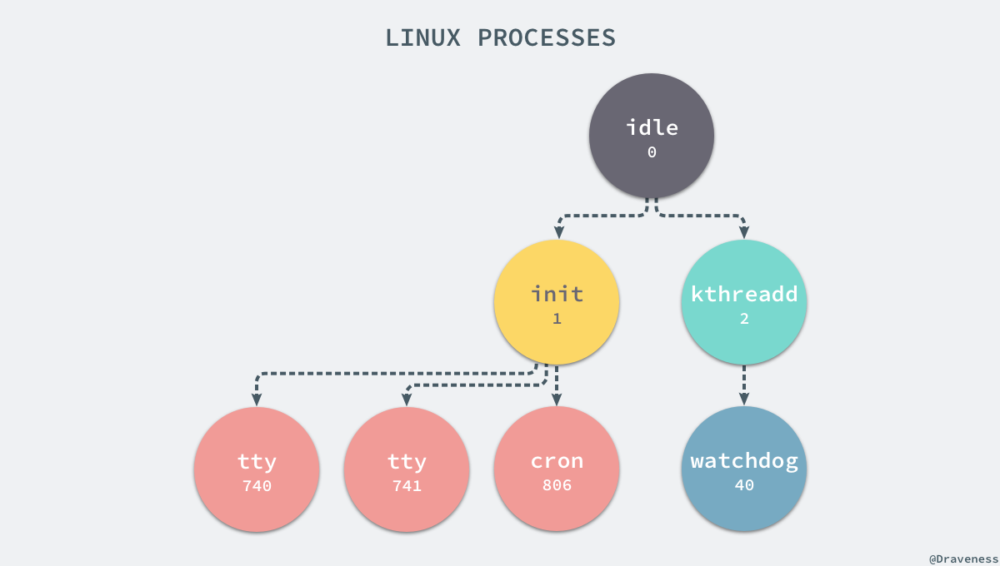
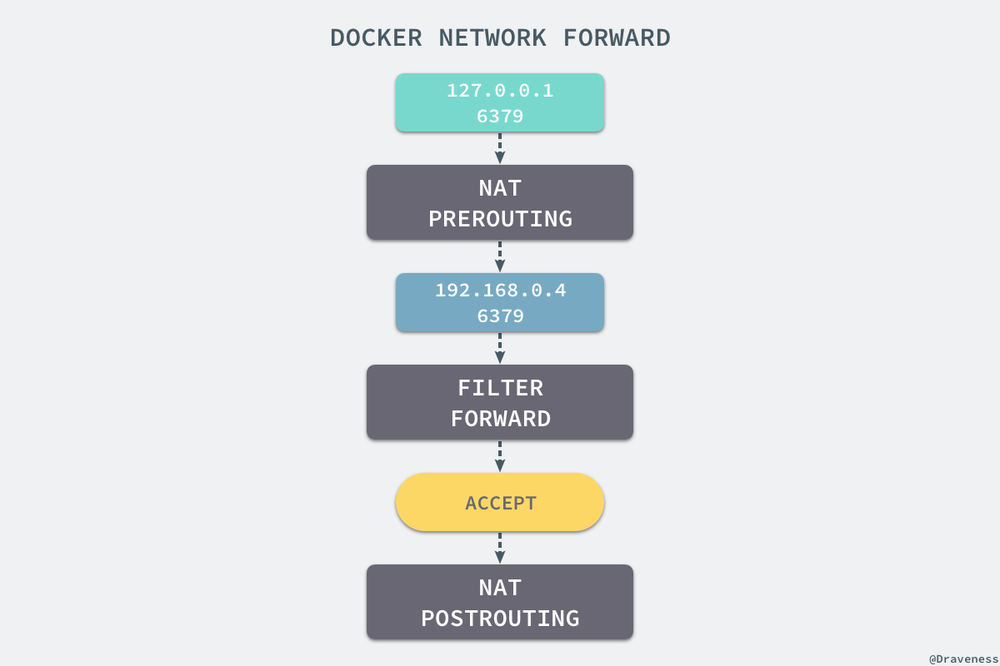
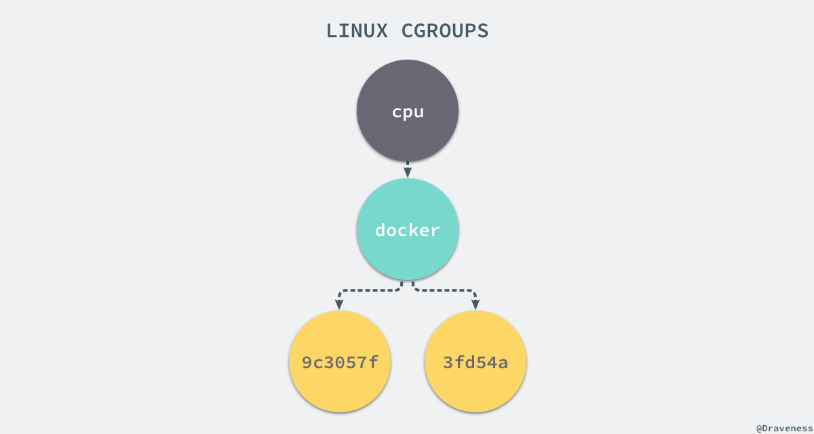
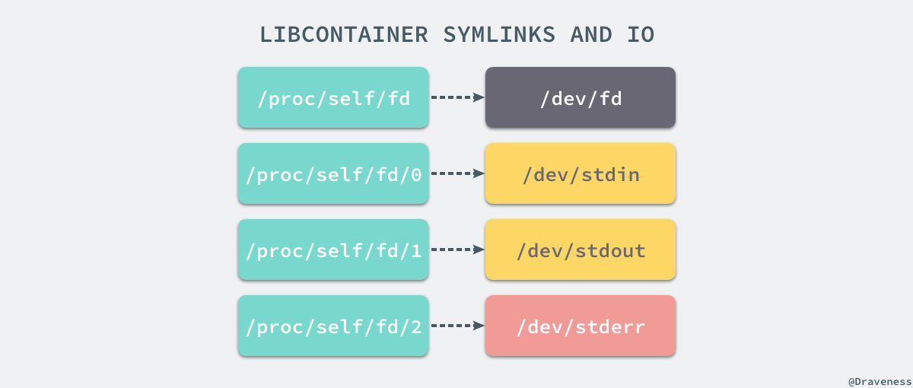
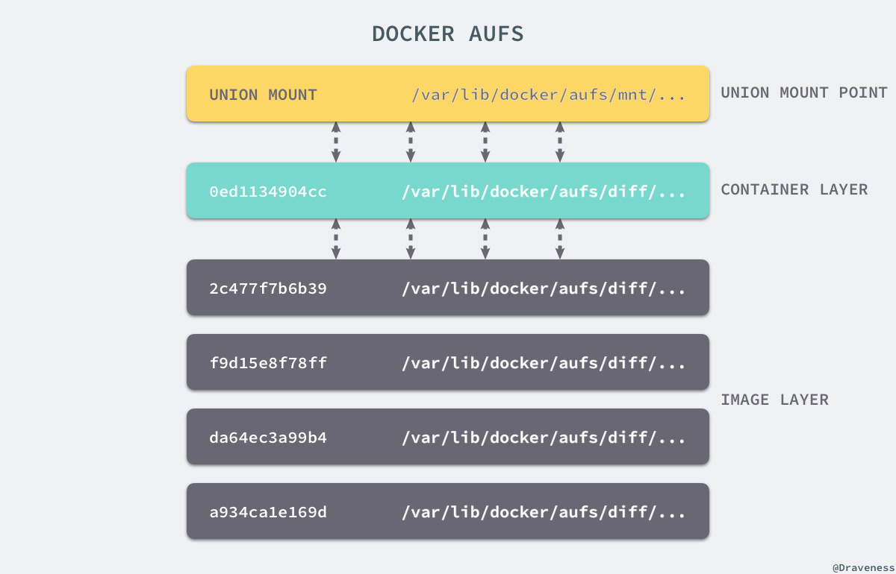

# Docker核心及实现

## 命名空间

**命名空间linux系统用于分离进程树、网络接口、挂载点以及进程间通信等资源**

### 七种命名空间

- CLONE_NEWCGROUP
- CLONE_NEWIPC
- CLONE_NEWNET
- CLONE_NEWNS
- CLONE_NEWPID
- CLONE_NEWUSER
- CLONE_NEWUTS

### 实体系统中的进程

- ***nix**类系统中，上帝进程idle（pid为0）创建 init（pid为1）进程和 kthreadd（pid为2）进程

  - #### init进程：

    负责执行内核的一部分初始化工作和系统配置，创建一些类似` getty` 的注册进程

  - #### kthreadd进程：

    管理和调度其他内核进程

### Docker容器中的进程

- 容器中的进程没有上帝进程、init进程等
- 宿主机和容器的进程树关系
  - 进程间隔离通过 clone() 方法传入命名空间 CLONE_NEWIPC 容器内部的任意进程对宿主机进程无感
- 使用 `docker run` 或 `docker start` 通过setNamespaces 设置进程、用户、网络、IPC以及UTS相关的命名空间

### Docker容器中的网络

- `docker run`启动的容器都具有单独的网络命名空间

- docker启动之后会在宿主机上创建网桥 docker0

- #### 四种网络模式

  - #### Host

    - 与宿主机共享网络命名空间
    - 不会有自己的虚拟网卡、IP等，使用宿主的IP和端口

  - #### Container

    - 与另一个容器共享网络命名空间不是和宿主机共享
    - 不会创建自己的网卡，配置IP等，与共享的容器在网络上共享（类似于实体机通过网线直接相连）

  - #### None

    - 拥有自己的命名空间
    - 不拥有网络配置（如IP、路由等），需要自己配置网卡、IP等

  - #### Bridge（默认网络模式）

    - 通过命名空间实现网络的隔离
    - 通过 iptables进行数据包转发

    docker0虚拟出一个网卡并为每一个容器分配一个新的IP地址将docker0的IP设置为默认网关。网桥docker0通过iptables中的配置与宿主机上的网卡相连，所有符合条件的请求都会通过iptables转发到docker0并由网桥分发给对应的容器；

    向iptables中添加转发规则，当访问本机是通过 iptables 的NAT PREROUTING进行重定向到容器的IP，重定向的是数据包通过 iptables 中的FILTER配置最终在NAT POSROUTING阶段将容器IP地址伪装成访问本机的地址

  

## 控制组

### CGroups机制（Control Groups）

- 实现宿主机上物理资源（CPU、内存）的隔离

- 被一组相同的标准和参数限制的进程

  - 这些进程之间构成层级关系，cgroup可以从父类继承一些用于限制资源使用的标准和参数
  - 每一个进程都可以随时加入一个cgroup或退出

- 每一个cgroup下都一个tasks文件

  - 存储属于当前控制组的所有进程pid

- Linux通过文件系统实现CGroup

  - cpuset			/sys/fs/cgroup/cpuset
  - cpu                 /sys/fs/cgroup/cpu
  - cpuacct          /sys/fs/cgroup/cpuacct
  - memory         /sys/fs/cgroup/memory
  - devices           /sys/fs/cgroup/devices
  - freezer            /sys/fs/cgroup/freezer
  - blkio                /sys/fs/cgroup/blkio
  - perf_event      /sys/fs/cgroup/perf_event
  - hugetlb           /sys/fs/cgroup/hugetlb

- 安装docker时会在以上每一个cgroup文件夹中都会有一个docker文件夹，运行容器时，在docker文件夹中同创建对应容器的文件夹即为这个容器的cgroup

  

## 联合文件系统

### 挂载点

- 创建新的进程时在 clone() 函数中传入 CLONE_NEWNS 得到父进程挂载点的拷贝

- 容器的启动需要提供根文件系统（rootfs），容器在此根文件系统中创建进程以及二进制的执行

  - 容器所必须的挂载点

  |    Path     |  Type  |
  | :---------: | :----: |
  |    /proc    |  proc  |
  |    /dev     | tmpfs  |
  |  /dev/shm   | tmpfs  |
  | /dev/mqueue | devpts |
  |  /dev/pts   | devpts |
  |    /sys     |  sys   |

  - 保证IO的符号链接

  

- 限制容器对宿主机上其他目录的访问

  - `pivot_root`或`chroot`改变进程能够访问的目录根节点

### 存储驱动

- 镜像的构建：镜像由一系列的只读层组成
  - `docker run`命令创建时创建镜像时，会在镜像的最上一层增加一个可写的层（容器层）
  - 所有对于运行时容器的修改都是对容器读写层的修改
  - 同一个镜像可以对应多个容器，镜像只读，容器则是镜像加上一个可读写的层

#### UnionFS

- linux操作系统设计的用于把多个文件系统联合到同一个挂载点的文件系统服务

#### AUFS

- 将不同文件夹中的层（分支）联合到同一个文件夹中，联合过程称为联合挂载

- 不同的镜像（存储在不同目录中）以及容器层的挂载点都会被Docker联合挂载在到mnt目录中

  

### Docker使用的存储驱动

- overplay2
- devicemapper
- aufs
- zfs

## Docker使用

#### 批量清理临时镜像文件：

- docker rmi $(docker images -q -f danging=trye)

#### 查看镜像支持的环境变量

- docker run IMAGE env

#### 本地的镜像文件存在位置： 

- Docker相关本地资源存放在/var/lib/docker/下
  - container目录存放的容器信息
  - graph存放镜像信息
  - aufs存放具体的镜像底层文件

#### 查看正在后台运行的容器的输出和日志信息：

- docker logs

#### 端口映射：

- 对于<1024的端口需要指定PublibshAllPort=true

#### 容器启动运行

- docker create或docker run 使用参数-c和-m来调整cpu和内存资源的分配

#### 仓库、注册服务器、注册索引之间的关系：

- 仓库是存放一组相关的镜像的集合，如统一应用的不同版本的镜像
- 注册服务器存放实际镜像，注册服务器利用注册索引来实现认证等的管理
- 注册索引则维护用户的账号，权限，搜索，标签等管理

#### 添加非官方镜像：

- 添加信任  --insecure-registry 网址:端口号

#### docker环境迁移：

- 停止docker服务，将整个docker存储文件复制到另一台宿主机上，然后调整另外一台宿主机的相关配置