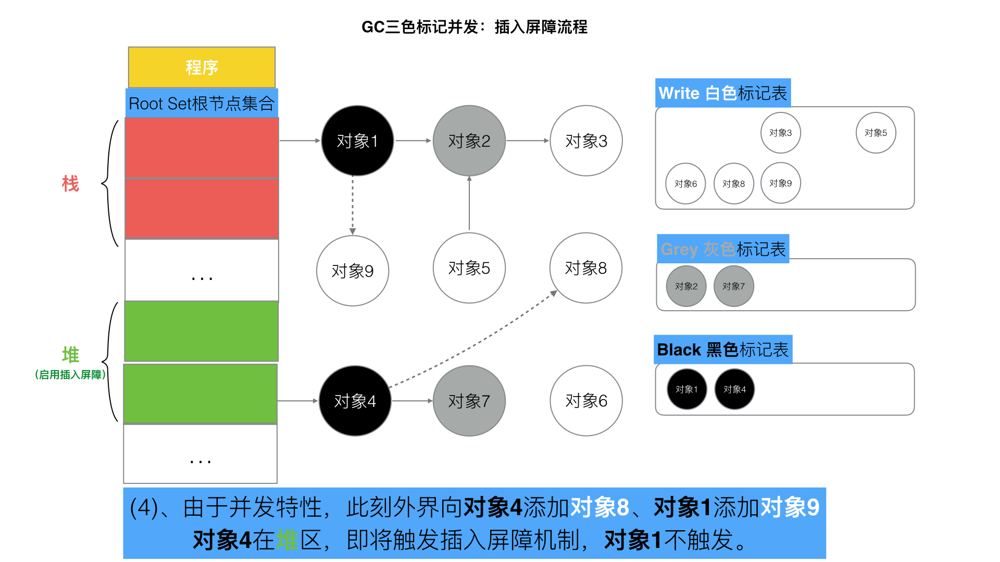
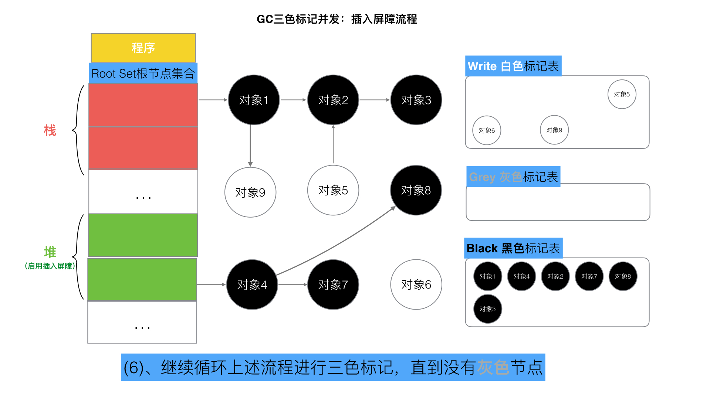
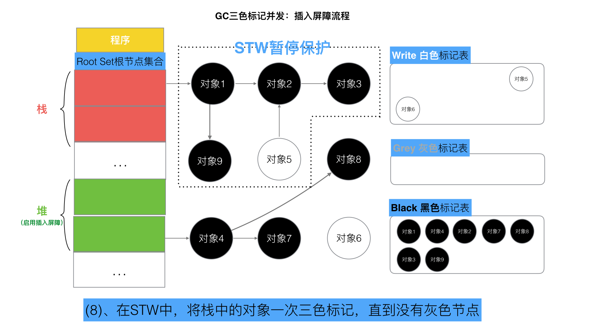
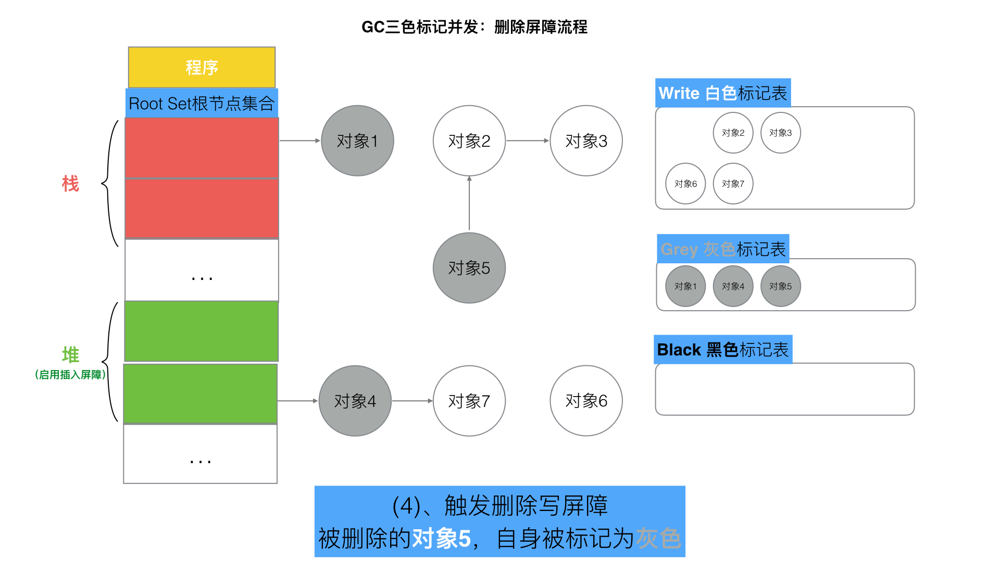
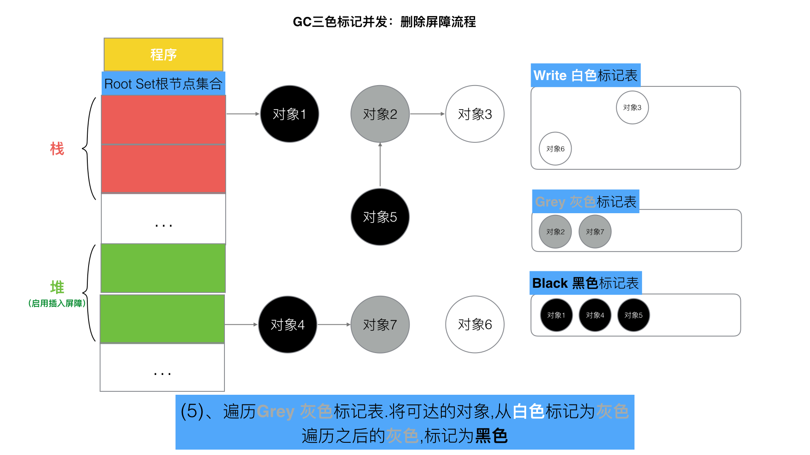

# GO学习笔记

## 数据类型

### 数组

- 数组的长度是数组类型的组成部分。

- 不同长度或不同类型的数据组成的数组都是不同的数组类型

- 不同长度的数组因为类型不同无法直接赋值

- 如果数组中的元素类型可以比较，那么两个数组是可以用 “==” 比较判断的

- 一个数组变量即表示整个数组与C语言中的数组变量就是第一个元素的地址不同

- 数组指针操作数组的方式和数组本身的操作类似不过不同长度的数组指针类型是完全不同的

- 空数组不占用内存空间与空结构体类似

  ```go
  var times [5][0]int
  for range times {
      fmt.Println("hello")
  }
  // times占用内存为0，其长度仍然是5
  ```

### slice

- 底层实现是数组

- slice之间不能通过 “==” 比较，可以通过bytes.Equal函数来判断两个字节型slice是否相等

  - slice中的元素是间接引用的
  - 底层数组中的元素可能会被修改

- 当切片的底层数据指针为空时，切片等于nil，同时len和cap也成为无效的值

- 增长规则  2倍—(1024)—>1.25倍

- append会触发扩容，copy深层拷贝两个切片不会扩容

- #### 切片的内存泄露问题

  - 在已有切片的基础上进行切片，不会创建新的底层数组。因为原来的底层数组没有发生变化，内存会一直占用，直到没有变量引用该数组。
  - 当原切片由大量的元素构成，但是我们在原切片的基础上切片，虽然只使用了很小一段，但底层数组在内存中仍然占据了大量空间，得不到释放。
  - 使用 `copy` 替代 `re-slice`

- 切片的强制类型转换。注意，Go语言实现中非0大小数组的长度不得超过2GB，因此需要针对数组元素的类型大小计算数组的最大长度范围（`[]uint8`最大2GB，`[]uint16`最大1GB，以此类推，但是`[]struct{}`数组的长度可以超过2GB）

  ```go
  // +build amd64 arm64
  
  import "sort"
  
  var a = []float64{4, 2, 5, 7, 2, 1, 88, 1}
  
  func SortFloat64FastV1(a []float64) {
      // 强制类型转换
      var b []int = ((*[1 << 20]int)(unsafe.Pointer(&a[0])))[:len(a):cap(a)]
  
      // 以int方式给float64排序
      sort.Ints(b)
  }
  
  func SortFloat64FastV2(a []float64) {
      // 通过 reflect.SliceHeader 更新切片头部信息实现转换
      var c []int
      aHdr := (*reflect.SliceHeader)(unsafe.Pointer(&a))
      cHdr := (*reflect.SliceHeader)(unsafe.Pointer(&c))
      *cHdr = *aHdr
  
      // 以int方式给float64排序
      sort.Ints(c)
  }
  ```

  - 第一种强制转换是先将切片数据的开始地址转换为一个较大的数组的指针，然后对数组指针对应的数组重新做切片操作。中间需要`unsafe.Pointer`来连接两个不同类型的指针传递。。
  - 第二种转换操作是分别取到两个不同类型的切片头信息指针，任何类型的切片头部信息底层都是对应`reflect.SliceHeader`结构，然后通过更新结构体方式来更新切片信息，从而实现`a`对应的`[]float64`切片到`c`对应的`[]int`类型切片的转换。

### 字符串

- 字符串(string) 是不可变的，拼接字符串事实上是创建了一个新的字符串对象。

- 字符串的底层数据类型是byte[]，字符串赋值也只是将底层的数组指针和长度进行赋值

- #### 字符串使用的编码UTF-8

  - UTF8字符序列也可能会遇到坏的编码。
  - 如果遇到一个错误的UTF8编码输入，将生成一个特别的Unicode字符‘\uFFFD’
  - 错误编码不会向后扩散是UTF8编码的优秀特性之一
  - 在for range迭代时仍然会迭代错误的字节部分
  - **rune是int32的别名**
    - 保存Unicode码点(目前只使用了21位)，当string和rune类型做强制转换时会发生内存的重新分配

- #### 字符串拼接方式

  - +，性能差
  - fmt.Sprintf，性能差
  - strings.Builder，性能好
  - bytes.Buffer，性能好
  - []byte，性能好

- #### 使用strings.Builder构造字符串

```go
func builderConcat(n int, str string) string {
	var builder strings.Builder
	builder.Grow(n * len(str)) // 预申请内存，比使用byte[]的方式还要少一次 byte转string 的内存申请
	for i := 0; i < n; i++ {
		builder.WriteString(str)
	}
	return builder.String()
}
```

- #### []byte转换成string不需要拷贝内存的场景，直接返回string.str指针指向[]byte内存
  - 使用m[string(b)]来查找map（map是string为key，临时把切片b转成string）；
  - 字符串拼接，如”<” + “string(b)” + “>”；
  - 字符串比较：string(b) == “foo”

### 结构体

- 结构体中成员变量的声明要遵循内存对齐的原则
- 命名为A的结构体类型不能包含A类型的成员，但可以包含*A类型的成员
- 结构体成员的Tag，在编译阶段关联到该成员的元信息字符串，格式  `json:"color“`
- 结构体成员的调用必须是由一个该结构体类型的变量来调用或者该结构体类型的一个引用来调用
- 结构体的引用作为函数返回值时可以直接使用其成员变量而结构体作为函数返回值时必须有外部变量接收才能使用其成员变量

**空结构体**

- 大小：unsafe.Sizeof(struct{}{}) ==> 0
- 空结构体不占据内存空间，被广泛作为各种占位符使用
  - 实现集合。将 map 作为集合(Set)使用时，可以将值类型定义为空结构体，仅作为占位符
  - 不发送数据的channel
  - 仅包含方法的结构体

**结构体对齐**

- 合理的内存对齐可以提高内存读写的性能，并且便于实现变量操作的原子性。
- `unsafe.Alignof(Args{})`可以返回内存对齐方式

**内存对齐技巧**

- #### 合理布局减少内存占用	

  - ###### 调整结构体中字段的顺序以减少内存占用

- #### 空 struct{} 的对齐      

  - ###### 当 `struct{}` 作为其他 struct 最后一个字段时，需要填充额外的内存保证安全。

  - ###### 因为如果有指针指向该字段, 返回的地址将在结构体之外，如果此指针一直存活不释放对应的内存，就会有内存泄露

### map

- map中的元素不是变量，不能对map中的元素取址
  - 在map扩容后map中元素的地址可能发生改变导致之前的取址无效
- 底层实现是哈希表，一个哈希表中有多个哈希表节点

```go
type hmap struct {
    count     int // 当前保存的元素个数
    ...
    B         uint8  // 指示bucket数组的大小
    ...
    buckets    unsafe.Pointer // bucket数组指针，数组的大小为2^B
    ...
}
```

```go
type bmap struct {
    tophash [8]uint8 //存储哈希值的高8位，遇到哈希值低位相同的key将其高位存储在该数组中一遍后续匹配
    data    byte[1]  //key value数据:key/key/key/.../value/value/value...
    overflow *bmap   //溢出bucket的地址
}
```

- 哈希冲突，链地址法 overflow保存冲突的kv存储的bucket
- 负载因子 = 键数量 / bucket数量，go中负载因子为6.5 (redis中为1)
  - 负载因子过小，说明空间利用率低
  - 负载因子过大，说明冲突严重，存取效率低
- 渐进扩容：
  - 扩容条件：1.负载因子＞6.5  2.溢出bucket数量＞2^15
  - 增量扩容：当负载因子过大则新建一个bucket其长度为原来的两倍，然后逐步每次搬迁2个键值对
- 等量扩容，平摊键值对
- 查找过程
  - 跟据key值算出哈希值
  - 取哈希值低位与hmpa.B取模确定bucket位置
  - 取哈希值高位在tophash数组中查询
  - 如果tophash[i]中存储值也哈希值相等，则去找到该bucket中的key值进行比较
  - 当前bucket没有找到，则继续从下个overflow的bucket中查找。
  - 如果当前处于搬迁过程，则优先从oldbuckets查找
- 插入过程
  - 跟据key值算出哈希值
  - 取哈希值低位与hmap.B取模确定bucket位置
  - 查找该key是否已经存在，如果存在则直接更新值
  - 如果没找到将key，将key插入
- **sync.Map**并发安全的MAP
  - 存储`map.Store`
  - 查询`map.Load`
  - 删除`map.Delete`

### channel

```go
type hchan struct {
    qcount   uint           // 当前队列中剩余元素个数
    dataqsiz uint           // 环形队列长度，即可以存放的元素个数
    buf      unsafe.Pointer // 环形队列指针
    elemsize uint16         // 每个元素的大小
    closed   uint32            // 标识关闭状态
    elemtype *_type         // 元素类型
    sendx    uint           // 队列下标，指示元素写入时存放到队列中的位置
    recvx    uint           // 队列下标，指示元素从队列的该位置读出
    recvq    waitq          // 等待读消息的goroutine队列
    sendq    waitq          // 等待写消息的goroutine队列
    lock mutex              // 互斥锁，chan不允许并发读写
}
```

- 有缓存的channel采用环形队列作为缓冲区

- hchan结构中的recvq和sendq保存读写goroutine队列

  - 读取缓冲为空或者无缓冲会阻塞，此时读的goroutine会被写goroutine唤醒；
  - 写入缓冲满或者无缓冲会阻塞，此时写goroutine会被读gorouting唤醒；

- hchan结构中的elemtype和elemsize保存类型和类型大小

- 写数据流程

  如果recvq等待接收队列不空说明缓冲没有数据或没有缓冲区，则直接取来一个等待队列中的G唤醒写入数据；如果缓冲区有空余，将数据写入缓冲区；如果缓冲区满则将数据写入G并把G加入到sendq队列

  

- 读数据流程

  如果sendq不为空，且没有缓冲则从sendq取出一个G唤醒并读取数据，如果sendq不空且有缓冲区，说明缓冲区满，则取出缓冲区首元素再从sendq拿一个G唤醒写入到缓冲区末尾；sendq为空，说明缓冲区也为空，将当前G加入recv队列等待唤醒

  

- 关闭channel会唤醒全部recvq的G，引发panic的场景有：

  - 关闭值为nil的channel  (读取为nil的信道会永远阻塞)
  - 关闭已经关闭的channel
  - 向关闭的channel中写数据（读取关闭的channel返回对应类型的零值和false）

### 函数

- 具名函数：一般对应于包级的函数，是匿名函数的一种特例。

- 支持多个参数和多个返回值，都是以值传递的方式和被调用者交换数据。

- 支持可变数量参数，可变参数必须在参数声明的最后出现，实际上是一个切片类型的参数

- 可变参数是空接口类型，调用者是否解包可变参数其结果不同

- 闭包函数：当匿名函数引用了外部作用域中的变量时就成了闭包函数，闭包是引用传递。

- go程序初始化流程

  

  - 包中的多个init函数其调用顺序未定，文件中的多个init函数按照顺序执行
  - **注意：**在进入main函数之前所有的初始化都在主系统线程中即同一个goroutine，如果在init中启动了其他goroutine则不会立即执行而是在进入main函数之后再执行
  
- 函数调用栈：递归调用深度逻辑上没有限制，不会出现栈溢出错误的，运行时会根据需要动态地调整函数栈的大小。goroutine启动时只会分配很小的栈空间

### 方法

- 方法是绑定到一个具体类型（接收器）的特殊函数。
- 接收器分为指针接收器和非指针接收器
  - 指针接收器：可以修改成员变量
  - 非指针接收器：接收器的值的被复制，方法作用于复制之后的接收器上，不会影响成员变量
- 方法是依托于类型的，必须在编译时静态绑定。
- 方法和函数都不支持重载
- 在结构体中通过匿名成员来实现继承，与C++中的虚函数多态不同，所继承来的方法的接受者仍然是匿名成员本身，在编译时会把调用继承的方法的代码展开

### 接口

- 接口类型是对其他类型行为的抽象和概括

- 接口定义了方法的集合，这些方法依托于运行时的接口对象。

- 接口对应的方法是在运行时动态绑定的。（Go语言通过隐式接口机制实现了鸭子面向对象模型。如果一个对象看起来像某个接口的实现那么就可以拿来当做这个接口使用）

  ```go
  type A interface{
    Go()
  }
  type B struct {
    
  }
  func (b *B)Go(){...}
  // 在编译时检查 B 类型是否实现了A接口
  var _ A = (*B)(nil)
  ```

## 流程控制

### defer

函数中通过某些方法获取的一些资源如文件、锁等，在函数的执行过程中某些操作可能导致提前返回，为了避免资源泄露在每个return之前调用release释放资源，如果没有defer就需要在每一个可能发生错误的地方调用release会造成**代码臃肿**和**维护性比较差**的问题。通过defer能够保证无论是在那个位置提前返回都能保证资源的释放

- **参数即时求值**，延迟函数的参数在defer语句出现时就已经确定下来了

- 延迟函数执行按后进先出顺序执行，即先出现的defer最后执行

- 延迟函数可能操作主函数的具名返回值

- 函数返回过程：

  1. 返回值存入栈(具名返回值会进行赋值)  

  2. defer函数

  3. 执行跳转RET指令

    注意当返回值为匿名返回值，返回字面值时defer不会影响返回值

```go
var g = 100

func deferFc2() (r int) {
	defer func() {
		g = 200
	}()
	fmt.Printf("f: g = %d\n", g) 
	return g
  // 第一步 r = g = 100
  // 第二步 g = 200
  // 第三步 RET
}
func deferFc3() (r int) {
	r = g
	defer func() {
		r = 200
	}()
	fmt.Printf("f: r = %d\n", r)
	r = 0
	return r
  // 第一步 r = 0
  // 第二步 r = 200
  // 第三步 RET
}
func main() {
    i := f()
    fmt.Printf("main: i = %d, g = %d\n", i, g)
}

deferFc2: g = 100
main: i = 100, g = 200

deferFc3: r = 100
main: i = 200, g = 100
```

- deferproc函数`func deferproc(siz int32, fn *funcval)`

  ​		siz 是 defered 函数的参数以字节为单位的大小

  ​		第二个参数 funcval 是一个变长结构体

  - 函数内部流程：

    - 编译器会把 go 代码中 defer 语句翻译成对 deferproc 函数的调用

    - deferproc 函数通过 newdefer 函数分配一个 _defer 结构体对象并放入当前 goroutine 的 _defer 链表的表头；

    - 在 _defer 结构体对象中保存被延迟执行的函数 fn 的地址以及 fn 所需的参数

    - 返回到调用 deferproc 的函数继续执行后面的代码

      通过return0()设置rax寄存器的值为0，隐性的给调用者返回一个0值，在panic/recover的情况下该值不是0值

  **在调用runtime.deferproc时，栈上保存着deferproc函数需要的两个参数和defered函数的参数（通过defer注册的函数就是defered函数）；deferproc函数会通过rax寄存器返回一个隐性返回值**

  - newdefer的实现
    - 首先尝试从与当前工作线程绑定的 p 的 _defer 对象池和全局对象池中获取一个满足大小要求 (sizeof( _defer) + siz向上取整至16的倍数)的 _defer结构体对象；如果没有满足要求的空闲 _defer 对象则从堆上分配一个
    - 然后把分配的对象挂在当前goroutine的 _defer 链表的表头

- deferreturn函数

  **负责递归的调用通过defer注册的函数**

  1. 通过当前 goroutine 对应的 g 结构体对象的  _defer  链表判断是否有需要执行的 defered 函数，如果没有（g. _defer == nil 或者 defered 函数不是在 deferreturn 的 caller 函数中注册的函数）则直接返回
     - 递归调用时通过判断 `d == nil` 可以确定递归的终止条件
     - 通过 `d.sp != sp` 来判断 d 对象所包装的defered函数现在是否被执行，比如在调用链 a()->b()->c() 中，他们都是通过defer注册的延迟函数，那么当 c() 执行结束确保只能执行c中注册的函数而不是a、b中注册的defer函数
  2. 从 _defer 对象中把 defered 函数需要的参数拷贝到栈上
  3. 释放 _defer 结构体对象
  4. 通过 jmpdefer 函数调用 defered 函数

### panic/recover

- defer语句被编译器翻译成对runtime包中的deferproc()函数的调用，该函数把defered函数打包成_defer结构体对象挂入goroutine对应的g结构体对象的__defer链表中，defer对象除了保存defered函数的地址以及函数需要的参数外，还会分别把call deferproc指令的下一条指令的地址以及此时函数调用栈顶指针保存在defer.pc和defer.sp成员中，用于recover时恢复程序的正常执行流程
- 当某个defered函数通过recover()函数捕获到一个panic之后，程序将从该defered函数对应的_defer结构体对象的pc成员所保存的指令地址处开始执行；
- **panic/recover执行流程**：对panic()或recover()的调用会被编译器翻译成runtime包中gopanic()和gorecover()的函数调用
  - 遍历当前goroutine所注册的defered函数并**通过reflectcall调用**遍历k'y到的函数
    - 不同的defered函数参数大小可能有很大的差异
    - gopanic函数的栈帧大小固定且很小
  - 如果某个defered函数调用了recover(运行时中的gorecover函数)则使用mcall(recovery)恢复程序的正常流程
  - 否则执行完所有的defered函数之后打印panic栈信息然后退出程序
- panic可以嵌套，当发生panic之后在执行defer函数时又发生了panic即为嵌套。每一个还没有被recover的panic都会对应一个_panic结构体对象，他们被依次挂在g结构体的__panic链表中，最近发生的panic位于链表的头，最早发生的位于链尾。
  - 嵌套情况下其调用链：**gopanic()——reflectcall()——defered()——gopanic()**
    - 如果在defered函数通过defer再次注册了defered函数并且recover收集了最新的panic，则调用链从**reflectcall()**原路返回到**gopanic()**
    - 如果在defered函数中没有recover自己的panic，则**reflectcall()**不会原路返回。要么第二次gopanic执行完所有defered函数之后退出程序，要么新发生的panic代替前一次的panic然后由外层的defered函数recover

- **主动调用用panic**

  - 在go代码中直接调用或者由编译器插入，编译器会在需要检查数组/slice是否越界的情况下插入painc代码

- **非法操作导致panic**

  - 向只读内存写入数据，访问非法内存等。在linux平台通过信号机制实现对panic的调用

    - **具体过程**

      1. CPU在内存中保存发生异常的指令的地址（**异常返回地址**）
      2. 进入内核，执行由操作系统启动时提供的**异常处理程序**，该程序会负责把CPU的所有相关的寄存器的值保存在内存中
      3. 向引起异常的当前线程**发送SIGSEGV信号**
      4. 从内核返回过程中发现有信号需要处理
      5. 从内核返回到**用户态执行信号处理程序**（go程序启动时会向内核注册信号处理函数），它把异常返回地址修改为runtime.sigpanic函数的地址
      6. 信号处理程序执行完毕进入内核
      7. 从内核返回开始执行**runtime.sigpanic**函数

    - SIGSEGV信号处理具体流程

      ```go
      内核返回-> runtime.sigtramp() ->runtime.sigtrampgo()->runtime.sighandler()->sigctxt.preparePanic()修改异常返回地址
      ```

      - runtime.sigtramp()是go程序启动时向内核注册的信号处理函数，当线程收到该信号内核负责让CPU进入该函数执行
      - 内核返回之前，把异常返回地址等数据保存在信号处理程序的函数调用栈中，等信号处理程序执行完成后再次进入内核时，内核会把之前保存在栈上的异常返回地址等数据拷贝回内核，然后再返回到用户态继续执行异常返回地址处的指令。这个过程中信号处理程序有机会修改异常返回地址为runtime.sigpanic函数的地址
      - 信号处理程序执行完成后进入内核后再次返回用户态时CPU就会从runtime.sigpanic函数开始执行

### select实现原理

```go
case数据结构
type scase struct {
    c           *hchan         // chan
    kind        uint16				// 表示case类型有caseRecv、caseSend和caseDefault三种类型
    elem        unsafe.Pointer // data element
}
```

```go
func selectgo(cas0 *scase, order0 *uint16, ncases int) (int, bool){
  	//1. 锁定scase语句中所有的channel
    //2. 按照随机顺序检测scase中的channel是否ready
    //   2.1 如果case可读，则读取channel中数据，解锁所有的channel，然后返回(case index, true)
    //   2.2 如果case可写，则将数据写入channel，解锁所有的channel，然后返回(case index, false)
    //   2.3 所有case都未ready，则解锁所有的channel，然后返回（default index, false）
    //3. 所有case都未ready，且没有default语句
    //   3.1 将当前协程加入到所有channel的等待队列
    //   3.2 当将协程转入阻塞，等待被唤醒
    //4. 唤醒后返回channel对应的case index
    //   4.1 如果是读操作，解锁所有的channel，然后返回(case index, true)
    //   4.2 如果是写操作，解锁所有的channel，然后返回(case index, false)
}
case elem, ok := <-chan1: // 通过ok来判断当前channel是否被关闭 关闭的channel可以返回此时ok==false
```

参数列表：

- cas0为scase数组的首地址，selectgo()就是从这些scase中找出一个返回。
- order0为一个两倍cas0数组长度的buffer，保存scase随机序列pollorder和scase中channel地址序列lockorder
- pollorder：每次selectgo执行都会把scase序列打乱，以达到随机检测case的目的。
- lockorder：所有case语句中channel序列，以达到去重防止对channel加锁时重复加锁的目的。
- ncases表示scase数组的长度

### range

- 遍历**slice**前会先获以slice的长度len_temp作为循环次数，循环体中，每次循环会先获取元素值，如果for-range中接收index和value的话，则会对index和value进行一次赋值。由于循环开始前循环次数就已经确定了，所以循环过程中新添加的元素是没办法遍历到的。
- 遍历**map**时没有指定循环次数，循环体与遍历slice类似。由于map底层实现与slice不同，map底层使用hash表实现，插入数据位置是随机的，所以遍历过程中新插入的数据不能保证遍历到
- channel遍历是依次从channel中读取数据,读取前是不知道里面有多少个元素的。如果channel中没有元素，则会阻塞等待，如果channel已被关闭，则会解除阻塞并退出循环。

### Mutex

```go
type Mutex struct {
    state int32
    sema  uint32
}
```

- Mutex.state表示互斥锁的状态，比如是否被锁定等。
- Mutex.sema表示信号量，协程阻塞等待该信号量，解锁的协程释放信号量从而唤醒等待信号量的协程。


- Locked: 表示该Mutex是否已被锁定，0：没有锁定 1：已被锁定。
- Woken: 表示是否有协程已被唤醒，0：没有协程唤醒 1：已有协程唤醒，正在加锁过程中。
- Starving：表示该Mutex是否处理饥饿状态， 0：没有饥饿 1：饥饿状态，说明有协程阻塞了超过1ms。
- Waiter: 表示阻塞等待锁的协程个数，协程解锁时根据此值来判断是否需要释放信号量。
- 自旋：加锁时，如果当前Locked位为1，说明该锁当前由其他协程持有，尝试加锁的协程并不是马上转入阻塞，而是会持续的探测Locked位是否变为0，这个过程即为自旋过程
- 自旋必须满足以下所有条件：
  - 自旋次数要足够小，通常为4，即自旋最多4次
  - CPU核数要大于1，否则自旋没有意义，因为此时不可能有其他协程释放锁
  - 协程调度机制中的Process数量要大于1，比如使用GOMAXPROCS()将处理器设置为1就不能启用自旋
  - 协程调度机制中的可运行队列必须为空，否则会延迟协程调度
- Mutex的两种模式 starving
  - normal	默认情况下，Mutex的模式为normal。该模式下，协程如果加锁不成功不会立即转入阻塞排队，而是判断是否满足自旋的条件，如果满足则会启动自旋过程，尝试抢锁。
  - starvation   被唤醒的协程得到CPU后开始运行，此时发现锁已被抢占了，自己只好再次阻塞，不过阻塞前会判断自上次阻塞到这次阻塞经过了多长时间，如果超过1ms的话，会将Mutex标记为”饥饿”模式，然后再阻塞。处于饥饿模式下，也即一旦有协程释放了锁，那么一定会唤醒协程，被唤醒的协程将会成功获取锁，同时也会把等待计数减1。
- woken
  - Woken状态用于加锁和解锁过程的通信，举个例子，同一时刻，两个协程一个在加锁，一个在解锁，在加锁的协程可能在自旋过程中，此时把Woken标记为1，用于通知解锁协程不必释放信号量了
- 重复解锁引发panic
  - Unlock过程分为将Locked置为0，然后判断Waiter值，如果值>0，则释放信号量。多次unlock会释放多个信号量进而唤醒多个协程去抢锁，应该使用defer来避免死锁

### RWMutex

```go
type RWMutex struct {
    w           Mutex  //用于控制多个写锁，获得写锁首先要获取该锁，如果有一个写锁在进行，那么再到来的写锁将会阻塞于此
    writerSem   uint32 //写阻塞等待的信号量，最后一个读者释放锁时会释放信号量
    readerSem   uint32 //读阻塞的协程等待的信号量，持有写锁的协程释放锁后会释放信号量
    readerCount int32  //记录读者个数
    readerWait  int32  //记录写阻塞时读者个数
}
```

- 写锁如何阻止读操作
  - 我们知道RWMutex.readerCount是个整型值，用于表示读者数量，不考虑写操作的情况下，每次读锁定将该值+1，每次解除读锁定将该值-1，所以readerCount取值为[0, N]，N为读者个数，最大可支持2^30个并发读者。当写锁定进行时，会先将readerCount减去2^30，从而readerCount变成了负值，此时再有读锁定到来时检测到readerCount为负值，便知道有写操作在进行，只好阻塞等待。而真实的读操作个数并不会丢失，只需要将readerCount加上2^30即可获得。写操作将readerCount变成负值来阻止读操作的。
- 写操作不会被饿死的保证
  - 写操作到来时，会把RWMutex.readerCount值拷贝到RWMutex.readerWait中，用于标记排在写操作前面的读者个数。前面的读操作结束后，除了会递减RWMutex.readerCount，还会递减RWMutex.readerWait值，当RWMutex.readerWait值变为0时唤醒写操作。

## 并发

### 原子操作

- sync/atomic

  - sync.Once 通过标志位来实现单件模式（for rang结构中声明的变量即为单件模式属于单变量）

  - `atomic.Value`原子对象提供了`Load`和`Store`两个原子方法，分别用于加载和保存数据，返回值和参数都是`interface{}`类型，因此可以用于任意的自定义复杂类型。一下为生产者消费者模式的演示

    ```go
    var config atomic.Value // 保存当前配置信息
    
    // 初始化配置信息
    config.Store(loadConfig())
    
    // 启动一个后台线程, 加载更新后的配置信息
    go func() {
        for {
            time.Sleep(time.Second)
            config.Store(loadConfig())
        }
    }()
    
    // 用于处理请求的工作者线程始终采用最新的配置信息
    for i := 0; i < 10; i++ {
        go func() {
            for r := range requests() {
                c := config.Load()
                // ...
            }
        }()
    }
    ```


### 顺序一致性内存模型

- 不同的Goroutine之间，并不满足顺序一致性内存模型，需要通过明确定义的同步事件来作为同步的参考。
- 如果两个事件不可排序，那么就说这两个事件是并发的。为了最大化并行，Go语言的编译器和处理器在不影响上述规定的前提下可能会对执行语句重新排序（CPU也会对一些指令进行乱序执行）。
- 一个goroutine是无法看到另一个goroutine中的执行顺序的

### goroutine调度器


- goroutine是Go实现的用户态线程

  - 传统操作系统线程的问题
    - 创建和切换笨重：需要进入内核
    - 内存使用笨重：一方面内核在创建线程时为了避免溢出会默认分配较大的虚拟地址空间也称栈空间，容易造成浪费；另一方面栈内存空间一旦创建和初始化完成之后其大小不会改变，仍存在溢出的风险
  - 用户态gororutine
    - 切换和创建都在用户代码中完成而无需进入操作系统内核
    - 栈大小默认2k，goroutine的栈会自动扩大和收缩
  - 两级线程模型（M:N）：M个goroutine可以运行在N个系统线程上，内核调度线程，线程调度goroutine
    - g结构体对象，goroutine的所有信息都保存在一个 g 对象中，当goroutine被调离CPU时，调度器负责把CPU寄存器的值保存在g对象的成员变量中，当goroutine被调度起来运行时，调度器负责把g对象的成员变量保存的寄存器的值复制到CPU的寄存器当中
    - schedt结构体对象，保存调度器自身的状态信息和保存goroutine的运行队列（全局运行队列）。每个go程序中schedt结构体只有一个实例对象，在源码中被定义成一个共享全局变量，访问队列中的数据需要互斥锁的操作。
    - p结构体对象，保存每个工作线程私有的局部goroutine运行队列，工作线程优先使用自己的局部运行队列，在必要情况下才去访问全局运行队列，尽量减少锁的冲突提高工作线程的并发性。每一个工作线程都会与一个p结构体对象的示例关联
    - m结构体对象，保存工作线程中的相关信息，如栈的起止位置、当前正在执行的goroutine以及是否空闲等状态信息，同时通过指针维护与p结构体对象的绑定关系。每个工作线程都有唯一一个m结构体对象与之对应

  

- **线程本地存储（TLS**）的使用：通过定义全局的m结构体变量，由线程本地存储机制可以为工作线程实现一个指向m结构体对象的私有全局变量，由此可以使用该全局变量来访问自己的m结构体对象以及与其关联p和g对象

#### main goroutine的创建

程序加载在**schedinit**完成调度系统的初始化后，调用**newproc()**创建新的goroutine用于**执行runtime.main**，runtime,main会去**调用main.main**

- **新的goroutine创建过程**
  1. 切换到g0栈；
  2. 分配g结构体对象；
  3. 初始化g对应的栈信息，并把参数拷贝到新g的栈上；
  4. 设置好g的sched成员，该成员包括调度g时所必须pc, sp, bp等调度信息；
  5. **调用runqput函数把g放入运行队列；**
  6. 返回

- newproc函数，接收两个参数：一所有参数的和大小，二入口函数的地址
  - newproc创建新的goroutine就绪需要把原来栈上的参数复制到新的栈上，所以必须要知道函数的参数的大小
  - 两个工作内容
    - 获取fn函数第一个参数的地址
    - 使用systemstack函数切换回g0栈，对于程序刚刚加载完成的场景来说本身就在g0栈所以不需要进行切换
- newproc1函数，newproc是对newproc1的封装
  - 内容：
    - sched成员进行初始化，该成员包含调度器代码在调度goroutine到CPU运行时的必须信息
      - sched的sp成员表示newg被调度起来运行时应该使用的栈的栈顶，sched的pc成员表示当newg被调度起来运行时从这个地址开始执行指令
    - 然后调用gostartcallfn函数
      - 从参数中提取出函数地址
        - 执行gostartcall函数，进行栈空间的调整和sched成员
          1. 调整栈空间，把goexit函数的第二条指令的地址入栈，伪造成goexit函数调用了fn，从而使fn执行完成之后执行ret指令时返回到goexit继续执行完成最后的清理工作
          2. 重新设置newg.buf.pc 为需要执行的函数的地址，fn，称为runtime.main函数的地址
    - 修改newg的状态为 _Grunnable 并放到**本地运行队列**当中，此时一个goroutine创建完成即 **main goroutine**
  - 说明：
    - main goroutine对应的newg结构体对象的sched成员已经完成初始化
    - newg已经放到与当前主线程绑定的p结构体对象的本地运行队列，第一个goroutine
    - newg的m成员为nil，因为此时还未被调度运行也就没有任何m进行绑定
  - 作用：
    - 从堆上分配一个g结构体对象并为这个newg分配一个大小为2K的栈，并设置好stack成员，然后把newg需要执行的函数的参数从执行newproc的栈 ( g0栈 ) 拷贝到newg的栈

#### main goroutine的调度(从g0切换到main goroutine)

- 保存g0的调度信息，主要是保存CPU栈顶寄存器SP到g0.sched.sp成员之中；

- **schedule函数**

  - 通过**globrunqget()**和**runqget()**函数分别从全局运行队列和当前工作线程的本地运行队列选取下一个需要运行的goroutine，如果两个队列都没有需要运行的giroutine则通过**findrunable()**函数从其他p的运行队列中盗取goroutine
  - 找到需要运行的giroutine之后调用**excute函数**

- **excute函数**（从g0切换到goroutine运行）

  - excute函数的第一个参数gp即需要调度运行的goroutine，将其状态从 _Grunnable修改为 _Grunning，然后把gp和m关联起来，由此可以找到当前线程正在执行哪一个goroutine

  - excute完成gp运行前准备工作之后，excute调用**gogo函数**

- **gogo函数**（从g0切换到gp（CPU执行权的转让以及栈的切换））

  - gogo函数的汇编代码功能
    - 将gp.sched的成员恢复到CPU的寄存器完成状态以及栈的转换
    - 跳转到gp.sched.pc所指的指令地址（runtime.main）处执行（JMP指令）

- **runtime.main函数**的工作流程

  1. 创建一个sysmon系统监控线程，负责整个程序的gc、抢占调度以及netpoll等功能的监控
  2. 执行runtime包的初始化
  3. 执行main包以及main包import的所有包的初始化
  4. 执行main.main函数
  5. 从main.main函数返回后调用exit系统调用退出进程

#### 非main goroutine的退出流程

**非main goroutine退出时会返回到goexit执行清理工作**

- 非main goroutine返回时直接返回到goexit的第二条指令 CALL runtime.goexit1(SB)，该指令继续调用goexit1函数

- goexit1函数调用mcall函数从当前g2 goroutine切换到g0，然后再g0栈上调用和执行goexit0函数

- mcall函数

  - 首先从当前g切换到g0，包括保存当前g的调度信息，把g0设置到TLS中，修改CPU的rsp寄存器使其指向g0的栈（g0.sched.sp位置固定，不会发生栈空间不足的情况）
  - 以当前运行的g为参数调用fn函数（这里是goexit0）

- 切换到g0栈之后，执行goexit0函数完成清理工作

  1. 把g的状态从 _Grunning变更为 _Gdead
  2. 然后把g的一些字段清空成0值
  3. 调用dropg函数解除g和m之间的关系，g->m = nil, m->currg = nil
  4. 把g放入到p的freeg队列缓存起来供下次创建g时快速获取而不用从内存分配。freeg即g的对象池
  5. 调用schedule函数再次进行调度

- #### mecall函数和gogo函数的对比

  - gogo函数实现从g0切换到某个goroutine中运行
    - 首先切换栈再通过 JMP 指令跳转
    - 切换栈和跳转指令不能颠倒，因为跳转指令之后执行的是用户的goroutine代码此时无法再切换栈
  - mcall函数实现从某个goroutine切换到g0中来运行
    - 只切换栈而没有使用跳转指令跳转到 runtime 代码去执行
    - goroutine使用call指令调用mcall函数，mcall函数本身就是 runtime 代码。所以在使用mcall时已经完成了代码的跳转

### 调度循环

```go
schedule()->execute()->gogo()->g2()->goexit()->goexit1()->mcall()->goexit0()->schedule()
// g2()->goexit()->goexit1()->mcall() 在g2空间执行
```


- #### 工作线程执行流程

  1. 初始化调用mstart函数
  2. 调用mstart1函数，在该函数中调用save函数设置g0.sched.sp和g0.sched.pc等调度信息，sp指向mstart函数栈帧的栈顶
  3. 依次调用`schedule->execute->gogo`
  4. 运行用户的goroutine代码
  5. 用户goroutine代码执行过程中调用runtime中的某些函数，然后这些函数调用mcall切换到g0.sched.sp所指的栈并最终再次调用schedule函数进入新一轮调度

### schedule调度策略

- #### 调度的发生

  - goroutine执行某个操作因条件不满足需要等待（channel阻塞，网络连接阻塞，加锁阻塞或select操作阻塞）而发生的调度；
  - goroutine主动调用Gosched()函数让出CPU而发生的调度；
  - goroutine运行时间太长或长时间处于系统调用之中而被调度器剥夺运行权而发生的调度。

- #### 从全局获取goroutine

  - globrunqget函数
    - 参数一，与当前工作线程绑定的p
    - 参数二，最多可以从全局队列拿多少个g到当前工作线程的本地运行队列中（根据本地队列的容量计算出应该拿多少个goroutine，实现了负载均衡）

  ```go
  // Try get a batch of G's from the global runnable queue.
  // Sched must be locked.
  func globrunqget(_p_ *p, max int32) *g {
      if sched.runqsize == 0 {  //全局运行队列为空
          return nil
      }
  
      //根据p的数量平分全局运行队列中的goroutines
      n := sched.runqsize / gomaxprocs + 1
      if n > sched.runqsize { //上面计算n的方法可能导致n大于全局运行队列中的goroutine数量
          n = sched.runqsize
      }
      if max > 0 && n > max {
          n = max   //最多取max个goroutine
      }
      if n > int32(len(_p_.runq)) / 2 {
          n = int32(len(_p_.runq)) / 2  //最多只能取本地队列容量的一半
      }
  
      sched.runqsize -= n
  
      //直接通过函数返回gp，其它的goroutines通过runqput放入本地运行队列
      gp := sched.runq.pop()  //pop从全局运行队列的队列头取
      n--
      for ; n > 0; n-- {
          gp1 := sched.runq.pop()  //从全局运行队列中取出一个goroutine
          runqput(_p_, gp1, false)  //放入本地运行队列
      }
      return gp
  }
  ```

- #### 从本地工作线程中获取goroutine（涉及到并发操作因为在获取g的过程中可能有其他线程在窃取g）

  - 本地循环队列
    - P的runq、runqhead、runqtail三个成员组成的无锁循环队列，最多可容纳256个goroutine
    - P的runnext成员，指向g结构体对象的指针，最多只包含一个goroutine
  - runqget函数
    - runnext成员不空则返回runnext所指的goroutine，并把runnext成员清零；
    - runnext为空则继续从循环队列中查找goroutine，对runqhead的操作为CAS操作
      - atmoic.LoadAcq
        - 原子读取
        - 位于atmoic.LoadAcq之后的代码对内存的读取和写入必须在atmoic.LoadAcq读取完成后才能执行，编译器和CPU不能打乱这个顺序
        - 当前线程执行atmoic.LoadAcq时可以读取到其他线程最近一次通过atomic.CasRel对同一个变量写入的值，与此同时，位于atmoic.LoadAcq之后的代码不管读取哪个内存地址中的值，都可以读取到其他线程中位于atomic.CasRel（对同一个变量操作）之前的代码最近一次对内存的写入
      - atomic.CasRel
        - 原子执行比较并交换操作
        - 位于atomic.CasRel之前的代码，对内存的读取和写入必须在atomic.CasRel对内存的写入之前完成，编译器和CPU都不能打乱这个顺序；
        - 线程执行atomic.CasRel完成后其它线程通过atomic.LoadAcq读取同一个变量可以读到最新的值，与此同时，位于atomic.CasRel之前的代码对内存写入的值，可以被其它线程中位于atomic.LoadAcq（对同一个变量操作）之后的代码读取到。
    - 以上两步都必要的使用 CAS操作（比较并交换）以保证多线程访问的安全性

  ```go
  // Get g from local runnable queue.
  // If inheritTime is true, gp should inherit the remaining time in the
  // current time slice. Otherwise, it should start a new time slice.
  // Executed only by the owner P.
  func runqget(_p_ *p) (gp *g, inheritTime bool) {
      // If there's a runnext, it's the next G to run.
      //从runnext成员中获取goroutine
      for {
          //查看runnext成员是否为空，不为空则返回该goroutine
          next := _p_.runnext   
          if next == 0 {
              break
          }
          if _p_.runnext.cas(next, 0) {
              return next.ptr(), true
          }
      }
  
      //从循环队列中获取goroutine
      for {
          h := atomic.LoadAcq(&_p_.runqhead) // load-acquire, synchronize with other consumers
          t := _p_.runqtail
          if t == h {
              return nil, false
          }
          gp := _p_.runq[h%uint32(len(_p_.runq))].ptr()
          if atomic.CasRel(&_p_.runqhead, h, h+1) { // cas-release, commits consume
              return gp, false
          }
      }
  }
  ```

  - #### CAS操作与ABA问题

    - 对runnext成员的CAS操作：
      - __ p__绑定的当前工作线程才会去修改runnext为一个非0值
      - 其他线程z很难过把runnext的值从一个非0值修改为0值，无法修改0值为非0值
      - 当前线程读取到A值之后，不可能有线程修改其值为B(0)之后再修改回A
    - 对循环队列的CAS操作：
      - 当前工作线程操作的是__ p__的本地队列，只有跟 p 绑定的当前工作线程才会因为向队列中添加goroutine去修改runqtail
      - 其他工作线程不会往该队列里添加goroutine，也不会去修改runqtail，他们只会因为窃取g而修改runqhead
      - 当前工作线程从runqhead读取A值之后，其他工作线程不可能修改runqhead的值为B之后再第二次把它修改为A

- #### 从其他P中窃取goroutine

  - 除了窃取g，还参与了gc和netpoll相关的工作

  - findrunnable()函数

    - 工作线程M的自旋状态：**工作线程在从其它工作线程的本地运行队列中盗取goroutine时的状态称为自旋状态**
    - 盗取算法：**两层for循环遍历allp中的所有的p查看其运行队列是否有待运行的g。如果有则窃取一半，为了保证公平性，遍历allp时从随机位置上的p开始，而且遍历的顺序也随机化了，使用了一种伪随机的方式遍历allp中的每个p，防止每次遍历时使用同样的顺序访问allp中的元素**

  - #### 工作线程进入睡眠

    - 找不到需要运行的goroutine则调用stopm进入睡眠状态
    - stopm()函数
      - **调用mput把m结构体对象放入sched的midle空闲队列，然后通过notesleep(&m.park)函数让自己进入睡眠状态**
      - notesleep函数调用futexsleep进入睡眠，因为**futexsleep有可能意外从睡眠中返回**，所以从futexsleep函数返回后还需要检查note.key是否还是0，如果是0则表示并不是其它工作线程唤醒了我们，只是futexsleep意外返回了，需要再次调用futexsleep进入睡眠。
      - futexsleep调用futex进入睡眠，**futex系统调用的功能为如果 \*uaddr == val 则进入睡眠，否则直接返回**，该操作必须是原子操作所以在通过系统调用futex进入内核执行

    `int64 futex(int32 *uaddr, int32 op, int32 val, struct timespec *timeout, int32 *uaddr2, int32 val2);`

    - note机制
      - **note是go runtime实现的一次性睡眠和唤醒机制**
      - **一个线程可以通过调用notesleep(\*note)进入睡眠状态，而另外一个线程则可以通过notewakeup(\*note)把其唤醒**
      - linux平台下使用futex系统调用实现，mac下使用pthread_cond_t条件变量来实现。note对这些底层机制进行抽象封装提高拓展性

- **调用runqput函数把g放入运行队列**

  - 首先尝试挂入 __ p__本地运行队列	
  - 如果本地队列已满，则调用runqputslow函数将gp挂入全局队列

  - **runqputslow函数**：使用链表把从 _ p_的本地队列中取出的一半连同gp一起串联起来（非原子操作）
    - 尝试加锁，需要先把准备工作做完减少上锁的粒度从而降低锁冲突的概率
  - 加锁成功，globrunqputbatch函数将链表接到全局队列上

- #### 被动调度

  - ##### 读channel的情况

    - 调用runtime.chanrecv1函数
      - runtime.chanrecv1函数调用chanrecv函数实现读取操作
        - 首先会判断channel是否有数据可读，如果有则直接读取并返回；如果没有，则把当前goroutine挂入channel的读取队列中并**调用goparkunlock函数阻塞**goroutine
        - goparkunlock函数
          - 直接调用gopark函数
            - 调用mcall从当前main goroutine切换到g0执行park_m函数
            - 设置当前goroutine状态为 _Gwaiting
            - 调用dropg函数解除g和m的关系
            - 调用schedule函数进入调度循环

  - ##### 唤醒阻塞在channel上的的goroutine

    - ##### 写channel的情况

      - 调用runtime.chansend1函数

        - 如果能立即发送则立即返回，如果不能立即发送则阻塞

      - channel的读取队列上有 g 在等待

      - 调用send函数

        - 调用goready函数切换到g0栈

          1. **调用ready唤醒正在等待读取的goroutine**

             - 将其状态设置为 _Grunnable 然后将其放入到运行队列中等待被调度器调度

          2. ##### 唤醒空闲的P，调用**weakup函数**

             - 首先通过CAS操作确认是否有其他工作线程正处于spining状态

             - CAS操作成功继续调用**startm**创建一个新的或唤醒一个正处于睡眠状态的工作线程

             - ##### startm函数

               - 首先判断是否有空闲的p结构体对象，如果没有则直接返回，如果有则需要创建或唤醒一个工作线程出来与之绑定

               - 确保有可以绑定的p对象之后，startm函数首先尝试从m的空闲队列中查找正处于休眠状态的工作线程，如果找到则通过notewakeup函数唤醒它，否则调用newm函数创建一个新的工作线程出来。

               - ##### notewakeup函数

                 - 首先使用atomic.Xchg设置note.key值为1，1表示被唤醒可以工作；0表示意外唤醒需要继续睡眠
                 - 然后调用futexwakeup函数，再调用包装了futex系统调用的futex函数来实现唤醒睡眠在内核中的工作线程

               - ##### newm函数

                 - 调用alloc从堆上分配一个m的结构体对象
                 - 调用newm1()函数
                 - 调用newosproc函数，其中调用clone函数创建一个系统线程
                 - **clone函数**
                   - 准备工作：
                     - 函数参数制定了内核创建线程时需要的选项和新线程应该使用的栈，newm已经创建出来新线程需要用的栈
                     - 其他参数：mp、gp和线程入口函数，从父线程的栈保存到CPU寄存器中，当创建子线程时操作系统内核会把父线程的所有寄存器复制一份给子线程
                   - 进入系统调用，clone会返回两次在子线程返回0，父线程返回子线程ID保存到栈最为newosproc的返回值
                   - 对新的工作线程进行配置，如绑定m等

- #### 主动调度

  - **runtime.Gosched**
  - runtime.Gosched函数调用mcall时传递给mcall的参数为：**gosched_m**
    - **gosched_m**调用**goschedlmpl**
    - goschedlmpl的参数为需要进行调度的goroutine
      - 将g的状态从 _Grunning设置为 _Grunnable，使用dropg函数解除m和g之间的关系
      - 调用**globrunqput**函数将g放入全局运行队列中

- #### 抢占调度

  sysmon系统监控线程会定期（10毫秒）通过retake函数对goroutine发起抢占

  - retake函数

    - 根据 p 的两种状态检查是否需要抢占

      - _Prunning，表示goroutine正在运行，**运行时间过长**，如果运行时间超过10毫秒则需要抢占

        - sysmon线程监控到某个goroutine连续运行超过10毫秒则调用preemptone函数向goroutine发出抢占请求，preemptone设置一些抢占标志而并不真正强制被抢占的goroutine暂停下
        - 被抢占的goroutine在函数的入口处检查g的stackguard0成员是否需要调用morestack_noctxt函数
        - 最终调用newstack函数处理抢占请求

      - _Psyscall，表示goroutine正在内核执行**系统调用**，此时需要多个**条件**来判断是否需要抢占

        - 条件：

          - p的运行队列里面有等待运行的goroutine。
          - 没有空闲的p。表示其它所有的p都已经与工作线程绑定且正忙于执行go代码，这说明系统比较繁忙，所以需要**抢占当前正处于系统调用之中而实际上系统调用并不需要的这个p**并把它分配给其它工作线程去调度其它goroutine。
          - 从上一次监控线程观察到p对应的m处于系统调用之中到现在已经超过10了毫秒。

        - ##### 剥夺与工作线程所绑定的P

          - retake函数判断出需要进行抢占会通过CAS来修改p的状态获取p的使用权，如果获取成功则调用handoffp寻找新的工作线程接管这个p
          - 需要开启新的工作线程接管的情况
            - _ p__的本地运行队列或全局运行队列里面有待运行的goroutine
            - 需要帮助gc完成标记工作
            - 系统比较忙，所有其他 _p__都在运行goroutine，需要帮忙
            - 所有有其他P都已经处于空闲状态，如果需要监控网络连接读写事件，则启动新的m来poll网络连接

        - ##### 从系统调用中返回的m

          - 系统调用全过程
            - 调用runtime.entersyscall函数
              - 调用reentersyscall函数，首先把现场信息保存在当前g的sched成员中，然后解除m和p的绑定关系并把状态设置为 _Psyscall（此处解除绑定之后，sysmon线程就不需要加锁或进行cas操作进行状态的检查从而判断解绑）
            - 使用SYSCALL指令进入系统调用
            - 调用runtime.exitsyscall函数
              - 调用exitsyscallfast去尝试绑定一个空闲的p（优先绑定进入系统调用之前的p，若绑定不成功则调用exitsyscallfast_pidle去全局队列获取空闲的p来绑定，如果找不到则把当前g放入到全局运行队列，由其他工作线程负责调度运行，然后调用stopm函数进入睡眠），如果调用成功则结束exitsyscall函数并按照函数调用链原路返回
              - 如果exitsyscallfast调用失败，则调用mcall函数切换到g0栈执行exitsyscall0函数
                - 再次尝试从全局空闲队列获取一个p进行绑定，然后通过excute函数继续执行goroutine
                - 找不到空闲的p则把当前goroutine放入全局运行队列，由其他工作线程负责调度运行，自己调用stopm进入睡眠

### **GPM模型**

##### 队列轮转

- 每个P都维护一个G的队列，P周期性的将G调度到M中执行，执行一小段时间，将上下文保存下来，然后将G放到队列尾部，然后从队列中重新取出一个G进行调度。同时还有一个全局队列，P会周期性的查看全局队列中是否有G待运行并将期调度到M中执行，全局队列中G的来源，主要有从系统调用中恢复的G。

##### 系统调用

- P的个数默认等于CPU核数，每个M必须持有一个P才可以执行G，一般情况下M的个数会略大于P的个数，这多出来的M将会在G产生系统调用，类似线程池


##### 工作量窃取


**goroutine阻塞**：系统调用(打开文件)、网络数据读取(socket)、管道操作、同步包的控制


## 内存管理


- 初始化预留的虚拟内存空间（512M+16G+512G）
- arena的大小为512G，为了方便管理把arena区域划分成一个个的page，每个page为8KB,一共有512GB/8KB个页；
- spans区域存放内存管理单元`runtim.mspan`的指针，每个指针对应一个page(8KB)，所以span区域的大小为(512GB/8KB)*指针大小8byte = 512M
- bitmap区域，主要用于GC，标识arean区域那些地址保存了对象，bitman中的每一位标识堆中的32位字节是否空闲。

### 内存管理组件

#### span线程管理单元

```go
type mspan struct {
    next *mspan            //链表后向指针，用于将span链接起来
    prev *mspan            //链表前向指针，用于将span链接起来
    startAddr uintptr // 起始地址，也即所管理页的地址
    npages    uintptr // 管理的页数
    nelems uintptr // 块个数，也即有多少个块可供分配
    allocBits  *gcBits //分配位图，每一位代表一个块是否已分配
    allocCount  uint16     // 已分配块的个数
    spanclass   spanClass  // class表中的class ID
    elemsize    uintptr    // class表中的对象大小，也即块大小
}
```

#### cache线程缓存

线程私有资源，为每个线程分配的span缓存

```go
type mcache struct {
    alloc [67*2]*mspan // 按class分组的mspan列表
}
```

每种class类型都有两组span列表，第一组列表中所表示的对象中包含了指针，第二组列表中所表示的对象不含有指针，这么做是为了提高GC扫描性能，对于不包含指针的span列表，没必要去扫描。

#### central中心缓存

全局资源，为多个线程服务，当某个线程内存不足时会向central申请，当某个线程释放内存时又会回收进central。

```go
type mcentral struct {
    lock      mutex     //互斥锁
    spanclass spanClass // span class ID
    nonempty  mSpanList // non-empty 指还有空闲块的span列表
    empty     mSpanList // 指没有空闲块的span列表
    nmalloc uint64      // 已累计分配的对象个数
}
```

- lock: 线程间互斥锁，防止多线程读写冲突
- spanclass : 每个mcentral管理着一组有相同class的span列表
- nonempty: 指还有内存可用的span列表
- empty: 指没有内存可用的span列表
- nmalloc: 指累计分配的对象个数
- 获取过程
  - 加锁
  - 从nonempty列表获取一个可用span，并将其从链表中删除
  - 将取出的span放入empty链表
  - 将span返回给线程
  - 解锁
  - 线程将该span缓存进cache
- 释放过程
  - 加锁
  - 将span从empty列表删除
  - 将span加入noneempty列表
  - 解锁

#### mheap页堆

每个mcentral对象只管理特定的class规格的span。所有的class对应的mcentral构成的集合存放于mheap数据结构中。

```go
type mheap struct {
    lock      mutex
    spans []*mspan
    bitmap        uintptr     //指向bitmap首地址，bitmap是从高地址向低地址增长的
    arena_start uintptr        //指示arena区首地址
    arena_used  uintptr        //指示arena区已使用地址位置
    central [67*2]struct {
        mcentral mcentral
        pad      [sys.CacheLineSize - unsafe.Sizeof(mcentral{})%sys.CacheLineSize]byte
    }
}
```

- lock： 互斥锁
- spans: 指向spans区域，用于映射span和page的关系
- bitmap：bitmap的起始地址
- arena_start: arena区域首地址
- arena_used: 当前arena已使用区域的最大地址
- central: 每种class对应的两个mcentral


### 内存布局

- 1.11版本之前go的堆内存采用线性内存布局
  - C和Go混合使用上遇到问题
    - 分配的内存地址会发生冲突，导致堆的初始化和扩容失败
    - 没有被预留的大块内存可能被分配给C的二进制，导致扩容后堆不连续
- 1.11版本开始使用稀疏内存布局
  - 堆的上限不再固定
  - 解决C和Go混合使用时地址空间冲突问题

### 内存分配过程

每个类型的内存管理单元 `runtime.mspan`都会管理特定大小的对象，当内存管理单元中不存在空闲对象时，它们会从 `runtime.mheap`持有的 134 个中心缓存 `runtime.mcentral` 中获取新的内存单元，中心缓存属于全局的堆结构体 `runtime.mheap`，它会从操作系统中申请内存

1. 获取当前线程的私有缓存mcache
2. 跟据size计算出适合的class的ID
3. 从mcache的alloc[class]链表中查询可用的span
4. 如果mcache没有可用的span则从mcentral申请一个新的span加入mcache中
5. 如果mcentral中也没有可用的span则从mheap中申请一个新的span加入mcentral
6. 从该span中获取到空闲对象地址并返回

- #### 微对象的分配

  - 小于16字节，主要用来分配较小的字符串和逃逸的临时变量
  - 微对象不能是指针类型

- #### 小对象的分配

  - 大小16B ~ 32KB的对象以及小于16字节的指针类型的对象
  - 分配步骤
    - 确定分配对象的大小以及跨度类 `runtime.spanClass`
    - 从线程缓存、中心缓存或者堆中获取内存管理单元并从内存管理单元找到空闲的内存空间
    - 调用 `runtime.memclrNoHeapPointers` 清空空闲内存中的分配

- #### 大对象的分配

  - 大于32KB的大对象
  - 直接调用 `runtime.mcache.allocLarge` 分配大片内存，不会从线程缓存或者中心缓存中获取内存管理单元直接从堆上分配

### GC

go在内存分配过程的同时会进行垃圾回收

常见垃圾回收算法：引用计数、标记清除和分代回收

- 引用计数

  - 优点：对象可以很快的被回收，不会出现内存耗尽或达到某个阀值时才回收。
  - 缺点：不能很好的处理循环引用，而且实时维护引用计数，有也一定的代价。
  - 代表语言：Python、PHP、Swift
- 标记清除     从根变量开始遍历所有引用的对象，引用的对象标记为”被引用”，没有被标记的进行回收。

  - 优点：解决了引用计数的缺点。
  - 缺点：需要STW，即要暂时停掉程序运行。
  - 代表语言：Golang(其采用三色标记法)
- 分代回收     按照对象生命周期长短划分不同的代空间，生命周期长的放入老年代，而短的放入新生代，不同代有不同的回收算法和回收频率。

  - 优点：回收性能好
  - 缺点：算法复杂
  - 代表语言： JAVA
- go三色标记法

  - 灰色：对象还在标记队列中等待
  - 黑色：对象已被标记，gcmarkBits对应的位为1（该对象不会在本次GC中被清理）
  - 白色：对象未被标记，gcmarkBits对应的位为0（该对象将会在本次GC中被清理）
  - 过程
    1. 从灰色对象的集合中选择一个灰色对象并将其标记成黑色
    2. 将黑色对象指向的所有对象都标记成灰色，保证该对象和被该对象引用的对象都不会被回收
    3. 重复上述两个步骤直到对象图中不存在灰色对象

### 垃圾回收优化

- 垃圾回收时机

  - ```
    阀值 = 上次GC内存分配量 * 内存增长率
    ```

    内存增长率由环境变量`GOGC`控制，默认为100，即每当内存扩大一倍时启动GC。

  - 定期触发：默认情况下，最长2分钟触发一次GC，这个间隔在`src/runtime/proc.go:forcegcperiod`变量中被声明：

  - 手动触发：runtime.GC()

- GC优化思路

  - 减少对象分配个数，比如对象复用或使用大对象组合多个小对象等等

#### 写屏障技术

- 屏障技术（保证在并发或增量标记过程中保证三色不变性的技术）

  - 内存屏障技术是一种屏障指令，它可以让 CPU 或者编译器在执行内存相关操作时遵循特定的约束
  - 保证内存操作的顺序性，在内存屏障前执行的操作一定会先于内存屏障后执行的操作，以避免CPU乱序执行指令带来的危险

- 三色不变性（只有保证以下一条才能保证垃圾回收算法的正确性）

  - 强三色不变性 — 黑色对象不会指向白色对象，只会指向灰色对象或者黑色对象
  - 弱三色不变性 — 黑色对象指向的白色对象必须包含一条从灰色对象经由多个白色对象的可达路径

- 写屏障

  ##### 插入写屏障（用于堆上的对象）

  - 标记过程：
    1. 垃圾收集器将根对象指向 A 对象标记成黑色并将 A 对象指向的对象 B 标记成灰色；
    2. 用户程序修改 A 对象的指针，将原本指向 B 对象的指针指向 C 对象，这时触发写屏障将 C 对象标记成灰色；
    3. 垃圾收集器依次遍历程序中的其他灰色对象，将它们分别标记成黑色

  - 缺陷
    栈上的对象在垃圾收集中也会被认为是根对象，所以为了保证内存的安全，必须**为栈上的对象增加写屏障**或者在**标记阶段完成重新对栈上的对象进行扫描**；需要STW重新扫描栈，标记栈上引用的白色对象的存活

  

  

  

  

  

  

  

  

  

  

  

  ##### 删除写屏障

  - 标记过程：

    1. 垃圾收集器将根对象指向 A 对象标记成黑色并将 A 对象指向的对象 B 标记成灰色；
    2. 用户程序将 A 对象原本指向 B 的指针指向 C，触发删除写屏障，但是因为 B 对象已经是灰色的，所以不做改变；
    3. **用户程序将 B 对象原本指向 C 的指针删除，触发删除写屏障，白色的 C 对象被涂成灰色**；
    4. 垃圾收集器依次遍历程序中的其他灰色对象，将它们分别标记成黑色；

  - 缺陷：

    回收精度低（删除引用后需要到下一轮回收才会被删除），GC开始时STW扫描堆栈来记录初始快照，这个过程会保护开始时刻的所有存活对象

  

  

  

  

  

  

  

  

#### 混合写屏障

- 栈不开启写屏障，堆上开启写屏障

- 过程
  - GC开始将栈上的可达对象全部扫描并标记成黑色（不再进行re-scan，无需STW）
  - GC期间，任何栈上创建的新对象均为黑色
  - 被删除的对象标记为灰色
    - 对象被堆对象删除引用成为栈对象的下游，立刻标记为灰色
    - 对象被栈对象删除引用成为栈对象的下游，直接添加都是黑色对象
  - 被添加的对象标记为灰色
    - 对象被堆对象删除引用成为堆对象的下游，立刻标记为灰色
    - 对象被栈对象删除引用成为堆对象的下游，原来的下游对象会被标记为灰色
- 混合写屏障满足`弱三色不变性`，结合删除写屏障和插入写屏障的优点开始时并发的扫描各个goroutine的栈使其变黑并一直保持

#### 并发和增量

- 增量垃圾收集 — 增量地标记和清除垃圾，降低应用程序暂停的最长时间；
  - 减少程序最长暂停时间
  - 将STW暂停时间划分成多个小的GC时间片
  - 垃圾回收开始前，开启写屏障
- 并发垃圾收集 — 利用多核的计算资源，在用户程序执行时并发标记和清除垃圾；
  - 并发垃圾收集器会在扫描对象之前暂停程序做一些标记对象的准备工作，其中包括启动后台标记的垃圾收集器以及开启写屏障，如果在后台执行的垃圾收集器不够快，应用程序申请内存的速度超过预期，运行时会让申请内存的应用程序辅助完成垃圾收集的扫描阶段，在标记和标记终止阶段结束之后就会进入异步的清理阶段，将不用的内存增量回收

#### 演进过程

- **v1.5** — 实现了基于**三色标记清除的并发**垃圾收集器；
  - 大幅度降低垃圾收集的延迟从几百 ms 降低至 10ms 以下；
  - 计算垃圾收集启动的合适时间并通过并发加速垃圾收集的过程；
- **v1.6** — 实现了**去中心化**的垃圾收集协调器；
  - 基于显式的状态机使得任意 Goroutine 都能触发垃圾收集的状态迁移；
  - 使用密集的位图替代空闲链表表示的堆内存，降低清除阶段的 CPU 占用；
- **v1.7** — 通过**并行栈收缩**将垃圾收集的时间缩短至 2ms 以内；
- **v1.8** — 使用**混合写屏障**将垃圾收集的时间缩短至 0.5ms 以内；
- **v1.12** — 使用**新的标记终止算法**简化垃圾收集器的几个阶段；
- **v1.14** — 使用全新的页分配器**优化内存分配的速度**；

### 逃逸分析

如果函数外部没有引用，则优先放到栈中；如果函数外部存在引用，则必定放到堆中；可以使用

`go build -gcflags=-m`查看变量的逃逸，注意编译器对代码优化成内联

- 栈上分配内存比在堆中分配内存有更高的效率
- 栈上分配的内存不需要GC处理
- 堆上分配的内存使用完毕会交给GC处理
- 逃逸分析目的是决定内分配地址是栈还是堆
- 逃逸分析在编译阶段完成

**逃逸场景**：指针逃逸、栈空间不足逃逸、动态类型逃逸、闭包引用对象逃逸、

如果拷贝的数据量小，由于指针传递会产生逃逸，可能会使用堆，也可能会增加GC的负担

## 并发控制

### WaitGroup包

- 原子加减操作和信号量

```go
type WaitGroup struct {
    state1 [3]uint32
}
```


- counter： 当前还未执行结束的goroutine计数器

- waiter count: 等待goroutine-group结束的goroutine数量，即有多少个等候者

- semaphore: 信号量

- Add()：Add()做了两件事，一是把delta值累加到counter中，因为delta可以为负值，也就是说counter有可能变成0或负值，所以第二件事就是当counter值变为0时，跟据waiter数值释放等量的信号量，把等待的goroutine全部唤醒，如果counter变为负值，则panic.

  ```go
  func (wg *WaitGroup) Add(delta int) {
      statep, semap := wg.state() //获取state和semaphore地址指针
      state := atomic.AddUint64(statep, uint64(delta)<<32) //把delta左移32位累加到state，即累加到counter中
      v := int32(state >> 32) //获取counter值
      w := uint32(state)      //获取waiter值
      if v < 0 {              //经过累加后counter值变为负值，panic
          panic("sync: negative WaitGroup counter")
      }
      //经过累加后，此时，counter >= 0
      //如果counter为正，说明不需要释放信号量，直接退出
      //如果waiter为零，说明没有等待者，也不需要释放信号量，直接退出
      if v > 0 || w == 0 {
          return
      }
      //此时，counter一定等于0，而waiter一定大于0（内部维护waiter，不会出现小于0的情况），
      //先把counter置为0，再释放waiter个数的信号量
      *statep = 0
      for ; w != 0; w-- {
          runtime_Semrelease(semap, false) //释放信号量，执行一次释放一个，唤醒一个等待者
      }
  }
  ```

- Wait()：一是累加waiter, 二是阻塞等待信号量

  ```go
  func (wg *WaitGroup) Wait() {
      statep, semap := wg.state() //获取state和semaphore地址指针
      for {
          state := atomic.LoadUint64(statep) //获取state值
          v := int32(state >> 32)            //获取counter值
          w := uint32(state)                 //获取waiter值
          if v == 0 {                        //如果counter值为0，说明所有goroutine都退出了，不需要待待，直接返回
              return
          }
          // 使用CAS（比较交换算法）累加waiter，累加可能会失败，失败后通过for loop下次重试
          if atomic.CompareAndSwapUint64(statep, state, state+1) {
              runtime_Semacquire(semap) //累加成功后，等待信号量唤醒自己
              return
          }
      }
  }
  ```

- Done()：调用add(-1)

### Context包

wg包对goroutine中派生的子G不方便控制，context可以控制多级goroutine，主要是通过channel来实现 

```go
case <-context.Done()
```

```go
type Context interface {
    Deadline() (deadline time.Time, ok bool)
    Done() <-chan struct{}
    Err() error
    Value(key interface{}) interface{}
}
```

- 继承关系

  

##### cancelCtx

```go
type cancelCtx struct {
    Context
    mu       sync.Mutex            // protects following fields
    done     chan struct{}         // created lazily, closed by first cancel call
    children map[canceler]struct{} // set to nil by the first cancel call
    err      error                 // set to non-nil by the first cancel call
}
```

- Done接口的实现

  ```go
  func (c *cancelCtx) Done() <-chan struct{} {
      c.mu.Lock()
      if c.done == nil {
          c.done = make(chan struct{})
      }
      d := c.done
      c.mu.Unlock()
      return d
  }
  ```

- Err接口的实现

  ```go
  func (c *cancelCtx) Err() error {
      c.mu.Lock()
      err := c.err
      c.mu.Unlock()
      return err
  }
  ```

- cancel方法的实现 其作用是关闭自己及其后代

  ```go
  func (c *cancelCtx) cancel(removeFromParent bool, err error) {
      c.mu.Lock()
      c.err = err                          //设置一个error，说明关闭原因
      close(c.done)                     //将channel关闭，以此通知派生的context
      for child := range c.children {   //遍历所有children，逐个调用cancel方法
          child.cancel(false, err)
      }
      c.children = nil
      c.mu.Unlock()
      if removeFromParent {            //正常情况下，需要将自己从parent删除
          removeChild(c.Context, c)
      }
  }
  ```

##### WithCancel

```go
func WithCancel(parent Context) (ctx Context, cancel CancelFunc) {
    c := newCancelCtx(parent)
    propagateCancel(parent, &c)   //将自身添加到父节点
    return &c, func() { c.cancel(true, Canceled) }
}
```

- 1. 如果父节点也支持cancel，也就是说其父节点肯定有children成员，那么把新context添加到children里即可
  2. 如果父节点不支持cancel，就继续向上查询，直到找到一个支持cancel的节点，把新context添加到children里；
  3. 如果所有的父节点均不支持cancel，则启动一个协程等待父节点结束，然后再把当前context结束

##### timerCtx

```go
type timerCtx struct {
    cancelCtx
    timer *time.Timer // Under cancelCtx.mu.
    deadline time.Time
}
```

- Deadline()接口，返回timerCtx.deadline。而timerCtx.deadline是WithDeadline()或WithTimeout()方法设置的。
- cancel接口重写了cancelCtx的cancle，只需要额外把time.Timer关闭

##### WithDeadline

- 初始化一个timerCtx实例
- 将timerCtx实例添加到其父节点的children中(如果父节点也可以被cancel的话)
- 启动定时器，定时器到期后会自动cancel本context
- 返回timerCtx实例和cancel()方法

##### valueCtx

```go
type valueCtx struct {
    Context
    key, val interface{}
}
```

- Value接口的实现

```go
func (c *valueCtx) Value(key interface{}) interface{} {
    if c.key == key {
        return c.val
    }
    return c.Context.Value(key)
}
```

当前context查找不到key时，会向父节点查找，如果查询不到则最终返回interface{}。也就是说，可以通过子context查询到父的value值。

##### WithValue

```go
func WithValue(parent Context, key, val interface{}) Context {
    if key == nil {
        panic("nil key")
    }
    return &valueCtx{parent, key, val}
}
```

创建的context是不支持cancle的，也就是说<-ctx.Done()永远无法返回。如果需要返回，需要在创建context时指定一个可以cancel的context作为父节点，使用父节点的cancel()在适当的时机结束整个context。

## **反射**

1. **每个变量都有一个静态类型(可以是通过type自定义的)在编译时就确定**
2. 接口类型的变量可以存储任何实现该接口的值，空interface类型变量可以存放所有值**。**
3. **iterface**类型都有一个value-type对来存储值的信息，value为具体的值，type为所持有元素的底层类型

### 反射三大定律

- 反射可以将interface类型变量转换成反射对象
- 反射可以将反射对象还原成interface对象
- 反射对象可修改，value值必须是可设置的

### 方法

- **reflect.ValueOf()**

- **reflect.TypeOf()**

  基本类型如int float struct这些值类型进行值传递需要获取他们的地址，反射类型为指针类型可以使用Elem来获取指针指向的值

- **Value.Elem()**

- **Type.Elem()**

- **Value.Set()**系列方法用于设置值

- **Field**系列方法获取结构体字段

- **reflect.Value** 和 **reflect.Type**提供了`Elem()`方法，可以获得指针向指向数据

用处：序列化和反序列化，比如json, protobuf等各种数据协议；配置文件解析相关的库，比如yaml、ini等

变量信息：1.类型信息，元信息，是预先定义好的，静态的。2.值信息，程序进行过程中，动态变化的。

- **kind**和**typeof**
  - kind是一个无符号整数，表示语言元数据类型，如指针类型，结构体类型等
  - type是一个接口类型，使用**TypeOf**可以获得动态类型，如结xx构体指针或xx结构体(具体到某一个包中的某一个结构体)
  - 使用 Kind 方法找出类型的类型。调用不适合这种类型的方法会导致运行时panic。

- 结构体
  - 结构体的字段获取：**(Value).FieldByName**
  - 结构体的方法的调用使用Call 其参数是Value类型的切片；结构体中tag保存在structfield里面，通过Field().tag.Get()获得

## Go test

### 单元测试

- 测试文件名必须以”_test.go”结尾；
- 测试函数名必须以“TestXxx”开始，参数为testing.T；
- 命令行下使用”go test”即可启动测试；

### 性能测试

- 文件名必须以“_test.go”结尾；
- 函数名必须以“BenchmarkXxx”开始，参数为testing.B；
- 使用命令“go test -bench=.”即可开始性能测试；

### 示例测试

1. 例子测试函数名需要以”Example”开头，无参数；
2. 检测单行输出格式为“// Output: <期望字符串>”；
3. 检测多行输出格式为“// Output: \ <期望字符串> \ <期望字符串>”，每个期望字符串占一行；
4. 检测无序输出格式为”// Unordered output: \ <期望字符串> \ <期望字符串>”，每个期望字符串占一行；
5. 测试字符串时会自动忽略字符串前后的空白字符；
6. 如果测试函数中没有“Output”标识，则该测试函数不会被执行；
7. 执行测试可以使用`go test`，此时该目录下的其他测试文件也会一并执行；
8. 执行测试可以使用`go test <xxx_test.go>`，此时仅执行特定文件中的测试函数；

### 子测试

- 子测试可以共享setup和tear-down，tear-down在所有子测试结束后才执行

### Main测试

- `func TestMain(m *testing.M)`，参数类型为`testing.M`指针。如果声明了这样一个函数，当前测试程序将不是直接执行各项测试，而是将测试交给TestMain调度。

## go标准库

|    包    |                             功能                             |
| :------: | :----------------------------------------------------------: |
| archive  | 提供了访问**tar**或**zip**类型文件的功能，能够支持大多数系统下的压缩包的变体 |
|  bufio   | 提供了对缓冲`IO`流的操作，包装`io.Reader`和`io.Writer`。使用需要创建`Reader/Scanner`对象和`Writer`对象，同时支持自定义`Scanner`的 拆分功能。 |
|  bytes   | 提供了操作字节流的一系列函数，如比较、前缀、拼接、搜索、替换、转换、长度、容量、读写 |
| compress | 提供了对**bzip2**、flate、**gzip**、lzw、**zlib**格式的压缩功能 |
|  crypto  |      收集了常用的密码算法，如aes、dsa、md5、rsa、shaX等      |
| encoding | 提供数据转换为字节级别或文本级别表示形式的共享接口，提供了gob、json、xml、base64等编解码方法 |
|   flag   |                    命令行参数解析功能函数                    |
|   fmt    |        格式化I/O操作，与C中的printf，scanf系函数类似         |
|   sort   |                  提供了用户自定义类型的排序                  |

### container

- 提供了**heap**、**list**、**ring**三种容器的相关操作
  - **heap**：实现了堆结构
    - 实现**heap**中的接口（`Len`、`Less`、`Swap`、`Push`、`Pop`）即可使用包中提供的对堆操作的一系列方法
  - **list**：实现了双向链表
    - 链表中的元素定义为`Element`，底层为空接口类型
    - 提供了双向链表的操作：**Next**、**Prev**、**Back**、**Front**、**InsertXxxx**、**MoveXxxx**、**PushXxxx**
  - **ring**：实现了环形列表
    - 底层使用空接口接收列表中的数据

### os

- os包实现了跨平台提供一些与系统交互的函数和变量
- 程序的命令行参数可以从**os.Args**中获得
- **os.Stdin**、**os.Stdout**获得系统的标准输入输出，os.Stderr标准错误输出
- **os.Open**打开系统中的文件，但是打开的文件 ***os.File**类型和**error**类型
- **bufio.Scanner**、**ioutil.ReadFile**和**ioutil.WriteFile**底层实现为 ***os.File**  以及它的**Read**和**Write**方法

## go编译运行

### 编译参数/性能调优

- 操作系统工具：**time**、**top**

- 编译环境变量`GODEBUG='gctrace=1'`(打印垃圾回收器信息)
- 代码中函数调用`runtime.ReadMemStats`
- **pprof**工具
  - 启动`net/http/pprof`服务
  - `go tool pprof`
- go语言引入的一种伪汇编，需要经过汇编器转换成机器指令才能被CPU执行。但是，用go汇编语言编写的代码一旦经过汇编器转换成机器指令之后，再用调试工具反汇编出来的代码已经不是go语言汇编代码了，而是跟平台相关的汇编代码。

### 函数调用过程

|                         函数调用过程                         |                              C                               |                              GO                              |
| :----------------------------------------------------------: | :----------------------------------------------------------: | :----------------------------------------------------------: |
|                         **参数传递**                         | **gcc编译的c/c++代码一般通过寄存器传递参数，在AMD64 Linux 平台，gcc约定函数调用时前面6个参数分别通过rdi, rsi, rdx, r10, r8及r9传递；** | **函数调用时参数是通过栈传递给被调用函数的，最后一个参数最先入栈，第一个参数最后入栈，参数在调用者的栈帧之中，被调用函数通过rsp加一定的偏移量来获取参数；** |
| **call指令负责把执行call指令时的rip寄存器（函数返回地址）入栈；** |                            **——**                            |                              ——                              |
|                                                              |       **gcc通过rbp加偏移量的方式来访问局部和临时变量**       |    **go编译器则使用rsp寄存器加偏移量的方式来访问它们；**     |
| **ret指令负责把call指令入栈的返回地址出栈给rip，从而实现从被调用函数返回到调用函数继续执行；** |                            **——**                            |                            **——**                            |
|                                                              |           **gcc使用rax寄存器返回函数调用的返回值**           |               **go使用栈返回函数调用的返回值**               |

### 程序的加载过程/初始化调度器的过程

- 加载主线程
- 初始化全局变量g0，作用提供一个栈供runtime代码执行，初始化内容主要是跟栈有关的内容，栈的大小约为64K
- 初始化m0，主线程与m0绑定，首先调用settls函数初始化主线程的本地存储然后检查TSL功能是否正常，若不正常直接abort退出程序。完成初始化后m0，g0和需要的p完全关联在一起
  - m0和g0的关联，把g0的地址存在主线程的本地存储中以实现关联，然后把m0挂在全局链表allm上。
  - m0初始化完成后调用procresize初始化系统需要用到的p结构体对象。（p的个数根据CPU核数以及环境变量来确定）
  - 把所有的p全都放在全局变量allp当中，并把m0和allp[0]关联在一起
  - 以上操作都在schedinit函数执行，还会将全局变量sched的maxcount成员设置为10000，限制最多的操作系统线程数量
- procresize函数如何初始化allp
  - allp = make([]*p, nprocs)
  - 然后循环创建p对象并保存在allp中
  - 将m0和allp绑定在一起，m0.p = allp[0], allp[0].m = m0
  - 把除了allp[0]之外的所有p放入到全局变量sched的pidle空闲队列之中


