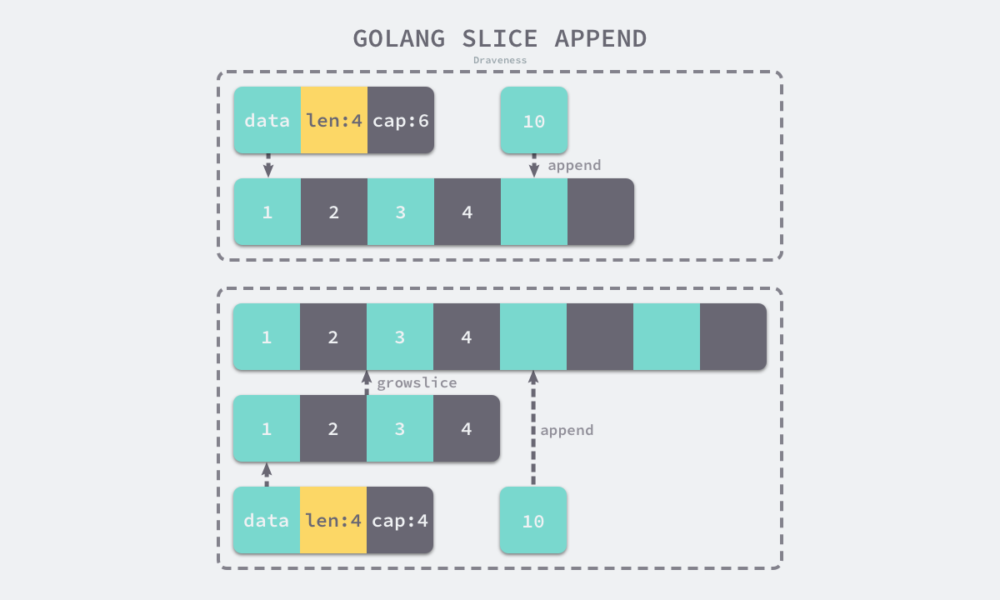
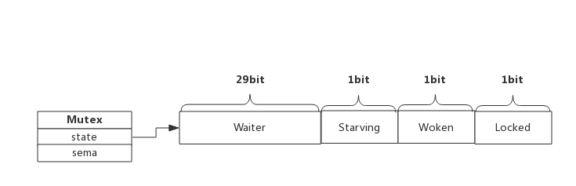

go语言中的数据类型分为值类型和引用类型。

值类型包括：int，float，bool，string，数组，结构体。值类型变量存储的是值，使用`new`初始化

引用类型包括：slice、map、interface、chan(nel)、函数。引用类型的变量存储的是地址，使用`make`初始化

在go语言中无论是值类型还是引用类型，全都遵循值拷贝/值复制。

# iota

##### 介绍：

iota是go语言中在const声明块中的行索引（下标从0开始），const块中当前一行通过iota表达式创建常量后，当前行在不声明的情况下默认使用前一行的iota表达式，但是此时iota所表示的值加一

##### 底层实现：

目录：go/ast

底层通过`ValueSpec`来表示const块中的一行，`ValueSpec.Names`表示一行中的多个常量

```go
type ValueSpec struct {
	Doc     *CommentGroup // associated documentation; or nil
	Names   []*Ident      // value names (len(Names) > 0)
	Type    Expr          // value type; or nil
	Values  []Expr        // initial values; or nil
	Comment *CommentGroup // line comments; or nil
}
```

const块中多行的常量实际上是ValueSpec的切片，在编译期间构造常量时的伪算法如下：

```go
for iota, spec := range ValueSpecs{
    for i, name := range spec.Names{
        obj :=NewConst(name, iota...)//此处将iota传入，用于构造常量
        ...
    }
}
```

##### 实例代码：

```go
const A = 0
const (
	B, C, D = 2 * iota, 2 * (iota - 1), 2 * (iota + 1)
	_, _, _
	E, F, G
	H = 3 * iota
	I
)

/*
A =  0
B =  0  C =  -2  D =  2  iota = 0
E =  4  F =   2  G =  6  iota = 2
H =  9                   iota = 3
I =  12                  iota = 4
*/
```

# struct

##### 介绍

结构体，与`c`语言中的`struct`类似，同时也可以具备`c++`或`java`中的class的能力。在结构体内部可以定义值类型和引用类型的任意组合。结构体中的字段定义，通过首字母是否大小写来判断是否对外暴露，同时结构体的定义也通过首字母是否大小写来判断结构体在外部包中是否可用。结构体字段的定义支持进行元信息的说明，例如`json:"field"`，称为字段的`tag`信息。对结构体中的字段或绑定在结构体上的方法的使用通过`.`操作符进行访问，不区分结构体还是结构体指针，因为`go`编译器优化了`->`操作符，当使用结构体指针时会自动解指针。

结构体中不包含任何字段，称为空结构体，空结构体在内存中不占空间，仅仅作为占位符使用。

结构体可以最为函数的接收器，通过与函数绑定实现面向对象中的方法。结构体无法继承，但是可以通过结构体嵌套的方式具备类似“继承”的能力，结构体中字段的定义支持使用匿名字段，将某个复合类型作为结构体的字段而不需要声明变量名，在使用这个复合类型的属性或方法时可直接调用。

##### 实例代码

```go
type Animal struct {
	Eat string
}

type Cat struct {
	Animal
  Name string  `json:"name"`
}

type Dog struct {
	Animal
  Name string  `json:"name"`
}

func main() {
	kitty := Cat{ // kitty 为一个 Cat 结构体变量
		Animal{},
		"kitty",
	}
	kitty.Eat = "fish"

	wangwang := new(Dog) // wangwang 为一个 *Dog 结构体指针变量
	wangwang.Eat = "bones"
	wangwang.Name = "wangwang"

	s := make([]struct{}, 0, 1)
	s = append(s, struct{}{})
	s = append(s, struct{}{})
	fmt.Println("s[0] = ", unsafe.Pointer(&s[0]), "s[1] = ", unsafe.Pointer(&s[1]))
	// s[0] =  0x1168e80 s[1] =  0x1168e80
}
```

# array

##### 介绍

数组与结构体都属于复合数据类型，两者在传参时进行值传递，全量拷贝。与`C/C++`中的数组不同的是，`go`语言中的数组被视为一个整体，数组的长度时数组类型的组成部分，不同长度或不同类型的数据组成的数组都是不同的数组类型，不同长度的数组因为类型不同无法直接赋值，一个数组变量表示整个数组而不是数组中第一个元素的地址。

数组的比较，如果数组中的元素类型可以比较，那么两个数组是可以用 `==` 直接比较判断

空数组不占用内存空间与空结构体类似

数组的初始化方式：

```go
arr1 := [4]{0,1,2,3}
arr2 := [...]{0,1,2,3} // 编译器会自行推导数组大小
```

# string

##### 介绍

字符串，不可修改，任何字符串增加/删除/交换操作都会重新申请内存创建新的字符串。字符串其底层通过 `[]byte` 实现，所以字符串的定义，就是`byte`数组指针和`byte`数组长度的赋值。

字符串中保存字符时使用`utf-8`编码，遍历字符串时按照`utf-8`编码进行遍历，如果出现损坏的编码值也会被正常遍历。如果字符串保存中文等非英文字符，在进行遍历时可能会出现乱码。

go语言中定义了`rune`类型，其底层为`uint32`，保存一个`Unicode`码点，来表示汉字、韩文、日文等非英文字符中的一个文字字符，与字符串的转换时会发生内存的重新分配。遍历`[]rune`数组可以单独取出每个文字字符而不会出现乱码。

字符串拼接拼接方式及性能比较：

` fmt.Sprintf` **<** `"+"` **<** `[]byte` **~=** `bytes.Buffer` **<** `strings.Builder `

`[]byte`到`string`的转换在某些场景下不需要拷贝内存而是直接把`string`的数组指针指向`[]byte`内存

- `map`查找时`key`值为`string`类型，`m[string(b)]`，切片到字符串的转换不发生内存拷贝
- 字符串拼接时，如`”<” + “string(b)” + “>”`，切片到字符串的转换不发生内存拷贝
- 字符串比较时，如`string(b) == “golang”`，切片到字符串的转换不发生内存拷贝

##### 实例代码

```go
func plusstring(n int, s string) string {
	tmp := ""
	for i := 0; i < n; i++ {
		tmp += s
	}
	return tmp
}
func fmtsprintf(n int, s string) string {
	tmp := ""
	for i := 0; i < n; i++ {
		tmp = fmt.Sprintf("%s%s", tmp, s)
	}
	return tmp
}

func stringbuilder(n int, s string) string {
	var builder strings.Builder
	for i := 0; i < n; i++ {
		builder.WriteString(s)
	}
	return builder.String()
}

func stringbuilderalloc(n int, s string) string {
	var builder strings.Builder
	builder.Grow(n * len(s))
	for i := 0; i < n; i++ {
		builder.WriteString(s)
	}
	return builder.String()
}

func bytesbuffer(n int, s string) string {
	var buf bytes.Buffer
	for i := 0; i < n; i++ {
		buf.WriteString(s)
	}
	return buf.String()
}

func bytesbufferalloc(n int, s string) string {
	var buf bytes.Buffer
	buf.Grow(n * len(s))
	for i := 0; i < n; i++ {
		buf.WriteString(s)
	}
	return buf.String()
}

func bytearray(n int, s string) string {
	tmp := []byte{}
	for i := 0; i < n; i++ {
		tmp = append(tmp, []byte(s)...)
	}
	return string(tmp)
}

func bytearrayprealloc(n int, s string) string {
	tmp := make([]byte, 0, n*len([]byte(s)))
	for i := 0; i < n; i++ {
		tmp = append(tmp, []byte(s)...)
	}
	return string(tmp)
}

go test -bench=.
goos: darwin
goarch: amd64
pkg: study/daily
cpu: Intel(R) Core(TM) i5-6200U CPU @ 2.30GHz
BenchmarkPlusstring-4                    2351838               887.9 ns/op
BenchmarkFmtsprintf-4                     475735              2135 ns/op
BenchmarkStringBuilder-4                 9144573               133.1 ns/op
BenchmarkStringBuilderalloc-4           13981028                83.09 ns/op
BenchmarkBytesbuffer-4                   8114152               147.0 ns/op
BenchmarkBytesbufferalloc-4              8331634               149.1 ns/op
BenchmarkBytearray-4                     5765785               215.9 ns/op
BenchmarkBytearrayprealloc-4             9463290               125.6 ns/op
```


# slice

##### 介绍

go语言中的动态数组类型，底层仍是通过数组实现，通过有自动扩容进行增长。

通过`make()`内置方法创建切片时，需要声明长度（通过`len()`内置方法取得）和容量（通过`cap()`内置方法取得），如：`s := make([]type,0,1)`

`append()`内置方法，用来向切片中添加元素，执行`append`操作时，当新元素的加入导致切片长度超过限制就会触发扩容操作，扩容策略为：当容量小于1024个元素时扩容为切片长度的2倍的大小，当容量超过1024个元素时扩容为切片长度的1.25倍的大小，扩容操作可能会生成新的切片。



切片支持`s[start:end]`的操作，即在原切片上进行切片，得到的新切片为按照“左闭右开”的规则在原切片上取`start`位置开始到`end`位置结束的内容。该操作不会创建新的切片，而是与复用底层数组，所以如果在长度较大的切片上执行这种操作，那么底层数组中除了新切片中的元素，其他数组元素所占用的空间将得不到释放，因为仍然存在底层数组对象的引用，无法被垃圾回收掉。这种情况下推荐使用`copy`内置方法可以实现切片的批量拷贝，其底层通过`runtime.memmove`进行内存操作。

切片的初始化方式：

```go
arr[0:3] or slice[0:3]
slice := []int{1, 2, 3}
slice := make([]int, 10, 20)
```

##### 底层实现

目录：runtime/slice.go

```go
type slice struct {
	array unsafe.Pointer
	len   int  // 长度，已存在元素的数量
	cap   int  // 容量，已存在元素的数量 + 空位的数量
}
```

##### 实例代码

```go
  a := make([]int, 0, 2)
	fmt.Println("a ", unsafe.Pointer(&a), "len = ", len(a), "cap = ", cap(a))
	a = append(a, 0)
	fmt.Println("a ", unsafe.Pointer(&a), "len = ", len(a), "cap = ", cap(a))
	a = append(a, 1)
	fmt.Println("a ", unsafe.Pointer(&a), "len = ", len(a), "cap = ", cap(a))
	a = append(a, 2)
	fmt.Println("a ", unsafe.Pointer(&a), "len = ", len(a), "cap = ", cap(a))
	/*
		a  0xc0000a4018 len =  0 cap =  2
		a  0xc0000a4018 len =  1 cap =  2
		a  0xc0000a4018 len =  2 cap =  2
		a  0xc0000a4018 len =  3 cap =  4   // 触发扩容的数据少，优先在原来内存上进行realloc
	*/
```

# map

##### 介绍

go语言中的`map`的是无序哈希表的实现，通过开放链地址的方式解决哈希冲突。

通过`make()`内置方法创建`map`时，需要声明大小（通过`len()`内置方法取得），如：`m := make(map[type]type,1)`

##### 底层实现

目录：runtime/map.go

底层由`hmap`定义，`hmap.count`表示大小，`hmap.flags`表示是否正在扩容阶段，`hmap.B`表示`bucket`数量（bucket的数量为2^B），`hmap.buckets`表示存储数据的桶，`hmap.oldbuckets`表示在扩容阶段原`hmap.oldbuckets`中的数据，查找时使用旧的hash值。

`bmap`表示bucket的定义，一个bucket可以保存8个`k-v`对，`bmap.tophash`保存这8个`k-v`对的哈希值的高八位，用于查找。

`mapextra`表示发生冲突时的数据存储位置，发生hash冲突的的数据将保存在`mapextra.overflow`中。

```go
// A header for a Go map.
type hmap struct {
	// Note: the format of the hmap is also encoded in cmd/compile/internal/reflectdata/reflect.go.
	// Make sure this stays in sync with the compiler's definition.
	count     int // # live cells == size of map.  Must be first (used by len() builtin)
	flags     uint8
	B         uint8  // log_2 of # of buckets (can hold up to loadFactor * 2^B items)
	noverflow uint16 // approximate number of overflow buckets; see incrnoverflow for details
	hash0     uint32 // hash seed

	buckets    unsafe.Pointer // array of 2^B Buckets. may be nil if count==0.
	oldbuckets unsafe.Pointer // previous bucket array of half the size, non-nil only when growing
	nevacuate  uintptr        // progress counter for evacuation (buckets less than this have been evacuated)

	extra *mapextra // optional fields
}

// mapextra holds fields that are not present on all maps.
type mapextra struct {
	// If both key and elem do not contain pointers and are inline, then we mark bucket
	// type as containing no pointers. This avoids scanning such maps.
	// However, bmap.overflow is a pointer. In order to keep overflow buckets
	// alive, we store pointers to all overflow buckets in hmap.extra.overflow and hmap.extra.oldoverflow.
	// overflow and oldoverflow are only used if key and elem do not contain pointers.
	// overflow contains overflow buckets for hmap.buckets.
	// oldoverflow contains overflow buckets for hmap.oldbuckets.
	// The indirection allows to store a pointer to the slice in hiter.
	overflow    *[]*bmap
	oldoverflow *[]*bmap

	// nextOverflow holds a pointer to a free overflow bucket.
	nextOverflow *bmap
}

// A bucket for a Go map.
type bmap struct {
	// tophash generally contains the top byte of the hash value
	// for each key in this bucket. If tophash[0] < minTopHash,
	// tophash[0] is a bucket evacuation state instead.
	tophash [bucketCnt]uint8
	// Followed by bucketCnt keys and then bucketCnt elems.
	// NOTE: packing all the keys together and then all the elems together makes the
	// code a bit more complicated than alternating key/elem/key/elem/... but it allows
	// us to eliminate padding which would be needed for, e.g., map[int64]int8.
	// Followed by an overflow pointer.
}

```


*ps：图中逻辑结构关系不代表底层数据结构的关系*

查找过程

- 跟据`key`值算出哈希值
- 取哈希值低位与`hmap.B`取模确定bucket位置
- 取哈希值高位在`bmap.tophash`数组中查询
- 如果`tophash[i]`与hash高八位相等，则去到该bucket中的依次比较`key`值进行查找
- 当前bucket没有找到，则继续从下个`overflow`的bucket中查找。
- 如果当前处于扩容迁移阶段，则优先从`oldbuckets`查找

插入过程

- 跟据`key`值算出哈希值
- 取哈希值低位与`hmap.B`取模确定bucket位置
- 在bucket中查找该`key`是否已经存在，如果存在则更新值
- 如果没找到将`key`，将`key-value`插入

渐进扩容策略：

负载因子 = 键数量 / bucket的数量，在go中被编码为6.5，负载因子过小，说明空间利用率低，负载因子过大说明冲突严重，存取效率低。

- 扩容条件：1.负载因子＞6.5  2.溢出bucket数量＞2^15
- 增量扩容：当负载因子过大时，会新建一个bucket，然后逐步每次迁移2个键值对

# interface

##### 介绍

接口有`interface{}`，称"空接口"和带有成员方法的非空接口两种，这两种接口的底层有不同的实现。

空接口具有特殊性，因其不持有任何方法所以任意数据类型的默认实现了空接口，任意类型都可以转换为空接口，这在函数设计时，当无法确定外部参数的类型时非常有用。

##### 底层实现

```go
// 非空interface的底层实现
type iface struct {
	tab  *itab  // 保存类型、方法等信息
	data unsafe.Pointer  // 指向的iface绑定对象的原始数据的副本，值传递
}
// inter 表示 interface 本身的静态类型
// _type 表示 interface 对应具体对象的类型， _type 和 iface 中的 data 简要描述一个变量。_type 是这个变量对应的类型，data 是这个变量的值
// hash 字段和 _type 中存的 hash 字段一致，以便于快速类型断言
// fun 表示虚函数表，它指向的是具体类型的函数方法。通过指针偏移找到对应内存地址存储的各个方法
type itab struct {
	inter *interfacetype
	_type *_type
	hash  uint32 // copy of _type.hash. Used for type switches.
	_     [4]byte
	fun   [1]uintptr // variable sized. fun[0]==0 means _type does not implement inter.
}
// _type 表示所有数据类型的元信息
type _type struct {
	size       uintptr // 类型占用内存大小
	ptrdata    uintptr // 包含所有指针的内存前缀大小
	hash       uint32  // 类型 hash
	tflag      tflag   // 标记位，主要用于反射
	align      uint8   // 对齐字节信息
	fieldAlign uint8   // 当前结构字段的对齐字节数
	kind       uint8   // 基础类型枚举值
	equal func(unsafe.Pointer, unsafe.Pointer) bool // 比较两个形参对应对象的类型是否相等
	gcdata    *byte    // GC 类型的数据
	str       nameOff  // 类型名称字符串在二进制文件段中的偏移量
	ptrToThis typeOff  // 类型元信息指针在二进制文件段中的偏移量
}
```

```go
// interface{}的底层实现
type eface struct {
	_type *_type
	data  unsafe.Pointer
}
```

# channel

##### 介绍

go语言中所特有的数据类型，通信通道，创建一个`channel`可以通过`c := make(chan type, 1)`来创建。`channel`中的元素可以时任意的数据类型。长度为0的`channel`为无缓冲通道。有缓存的`channel`采用环形队列作为缓冲区。读取缓冲为空或者无缓冲发生阻塞，写入缓冲满或者无缓冲发生阻塞。

`channel`时go语言中用来协程间通信的利器。

***使用注意事项***

| channel | nil      | closed              |
| ------- | -------- | ------------------- |
| 写入    | deadlock | panic               |
| 读取    | deadlock | 返回类型零值和false |
| 关闭    | panic    | 正常                |

##### 底层实现

`hchan`结构中的`hchan.qcount`、`hchan.dataqsiz`和`hchan.buf`保存环形队列的元素个数，队列长度和内存地址i

`hchan`结构中的`hchan.elemtype`和`hchan.elemsize`保存类型和类型大小

`hchan`结构中的`hchan.recvq`和`hchan.sendq`保存读写goroutine队列

channel的底层通过环形队列和锁来实现并发的控制。

```go
type hchan struct {
	qcount   uint           // total data in the queue
	dataqsiz uint           // size of the circular queue
	buf      unsafe.Pointer // points to an array of dataqsiz elements
	elemsize uint16
	closed   uint32
	elemtype *_type // element type
	sendx    uint   // send index
	recvx    uint   // receive index
	recvq    waitq  // list of recv waiters  有 recv 行为（也就是 <-ch）阻塞在 channel 上的 goroutine 队列
	sendq    waitq  // list of send waiters  有 send 行为 (也就是 ch<-) 阻塞在 channel 上的 goroutine 队列

	// lock protects all fields in hchan, as well as several
	// fields in sudogs blocked on this channel.
	//
	// Do not change another G's status while holding this lock
	// (in particular, do not ready a G), as this can deadlock
	// with stack shrinking.
	lock mutex
}

type waitq struct {
	first *sudog
	last  *sudog
}

type sudog struct {
    // The following fields are protected by the hchan.lock of the
    // channel this sudog is blocking on. shrinkstack depends on
    // this for sudogs involved in channel ops.

    g          *g
    selectdone *uint32 // CAS to 1 to win select race (may point to stack)
    next       *sudog
    prev       *sudog
    elem       unsafe.Pointer // data element (may point to stack)

    // The following fields are never accessed concurrently.
    // For channels, waitlink is only accessed by g.
    // For semaphores, all fields (including the ones above)
    // are only accessed when holding a semaRoot lock.

    acquiretime int64
    releasetime int64
    ticket      uint32
    parent      *sudog // semaRoot binary tree
    waitlink    *sudog // g.waiting list or semaRoot
    waittail    *sudog // semaRoot
    c           *hchan // channel
}
```

##### 实例代码

```go
main.go

import (
	"fmt"
)

func producer(c chan<- int) {
	for i := 0; i < 10; i++ {
		fmt.Println("producer", i, "-> c")
		c <- i
	}
}

func consumer(c <-chan int) {
	for v := range c {
		fmt.Println("consumer c ->", v)
	}
}

func main() {
	c := make(chan int, 3)
	go consumer(c)
	go producer(c)
	time.Sleep(time.Second * 5)
}

go run main.go
producer 0 -> c
producer 1 -> c
producer 2 -> c
producer 3 -> c
producer 4 -> c
consumer c -> 0
consumer c -> 1
consumer c -> 2
consumer c -> 3
consumer c -> 4
producer 5 -> c
producer 6 -> c
producer 7 -> c
producer 8 -> c
producer 9 -> c
consumer c -> 5
consumer c -> 6
consumer c -> 7
consumer c -> 8
consumer c -> 9
```


# function

##### 介绍

go语言中的函数同样有具名函数、匿名函数、闭包函数，函数支持多参数和多返回值，参数统一都是以值传递的方式（对于引用类型，传参即传地址），参数支持可变参数（切片作为参数传递）可变参数的声明必须放在参数的最后一个位置，当使用可变参数时，通过`...`运算进行解封装，需要注意的是，当使用空接口类型的可变参数时，传参时解封装与不解封装两者的结果不同。

闭包函数：当匿名函数引用了外部作用域中的变量时就成了闭包函数，闭包是引用传递。

##### 实例代码

```go
package main

import (
	"fmt"
)

func f1(data ...interface{}) {
	fmt.Println(data...)
}

func f2() func() int {
	a, b := 0, 1
	return func() int {
		tmp := a + b
		a, b = b, tmp
		return tmp
	}
}

func main() {
	var array []interface{} = []interface{}{0, 1, 2, 3, 4}
	f1(array)
	f1(array...)

	f := f2()
	for i := 0; i < 10; i++ {
		fmt.Printf("%d ", f())  // 此时f中的a,b已经从f2的栈逃逸到堆上
	}
}

go run ./main.go
[0 1 2 3 4]
0 1 2 3 4
1 2 3 5 8 13 21 34 55 89
```


# sync.Mutex\sync.Map\sync.signalflight\sync.semaphore\sync.errorgroup\等

##### 介绍

前面的数据类型都是通用场景下的数据类型，这里简要介绍几种特殊场景下的几种数据类型，`sync.Mutex`和`sync.Map`都是go语言在并发场景下所常用的，

`sync.Mutex`是go语言的互斥锁，其底层实现是由两个`int32`的类型组成的结构体，通过CAS操作进行状态的判断是否获得锁，通过信号量来通过go运行时唤醒goroutine，在锁的获取过程中存在自旋状态，同时也有读写锁`sync.RWMutex`，用于并发场景下对共享资源的读写。

##### 底层实现



- Locked: 表示该Mutex是否已被锁定，0：没有锁定 1：已被锁定。
- Woken: 表示是否有协程已被唤醒，0：没有协程唤醒 1：已有协程唤醒，正在加锁过程中。
- Starving：表示该Mutex是否处于饥饿状态， 0：没有饥饿 1：饥饿状态，说明有协程阻塞了超过1ms。
- Waiter: 表示阻塞等待锁的协程个数，协程解锁时根据此值来判断是否需要释放信号量。
- 自旋：加锁时，如果当前Locked位为1，说明该锁当前由其他协程持有，尝试加锁的协程并不是马上转入阻塞，而是会持续的探测Locked位是否变为0，这个过程即为自旋过程
- 自旋必须满足以下所有条件：
  - 自旋次数要足够小，通常为4，即自旋最多4次
  - CPU核数要大于1，否则自旋没有意义，因为此时不可能有其他协程释放锁
  - 协程调度机制中的Process数量要大于1，比如使用GOMAXPROCS()将处理器设置为1就不能启用自旋
  - 协程调度机制中的可运行队列必须为空，否则会延迟协程调度
- Mutex的两种模式 starving
  - normal	默认情况下，Mutex的模式为normal。该模式下，协程如果加锁不成功不会立即转入阻塞排队，而是判断是否满足自旋的条件，如果满足则会启动自旋过程，尝试抢锁。
  - starvation   被唤醒的协程得到CPU后开始运行，此时发现锁已被抢占了，自己只好再次阻塞，不过阻塞前会判断自上次阻塞到这次阻塞经过了多长时间，如果超过1ms的话，会将Mutex标记为”饥饿”模式，然后再阻塞。处于饥饿模式下，也即一旦有协程释放了锁，那么一定会唤醒协程，被唤醒的协程将会成功获取锁，同时也会把等待计数减1。
- woken
  - Woken状态用于加锁和解锁过程的通信，举个例子，同一时刻，两个协程一个在加锁，一个在解锁，在加锁的协程可能在自旋过程中，此时把Woken标记为1，用于通知解锁协程不必释放信号量了
- 重复解锁引发panic的原因
  - Unlock过程分为将Locked置为0，然后判断Waiter值，如果值>0，则释放信号量。多次unlock会释放多个信号量进而唤醒多个协程去抢锁，应该使用defer来避免死锁

##### 介绍

`sync.Map`是go语言的并发安全的`map`结构体，其底层通过读写分离实现，在数据读多写少的情况下具有很好的性能，写操作仍然会通过读写锁控制，并且在读操作时，在未命中的情况下会采取击穿读写层，进行数据从写层到读层的迁移策略。

##### 介绍

`sync.singleflight`