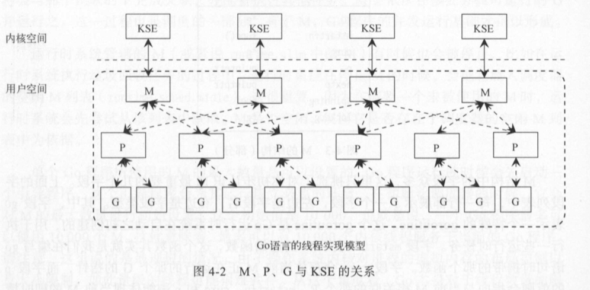
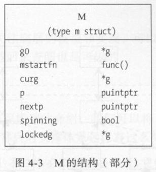
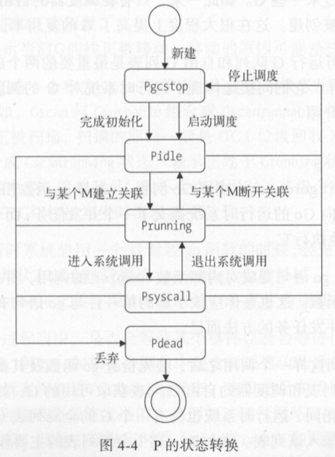
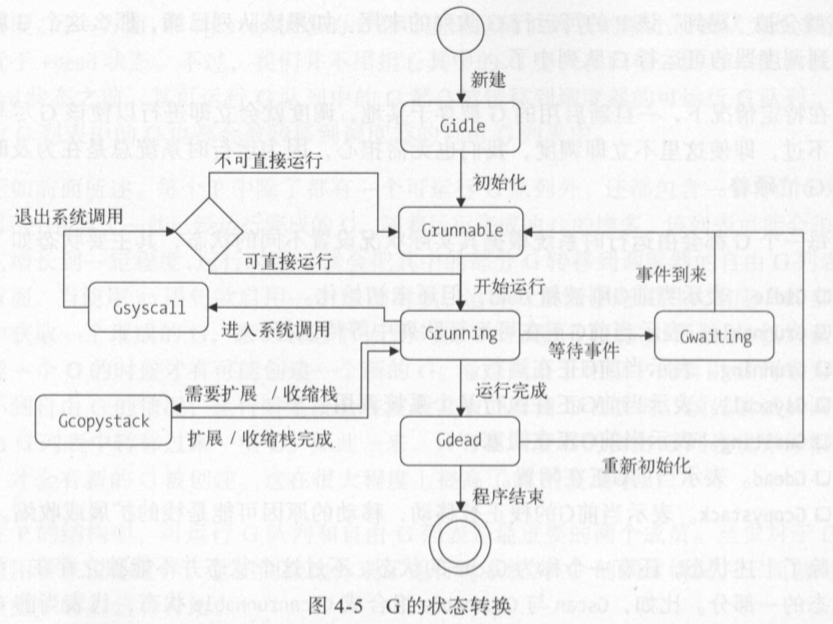
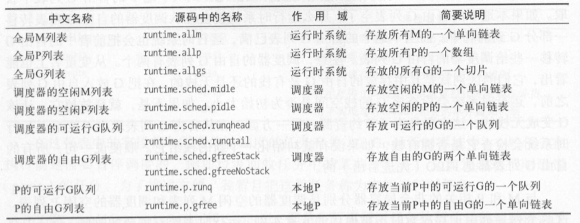
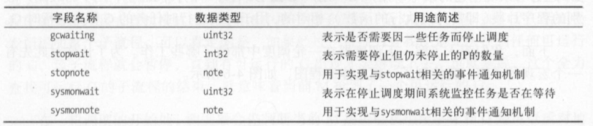
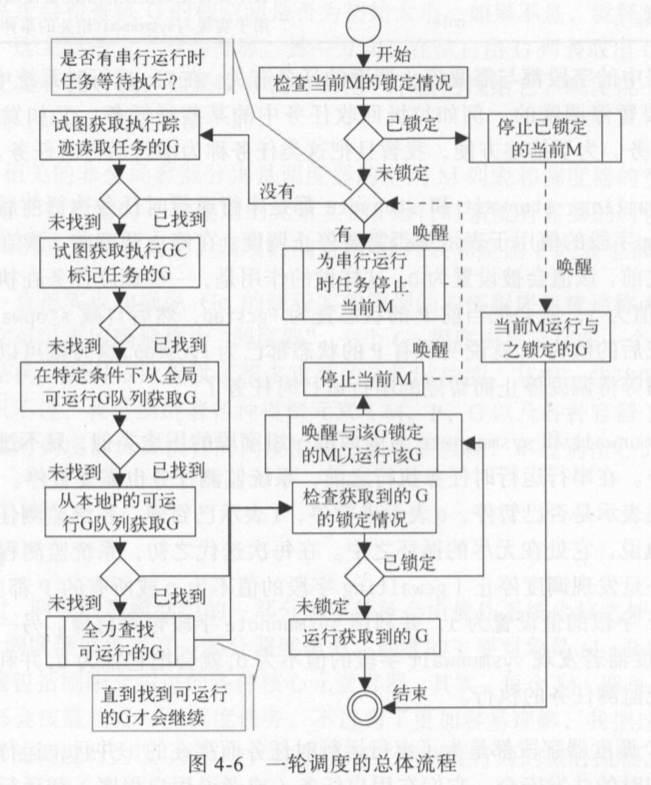

# Go语言简要介绍

- ##### 语言特性：开源、静态编译类型、跨平台、自动垃圾回收、原生并发、完善的构建工具、多编程范式、代码风格统一、高效编程和运行、丰富的标准库

- ##### 工程结构

  源码文件：命令源码文件(main包)、库源码文件(文件命名与所属包/目录名一致)、测试源码文件

  代码包：包的导入使用别名简化包中的程序实体名称，使用 . 来命名可以直接使用包中的程序实体，使用 “_” 只初始化而不适用包

  包初始化：init()，在main函数执行之前会分析依赖情况然后执行init函数。执行顺序全局变量初始化->包初始化init()->main()

- 数据类型

  类型断言：var i1,ok = interface{}(a).(b)，要判断的类型强制转换成接口类型，若a是b同一种类型的数据则i1值为a在b类型中的实际值ok为nil，否则i1为b类型的零值(默认值)。用switch语句进行类型判断 switch i := v.(type) { ... }

  rune类型用来存储Unicode字符(32位二进制数表示的有符号整型数)

  切片是对数组的包装形式，底层实现是数组

# 并发编程基础

- IPC通信：

  基于通信和基于共享内存。基于通信的方式有管道(字节流)、消息队列(结构化数据)；共享内存区是一种基于共享内存的最快的IPC方法。基于信号的IPC方法有信号(异步)和信号量(同步)。go支持的IPC方法由管道、信号和socket

- 进程：

  fork()，子进程会获得父进程的数据段、堆和栈的副本，共享父进程代码段。采用写时复制；exec()子进程可以通过该系统调用加载新的程序到自己的内存中替换掉原先内存中的数据段、堆、栈和代码段；内核所有程序的父进程，孤儿进程会被内核进程收养。

```go
pid := os.Getpid()、ppid := os.Getppid()
```

- 进程的状态：
  - 可运行状态R
  - 可中断的睡眠状态S(等待网络响应或者信号到达)
  - 不可中断的睡眠状态D(不可被中断通常是在等待一个特殊事件如若同步的I/O操作等)
  - 暂停状态或跟踪状态T(GDB调试)
  - 僵尸状态Z(进程即将结束，绝大多数资源已经被回收，残留一些信息如退出码以及一些统计信息可能被父进程用到，进程的主体已经被删除只剩下一个空壳)
  - 退出状态X(不需要保留残留信息，可以让父进程忽略SIGCHLD信号或者子进程从父进程分离)

- 进程的空间

  内核和CPU负责维护虚拟内存和物理内存的映射关系，内核会为每个用户进程分配虚拟内存而不是物理内存。用户进程的内存直线相互独立互不干扰，是因为被映射到不同的物理内存之上。内核把进程的虚拟内存划分成若干页而物理内存由CPU划分成一个个叶框。
  - 内核空间：TASK_SIZE ~ 最大
  - 用户空间：0 ~ TASK_SIZE
  - [内核态] 和 (用户态的切换) ： (CPU用户态)--->用户进程发出系统调用--->(封装例程)--->CPU从用户态切换到内核态--->[系统调用处理程序]--->[系统调用服务例程]--->[系统调用处理程序]--->CPU从内核态切换到用户态--->(封装例程)---->(用户进程)

## 通信方式

### 管道

**匿名管道**：在管道塞满时阻塞。exec包执行两个程序，前者的输出通过管道作为后者的输出，声明*bytes.Buffer类型的变量，因为该类型实现了io.Reader()、io.Write()接口所以可以作为exec执行程序的e.Stdout或e.Stdin

**命名管道**：在管道的一端未准备好时阻塞。os.Pipe() 返回reader、writer和err，前两个返回值均是*os.File类型，读写两端需要并发执行；命名管道实现多路复用的关键是原子性操作，而os.Pipe基于系统的管道实现而系统管道不支持原子性操作，在Go标准库代码包io提供了基于内存的有原子性操作保证的管道称为内存管道io.Pipe()

### 信号

进程响应信号的三种方式，忽略，捕捉，执行默认操作。信号的默认操作有：终止进程、忽略该信号、终止进程并保存内存信息、停止进程、恢复进程

**os/signal**：

- signal.Notify(c chan<- os.Signal, sig ...os.Signal) 函数向系统发送当前进程的信号，若要取消部分信号的处理行为则可以再次调用Notify方法自定义处理方法的信号会覆盖掉系统的默认操作
- signal.Stop(c chan<- os.Signal) 函数会取消之前调用Notify函数时告知signal处理程序需要自行处理若干信号的行为。
- os/signal代码包中的Notify和Stop都是以signal接收通道作为唯一标识来对相应的信号集进行处理。在signal处理程序的内部，存在一个私有字典即信号集字典，用于存放以signal接收通道为键并以信号集合的辩题为元素的K-V对。如果不存在则添加，否则更新

### socket

非阻塞式socket实例 (C/C++ 默认阻塞式的socket)，返回 EAGAIN 错误

服务端：

```go
listener, err := net.Listen("tcp", "127.0.0.1:8080")
conn,err := listener.Accept()
```

客户端

```go
conn, err := net.Dial("tcp","127.0.0.1:8080")
conn, err := net.DialTimeout("tcp","127.0.0.1:8080",2*time.Second)
```

net.Conn接口类型其中包含了8个方法

- Read方法，io.Reader接口中唯一的方法 Read ，它是该接口的一个实现类型，所以可以调用bufio.NewReader函数包装变量conn
- Write方法，同理它也是io.Writer的一个实现类型，得到一个缓冲写入器其容量为40096个字节，如果写入的数据超过此容量则会全部或一部分直接写入代理的对象中，如conn，而不是先写入缓冲写入器
- Close方法
- LocalAddr 和 RemoteAddr
- SetDeadline、SetReadDeadline、SetWriteDeadline，设置超时时间是一个绝对时间，在设置超时时间后的相关I/O操作在到达超时时间还没完成，那么他们就会被立即结束执行并返回一个非nil的error类型值，所以如果要设置超时时间就需要在每次读取数据操作之前都设置超时时间。当不需要超时时间时要及时取消他调用**SetDeadline(time.Time{})**

# Go并发机制

## 原理探究

### 两级线程模型



- M

  代表一个内核线程，大多数情况下M的创建是因为没有足够的M关联P运行其中的G，在运行时系统进行监控和垃圾回收时也会创建新的M

  

|   字段   |       类型        |                   功能                   |
| :------: | :---------------: | :--------------------------------------: |
|    g0    | g结构体对象的指针 | 运行时系统启动时创建，执行一些运行时任务 |
| mstartfn |  func()函数指针   |          编写go语句时携带的函数          |
|   curg   | g结构体对象的指针 |             当前正在运行的G              |
|    p     |     指针类型      |               当前关联的P                |
|  nextp   |     指针类型      |   潜在关联的P，调度器会把P和M进行预连    |
| spinning |       bool        |      表示当前M是否正在寻找可运行的G      |
| lockedg  | g结构体对象的指针 |      表示当前锁定的G（如果有的话）       |

- P

  - 状态
    - Pidle：当前P并未与任何M存在关联
    - Prunning：当前P正在与某个M关联运行（会被抢占）
    - Psyscall：P中运行的那个G正在进行系统调用（会被抢占）
    - Pgcstop：运行时系统需要停止调度（如在垃圾回收之前会视图把全局P列表中的P都置于此状态，当垃圾回收结束之后全部从Pgcstop转移到Pidle状态）
    - Pdead：当前P已经不会再使用。如果在运行过程中调用`runtime.GOMAXPROCS`会把多余的P置于此状态

  

- G

  - 状态

    - Gidle：当前G刚刚被新分配还未被初始化
    - Grunnable：当前G正在可运行队列中等待运行
    - Grunning：当前G正在运行
    - Gsyscall：当前G正在执行某个系统调用
    - Gwaiting：当前G正在阻塞
    - Gdead：当前G正在闲置
    - Gcopystack：当前G的栈正被移动，移动的原因可能是栈的扩缩

    Gscan状态不能共存需要与其他状态组合成复合状态，表示当前G的栈正在被扫描

    

- GPM的容器

  

  - 从Gsyscall状态转出G会被放到调度器的可运行G队列
  - 从Gwaiting状态转出的G，有的会放入本地可运行队列，有的放入调度器可运行队列，有的直接运行（刚进行完网络I/O的G）
  - G转入Gdead状态后首先会被放入本地P的自由队列在运行时系统需要自由的G封装`go`函数时也会尝试从本地P自由队列中获取；如果获取不到则从调度器自由队列转移一部分到本地P自由队列

### 调度器

- Go运行时系统中，一些任务在执行前需要暂停调度，如垃圾回收任务中的某些子任务，发起运行时panic的任务等统称为串行运行时任务



- main goroutine的调度运行：Go的引导程序完成初始化工作之后，引导程序会在最后让调度器进行一轮调度让封装了main代码的G运行（用户G，用于封装运行时代码的为运行时G）



