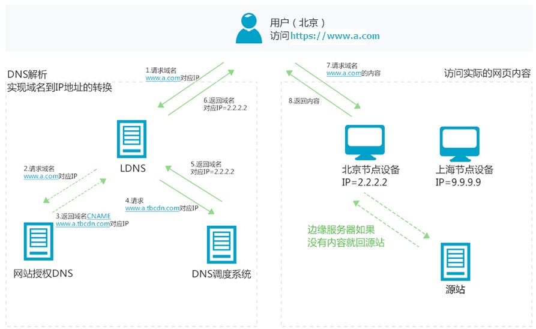
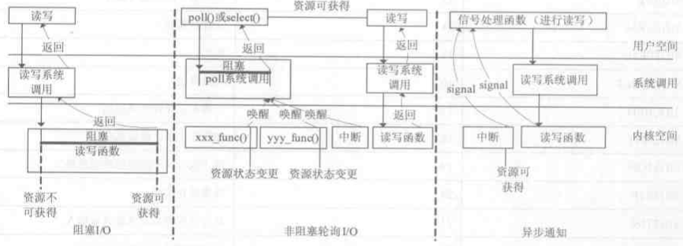
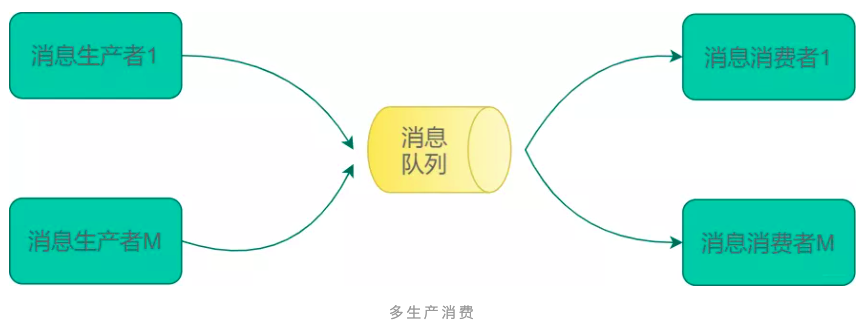
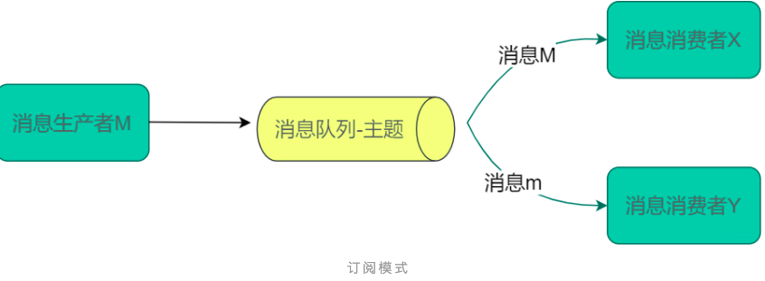
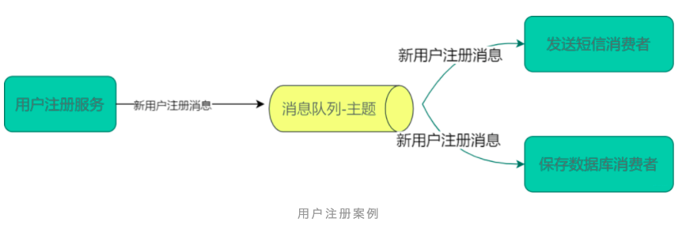
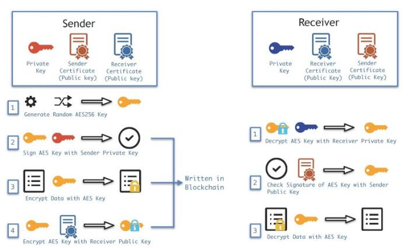

# 后端知识储备

## 分布式

### 水平伸缩

### 垂直伸缩

## 缓存思想（提升系统的读能力）

### 通读缓存

当前应用程序获取数据，如果数据存在于通读缓存中就直接返回。如果不存在于通读缓存，那么就访问数据源，同时将数据存放于缓存中。如**CDN**和**反向代理**

### 旁路缓存

应用程序需要自己从数据源读取数据，然后将这个数据写入到旁路缓存中。这样，下次应用程序需要数据的
时候，就可以通过旁路缓存直接获得数据了

### 缓存优缺点

#### 过期失效

数据更新后缓存成了脏数据，在每次写入缓存数据的时候标记失效时间，读取数据的时候检查数据是否失效，如果失效了就重新从数据源获取数据。

#### 过期通知

应用程序在更新数据源的时候，通知清除缓存中的数据。

### CDN

**内容分发网络**（Content Delivery Network，简称CDN）是建立并覆盖在承载网之上，由分布在不同区域的边缘节点服务器群组成的分布式网络（分布式存储技术）。

- #### 功能实体

  - 边缘服务器：缓存资源，实现内容的边缘传播和存储
  - 中心平台：负载均衡，用户集中接入对内容进行缓存负载均衡以及访问控制；调度，通过负载均衡为用户选择最佳的访问站点的路由功能；内容管理，负责内容的注入发布，更新，审核等

- #### 作用

  - 节省骨干网带宽，减少带宽需求量；
  - 提供服务器端加速，解决由于用户访问量大造成的服务器过载问题； 
  - 服务商能使用Web Cache技术在本地缓存用户访问过的Web页面和对象，实现相同对象的访问无须占用主干的出口带宽，并提高用户访问因特网页面的相应时间的需求； 
  - 能克服网站分布不均的问题，并且能降低网站自身建设和维护成本； 
  - 降低“通信风暴”的影响，提高网络访问的稳定性。

- #### 过程

  - CDN的加速资源跟域名绑定。
  - 通过域名访问资源，首先是通过DNS分查找离用户最近的CDN节点（边缘服务器）的IP
  - 通过IP访问实际资源时，如果CDN上并没有缓存资源，则会到源站请求资源，并缓存到CDN节点上，这样，用户下一次访问时，该CDN节点就会有对应资源的缓存了。

## 异步思想（提升系统的写能力）

### 事件驱动模型

### 同步异步

### 同步和异步区别

- 同步I/O：阻塞/非阻塞以及多路复用都是同步IO模型，需要用户进程主动询问系统内核
- 异步I/O：内核执行完IO操作后主动通知用户进程

- ### Reactor和Proactor区别
  - Reactor模式是同步I/O，处理I/O操作的依旧是产生I/O的程序；
  - Proactor是异步I/O，产生I/O调用的用户进程不会等待I/O发生，具体I/O操作由操作系统完成。
  - 异步I/O需要操作系统支持，Linux异步I/O为AIO，Windows为IOCP。通过**函数回调或信号机制**实现

### 消息队列

用户的请求存入消息队列之后立即返回，消息队列再把请求发给后台进行处理

- 那么目前主要的消息队列有哪些，其有缺点是什么

#### 点对点

对生产者多消费者的情况。一个消息被一个消费者消费。互不干扰某一个服务出现问题不会影响到全局

#### 订阅模式

开发人员在消息队列中设置主题，生产者往相应的主题发送数据，消费者从对应的主题中消费数据，每个消费者按照自己业务逻辑分别进行计算

### 异步优点

#### 快速响应

#### 削峰填谷

不同的场景其并发请求量不同。访问压力随时都在变化，系统的访问高峰和低谷的并发压力可能也有非常大的差距。如果按照压力最大的情况部署服务器集群，那么服务器在绝大部分时间内都处于**闲置状态**。但利用消息队列，我们可以将需要处理的消息放入消息队列，而消费者可以控制消费速度，因此能够降低系统访问高峰时压力，而在访问低谷的时候还可以继续消费消息队列中未处理的消息，保持系统的资源利用率

#### 降低耦合

如果调用是同步的，那么意味着调用者和被调用者必然存在依赖，一方面是代码上的依赖，应用程序需要依赖发送邮件相关的代码，如果需要修改发送邮件的代码，就必须修改应用程序，而且如果要增加新的功能

## 负载均衡

### HTTP重定向

- 吞吐率限制

  主站点服务器的吞吐率平均分配到被转移的服务器

- 重定向访问深度不同

  当重定向到一个复杂的动态页面，被转移的服务器的负载能力不可预知，请求工作量增加，重定向服务器IP地址可能需要暴露在公网上

### DNS负载均衡

- 特性：
  - 可以根据用户IP来进行智能解析
  - 动态DNS，每次IP地址变更及时更新DNS服务器
- 缺陷：
  - DNS解析的结果用户位置，为运维带来不便
  - DNS只会分析域名和IP而不会参考应用层协议中的调度策略
  - DNS解析时需要根据实际服务器的负载差异调整调度策略，需要自定义DNS服务器
  - DNS各级缓存，不同的缓存可能导致迷路

### 反向代理负载均衡

- ##### 转发HTTP请求

- 特性：

  - 调度策略丰富
  - 工作在HTTP层面，对反向代理的服务器的并大处理能力提高
  - 转发操作需要一定开销：如创建线程、与后端服务器建立TCP连接、接收后端服务器返回的处理结果、分析HTTP头部信息、用户空间和内核空间的频繁切换
  - 反向代理服务器可以监控后端服务器，比如系统负载、响应时间、是否可用、TCP连接数、流量等，从而根据这些数据调整负载均衡的策略。
  - 反向代理服务器可以让用户在一次会话周期内的所有请求始终转发到一台特定的后端服务器上（粘滞会话），这样的好处一是保持session的本地访问，二是防止后端服务器的动态内存缓存的资源浪费。

- 缺陷：

  - 工作在HTTP层，HTTP层的开销不可避免同时也限制了可扩展性和性能极限

### IP负载均衡

- 在传输层进行数据报文的转发
- 调度服务器和实际服务器通过网络连接
  - 受限于WAN交换机出口带宽的限制，因为调度服务器和实际服务器的通信建立在传输层
- 将调度器收到的IP数据包封装在一个新的IP数据包中，转交给实际服务器，然后实际服务器的响应数据包可以直接到达用户端
- 调度服务器和实际服务器不再同一个WANt网段中，可以将服务器根据需要部署在不同的地区

### 数据链路负载均衡

- 在数据链路层修改目标mac地址，实际服务器数据直接发送到客户端，不会受到WAN出口带宽的限制
- 调度服务器和实际服务器通过双绞线连接
  - 设置统一默认网关
  - 设置统一IP别名
  - IP别名添加在回环接口lo
  - 关闭实际服务器对网络中针对IP别名的ARP广播

## 数据存储

### 数据主从赋值

### 数据库分片

### NoSql数据库

## 安全性

### 数据加密

### 对称加密和非对称加密

### 相关加密解密场景

### HTTP攻击与防护

- 满足安全应该有哪些防御
  - 避免窃听(加密)
  - 避免篡改(加密)
  - 避免中间人攻击(认证)
  - 避免重放攻击(API调用限制，session认证)

- 中间人攻击的抵御方法

  - 认证中心签发数字签名

  - 认证中心自己有一把私钥和一把公钥，每个浏览器都会拥有各个认证中心的公钥。开发者需要向认证中心提交自己的域名，认证中心先把服务器的域名、公钥、证书有效期等信息进行Hash，形成**信息摘要**（不可逆向），再用自己的密钥进行加密，形成**数字签名**。因为数字签名是由认证中心私钥生成的，其他人都无法生成数字签名，只能解析数字签名。

  - 服务器发送数字证书

    服务器的域名、公钥、证书有效期等信息+**数字签名**=**数字证书**

  - 客户端验证数字证书
    1 用认证中心的公钥解密**数字签名**得到**信息摘要**
    2 对服务器的域名、公钥、证书有效期等信息进行Hash，形成**信息摘要**
    3 对比两个信息摘要，如果一致，则说明这个公钥确实来自我要访问的服务器。

  - 中间人攻击，可以修改明文的域名、公钥、证书有效期等信息，但是生成不了信息摘要，因此无法伪装目标服务器。

  - 客户端除了验证信息摘要，还要验证数字证书中的域名是否就是访问的域名、域名是否过期等信息。

- 区块链中加密传输过程

  

- 抵御接口被恶意调用重发的方法

  - http协议的无状态特性决定了是无法彻底避免第三方调用你的后台服务
  - 解决方案
    - 对于合法的认证访问，进行访问次数频率的限制
    - 通过认证来解决，如session、token等
      - token登录

## 高可用

### 概念

### 冗余备份

### 负载均衡

### 限流降级

### 异地多活

## 微服务

### 概念

