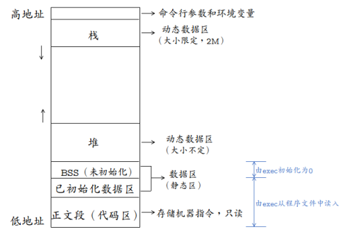
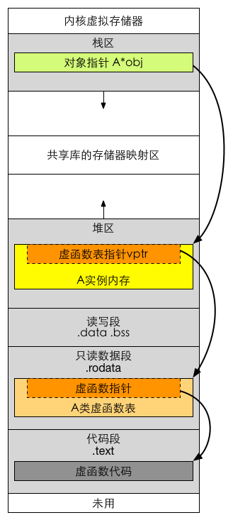

# C/C++面试宝典

### 源码到可执行文件的过程

预编译( .i 文件)——>编译——>汇编(win下生成.o文件，linux下生成.obj文件)——>链接(静态链接和动态链接)

### C/C++的内存分布



- 4G空间划分成3G用户空间和1G的内核空间
- 因为静态数据成员在**BSS和初始化数据段**分配内存，属于本类的所有对象共享，所以它不属于特定的类对象，在没有产生类对象前就可以使用。
  - 在C语言中代码执行之前初始化，属于编译期初始化。
  - 在C++中全局或局部静态对象当且仅当对象首次用到时进行构造，调用构造函数
- static修饰的成员函数，在**代码区**分配内存。
- 如果一个类是局部变量则该类数据存储在栈区，如果一个类是通过new/malloc动态申请的，则该类数据存储在堆区。
- 如果该类是virutal继承而来的子类，则该类的虚函数表指针和该类其他成员一起存储。
- 虚函数表指针指向只读数据段中的类虚函数表，虚函数表中存放着一个个函数指针，函数指针指向代码段中的具体函数。




### new，delete，malloc和free的关系

- malloc与free是C++/C语言的标准库函数，new/delete是C++的运算符。
- 用于申请动态内存和释放内存。都是在堆(heap)上进行动态的内存操作。

- new分配内存按照数据类型进行分配，malloc分配内存按照指定的大小分配；
- new返回的是指定对象的指针，而malloc返回的是void*，因此malloc的返回值一般都需要进行类型转化。
- new不仅分配一段内存，而且会调用构造函数，malloc不会。
- new分配的内存要用delete销毁，malloc要用free来销毁；delete销毁的时候会调用对象的析构函数，而free则不会。
- new是一个操作符可以重载，malloc是一个库函数。
- malloc分配的内存不够的时候，可以用realloc扩容。new没用这样操作。
- new如果分配失败了会抛出bad_malloc的异常，而malloc失败了会返回NULL。
- 申请数组时： new[]一次分配所有内存，多次调用构造函数，搭配使用delete[]，delete[]多次调用析构函数，销毁数组中的每个对象。而malloc则只能sizeof(int) * n。

#### malloc原理以及brk系统调用和mmap系统调用

- Malloc函数用于动态分配内存。为了减少内存碎片和系统调用的开销，malloc其采用内存池的方式，先申请大块内存作为堆区，然后将堆区分为多个内存块，以块作为内存管理的基本单位。当用户申请内存时，直接从堆区分配一块合适的空闲块。
- Malloc采用隐式链表结构将堆区分成连续的、大小不一的块，包含已分配块和未分配块；同时malloc采用显示链表结构来管理所有的空闲块，即使用一个双向链表将空闲块连接起来，每一个空闲块记录了一个连续的、未分配的地址。当进行内存分配时，Malloc会通过隐式链表遍历所有的空闲块，选择满足要求的块进行分配；当进行内存合并时，malloc采用边界标记法，根据每个块的前后块是否已经分配来决定是否进行块合并。
- Malloc在申请内存时，一般会通过brk或者mmap系统调用进行申请。其中当申请内存小于128K时，会使用系统函数brk在堆区中分配；而当申请内存大于128K时，会使用系统函数mmap在映射区分配。

### C和C++对比

- 设计思想上：C++是面向对象的语言，而C是面向过程的结构化编程语言
- 语法上：
  - C++具有封装、继承和多态三种特性
  - C++相比C，增加多许多类型安全的功能，比如强制类型转换、
  - C++支持范式编程，比如模板类、函数模板等

### 继承的优缺点

- 优点：类继承是在编译时刻静态定义的，且可直接使用，类继承可以较方便地改变父类的实现。
- 缺点：首先，因为继承在编译时刻就定义了，所以无法在运行时刻改变从父类继承的实现。其次，父类通常至少定义了子类的部分行为，父类的任何改变都可能影响子类的行为。如果继承下来的实现不适合解决新的问题，则父类必须重写或被其他更适合的类替换。这种依赖关系限制了灵活性并最终限制了复用性。

### C++面向对象特点

- 封装，将客观事物抽象成类，每个类对自身的数据和方法实行protection(private,protected,public)
- 继承，
  - 实现继承（指使用基类的属性和方法而无需额外编码的能力）、
  - 可视继承（子窗体使用父窗体的外观和实现代码）、
  - 接口继承（仅使用属性和方法，实现滞后到子类实现）。
- 多态，允许将子类类型的指针赋值给父类类型的指针，实现发送一个通用的消息而调用不同的方法；
  - 作用：隐藏实现细节，使得代码能够模块化；扩展代码模块，实现代码重用；接口重用：为了类在继承和派生的时候，保证使用家族中任一类的实例的某一属性时的正确调用。

### 子类析构时是否需要调用父类析构函数

- 析构函数调用的次序是先派生类的析构后基类的析构，也就是说在基类的的析构调用的时候,派生类的信息已经全部销毁了
- 构造函数的调用次序先调用基类的构造函数、然后调用派生类的构造函数；

### 多态，虚函数，纯虚函数

- 多态：是对于不同对象接收相同消息时产生不同的动作。
- C++的多态性具体体现在运行和编译两个方面：
  - 在程序运行时的多态性通过继承和虚函数来体现；
    在程序编译时多态性体现在函数和运算符的重载上
- 虚函数：在基类中冠以关键字 virtual 的成员函数。 它提供了一种接口界面。允许在派生类中对基类的虚函数重新定义。
- 纯虚函数的作用：在基类中为其派生类保留一个函数的名字，以便派生类根据需要对它进行定义。作为接口而存在 纯虚函数不具备函数的功能，一般不能直接被调用。一个类中至少有一个纯虚函数，那么这个类被称为抽象类。抽象类必须用作派生其他类的基类，而不能用于直接创建对象实例。但仍可使用指向抽象类的指针支持运行时多态性。

### 纯虚函数的实现

- 在类内部添加一个虚拟函数表指针，该指针指向一个虚拟函数表，该虚拟函数表包含了所有的虚拟函数的入口地址，每个类的虚拟函数表都不一样，在运行阶段可以循此脉络找到自己的函数入口。
- 纯虚函数相当于占位符，先在虚函数表中占一个位置由派生类实现后再把真正的函数指针填进去。除此之外和普通的虚函数没什么区别。

### C++中的模板类

- 可用来创建动态增长和减小的数据结构
- 它是类型无关的，因此具有很高的可复用性。
- 它在编译时而不是运行时检查数据类型，保证了类型安全
- 它是平台无关的，可移植性
- 可用于基本数据类型

### 引用和引用的声明需要注意的问题

- 引用就是某个目标变量的“别名”(alias)，对引用的操作与对变量直接操作效果完全相同。
- 注意问题：
  - 申明一个引用的时候，切记要对其进行初始化。
    引用声明完毕后，相当于目标变量名有两个名称，即该目标原名称和引用名，不能再把该引用名作为其他变量名的别名。
  - 声明一个引用，不是新定义了一个变量，它只表示该引用名是目标变量名的一个别名，它本身不是一种数据类型，因此引用本身不占存储单元，系统也不给引用分配存储单元。
  - 不能建立数组的引用。

### 引用作为函数参数的特点

- 传递引用给函数与传递指针的效果是一样的。
- 使用引用传递函数的参数，在内存中并没有产生实参的副本，它是直接对实参操作；
  - 而使用一般变量传递函数的参数，当发生函数调用时，需要给形参分配存储单元，形参变量是实参变量的副本；如果传递的是对象，还将调用拷贝构造函数。
- 使用指针作为函数的参数虽然也能达到与使用引用的效果，但是，在被调函数中同样要给形参分配存储单元，且需要重复使用"*指针变量名"的形式进行运算，这很容易产生错误且程序的阅读性较差；另一方面，在主调函数的调用点处，必须用变量的地址作为实参。而引用更容易使用，更清晰。

### 常引用

```c++
string foo( );
void bar(string & s);
bar(foo( ));
bar("hello world");
```

- foo( )和"helloworld"串都会产生一个临时对象，而在C++中，这些临时对象都是const类型的。表达式就是试图将一个const类型的对象转换为非const类型，这是非法的。
- 引用型参数应该在能被定义为const的情况下，尽量定义为const 。

### 引用作为函数返回值的好处

- 不产生返回值的副本
  - 不能返回局部变量的引用
  - 不能返回内部new分配的内存的引用；因为如果返回值只是作为临时变量出现那么就无法释放new分配的空间
  - 可以返回类成员的引用最好是const
- 流操作符重载返回值申明为“引用”的作用

### 引用和多态的关系

- 一个基类的引用可以指向他的派生类实例

### “引用”与指针的区别是什么？

- 指针有自己的一块空间，而引用只是一个别名；使用sizeof看一个指针的大小是4，而引用则是被引用对象的大小；
- 指针可以被初始化为NULL，而引用必须被初始化且必须是一个已有对象的引用；
- 作为参数传递时，指针需要被解引用才可以对对象进行操作，而直接对引 用的修改都会改变引用所指向的对象；
- 可以有const指针，但是没有const引用；
- 指针在使用中可以指向其它对象，但是引用只能是一个对象的引用，不能被改变；
- 指针可以有多级指针（**p），而引用只有一级；
- 指针和引用使用++运算符的意义不一样；
- 如果返回动态内存分配的对象或者内存，必须使用指针，引用可能引起内存泄露。
- 指针通过某个指针变量指向一个对象后，对它所指向的变量间接操作。程序中使用指针，程序的可读性差；而引用本身就是目标变量的别名，对引用的操作就是对目标变量的操作。

### 结构与联合有和区别

- 结构和联合都是由多个不同的数据类型成员组成, 但在任何同一时刻, 联合中只存放了一个被选中的成员（所有成员共用一块地址空间）,对于联合的不同成员赋值,将会对其它成员重写, 原来成员的值就不存在了
- 结构的所有成员都存在（不同成员的存放地址不同）, 而对于结构的不同成员赋值是互不影响的。

### 关联、聚合以及组合的区别

- 聚合，聚合类不需要对被聚合类负责

  ```c++
  class A 
  {
  	...
  }  
  class B
  { 
  	A* a;
   	.....
  }
  ```

- 组合，组合类需要对被组合类负责，共存亡

  ```c++
  class A
  {
  	...
  }
  class B
  {
  	A a;
  	...
  }
  ```

### 重载和重写

- 重载：指函数被重载
  - 相同的范围（在同一个类中）；
  - 函数名字相同；
  - 参数不同；
  - virtual 关键字可有可无。
- 重写(覆盖)：指派生类覆盖父类的方法
  - 不同的范围（分别位于派生类与基类）；
  - 函数名字相同；
  - 参数相同；
  - 基类函数必须有virtual 关键字。
- 实现原理上
  - 重载：编译器根据函数不同的参数表，对同名函数的名称做修饰，然后这些同名函数就成了不同的函数（至少对于编译器来说是这样的）。对于函数的调用，在编译器间就已经确定了，是静态的。也就是说，它们的地址在编译期就绑定了（早绑定），因此，重载和多态无关
  - 重写：和多态相关。当子类重新定义了父类的虚函数后，父类指针根据赋给它的不同的子类指针，动态的调用属于子类的该函数，这样的函数调用在编译期间是无法确定的（调用的子类的虚函数的地址无法给出）。因此，这样的函数地址是在运行期绑定的（晚绑定）。
- “隐藏”：是指派生类的函数屏蔽了与其同名的基类函数，规则如下：
  - 如果派生类的函数与基类的函数同名，但是参数不同。此时，不论有无virtual关键字，基类的函数将被隐藏（注意别与重载混淆）。
  - 如果派生类的函数与基类的函数同名，并且参数也相同，但是基类函数没有virtual 关键字。此时，基类的函数被隐藏（注意别与覆盖混淆）

### define关键字

- 不要以分号结尾

- 宏定义最好带上括号，否则会出现运算符优先级问题 如 

  ```c++
  #DEFINE MUL(x,y) x\*y 
  ==> MUL(1+2, 4+6)
  ==> 1+2\*4+6=15
  ```

- 宏定义的参数不要是多次运算后的结果

### 含参数的宏和函数的优缺点

- 函数调用时，先求出实参表达式的值，然后带入形参。而使用带参的宏只是进行简单的字符替换。
- 函数调用是在程序运行时处理的，分配临时的内存单元；而宏展开则是在编译时进行的，在展开时并不分配内存单元，不进行值的传递处理，也没有“返回值”的概念。
- 对函数中的实参和形参都要定义类型，二者的类型要求一致，如不一致，应进行类型转换；而宏不存在类型问题，宏名无类型，它的参数也无类型，只是一个符号代表，展开时带入指定的字符即可。宏定义时，字符串可以是任何类型的数据。
- 调用函数只可得到一个返回值，而用宏可以设法得到几个结果。
- 使用宏次数多时，宏展开后源程序长，因为每展开一次都使程序增长，而函数调用不使源程序变长。
- 宏替换不占运行时间，只占编译时间；而函数调用则占运行时间（分配单元、保留现场、值传递、返回）。一般来说，用宏来代表简短的表达式比较合适。

### 内联函数和宏的对比

- 宏是由预处理器对宏进行替代，而内联函数是通过编译器控制来实现的。
- 内联函数是真正的函数，只是在需要用到的时候，内联函数像宏一样的展开，所以取消了函数的参数压栈，减少了调用的开销。你可以象调用函数一样来调用内联函数，而不必担心会产生于处理宏的一些问题。
- 内联函数也有一定的局限性。就是函数中的执行代码不能太多了，如果，内联函数的函数体过大，一般的编译器会放弃内联方式，而采用普通的方式调用函数。这样，内联函数就和普通函数执行效率一样了。
- 内联函数是不能为虚函数的，但样子上写成了内联的，即隐含的内联方式。在某种情况下，虽然有些函数我们声明为了所谓“内联”方式，但有时系统也会把它当作普通的函数来处理，这里的虚函数也一样，虽然同样被声明为了所谓“内联”方式,但系统会把它当然非内联的方式来处理。

### static关键字的作用

- 全局静态变量
  在全局变量前加上关键字static，全局变量就定义成一个全局静态变量。静态存储区，在整个程序运行期间一直存在。
  初始化：未经初始化的全局静态变量会被自动初始化为0（自动对象的值是任意的，除非他被显式初始化）。
  作用域：全局静态变量在声明他的文件之外是不可见的，准确地说是从定义之处开始，到文件结尾。
- 局部静态变量
  在局部变量之前加上关键字static，局部变量就成为一个局部静态变量。内存中的位置：静态存储区。
  作用域：作用域仍为局部作用域，当定义它的函数或者语句块结束的时候，作用域结束。但是当局部静态变量离开作用域后，并没有销毁，而是仍然驻留在内存当中，只不过我们不能再对它进行访问，直到该函数再次被调用，并且值不变。
- 静态函数
  在函数返回类型前加static，函数就定义为静态函数。函数的定义和声明在默认情况下都是extern的，但静态函数只是在声明他的文件当中可见，不能被其他文件所用。
  函数的实现使用static修饰，那么这个函数只可在本cpp内使用，不会同其他cpp中的同名函数引起冲突。
  warning：不要再头文件中声明static的全局函数，不要在cpp内声明非static的全局函数，如果你要在多个cpp中复用该函数，就把它的声明提到头文件里去，否则cpp内部声明需加上static修饰。
- 类的静态成员
  在类中，静态成员可以实现多个对象之间的数据共享，并且使用静态数据成员还不会破坏隐藏的原则，即保证了安全性。因此，静态成员是类的所有对象中共享的成员，而不是某个对象的成员。对多个对象来说，静态数据成员只存储一处，供所有对象共用。
- 类的静态函数
  静态成员函数和静态数据成员一样，它们都属于类的静态成员，它们都不是对象成员。因此，对静态成员的引用不需要用对象名。
  在静态成员函数的实现中不能直接引用类中说明的非静态成员，可以引用类中说明的静态成员（这点非常重要）。如果静态成员函数中要引用非静态成员时，可通过对象来引用。如下格式：<类名>::<静态成员函数名>(<参数表>)

### volatile关键字

- 用volatile修饰的变量不会从寄存器上取而是从内存中读取
- 场景：
  -  并行设备的硬件寄存器（如：状态寄存器）
  -  一个中断服务子程序中会访问到的非自动变量(Non-automatic variables)
  -  多线程应用中被几个任务共享的变量

### 什么情况下只能用初始化列表初始化而不能用赋值初始化

- 类中含有const，reference成员变量
- 基类的构造函数都需要列表初始化

### C++是否类型安全

- 不是。可以用reinterpret cast进行不同类型指针之间的强制转换
- 四种类型转换
  - **static_cast**
    - 非多态类型转换(静态转换)，**对应于C中的隐式类型转换**不能用于两个不相关类型的转换，在编译时完成不能去除原有类型的类型修饰符，转换对象时没有动态类型检查在从基类转换成派生类时存在安全隐含
  - **reinterpret_cast**
    - 重新解释，可将一种类型转换成另一种不相关类型，**对应C中的强制类型转换**，处理无法进行隐式转换的情况；可以通过声明伪定义函数指针类型利用reinterpret_cast来强制转换带参数的函数，实现带参数的函数的不传参调用
  - **const_cast**
    - 他的功能就是删除变量的const属性，方便再次赋值；该转换在编译时完成，用于解除const，volatile修饰符，只能转换指针或者引用
  - **dynamic_cast**
    - 动态类型转换，如子类和父类之间的多态类型转换
    - 只能用于含有虚函数的类，用于类层次间的向上和向下转化。
    - 只能转指针或引用。
    - 向下转化时，如果是非法的对于指针返回NULL，对于引用抛异常。
    - 它通过判断在执行到该语句的时候变量的运行时类型和要转换的类型是否相同来判断是否能够进行向下转换。

### main函数执行之前会执行什么代码

- 静态变量、全局变量、全局对象的分配；全局对象会调用构造函数在main函数结束后调用它的析构函数
- 系统会为某个启动的程序分配地址空间,创建进程和主线程；

### 内存分配以及他们的区别

- 静态存储区：全局变量、static变量
- 栈空间：函数内部局部变量
- 堆空间：动态内存分配

### struct和class的区别

- 在C++中，可以用struct和class定义类，都可以继承。
- 区别：struct的默认继承权限和默认访问权限是public，而class的默认继承权限和默认访问权限是private。

### 空类的大小

- 编译器不允许一个类的大小为0。编译器会插进去的一个char ，使得这个class的不同实体（object）在内存中配置独一无二的地址。 也就是说这个char是用来标识类的不同对象的。

### const和define对比

- const作用：定义常量、修饰函数参数、修饰函数返回值三个作用。被const修饰的东西都受到强制保护，可以预防意外的变动，能提高程序的健壮性。


- const 常量有数据类型，而(define)宏常量没有数据类型。
  - 编译器可以对const进行类型安全检查。而对define只进行字符替换，没有类型安全检查，并且在字符替换可能会产生意料不到的错误。
  - 有些集成化的调试工具可以对const常量进行调试，但是不能对宏常量进行调试。

### main主函数执行完毕后，是否可能再执行一段代码

- 可以用\_onexit 注册一个函数，它会在main之后执行。程序正常终止时，将向\_onexit函数传递要调用的函数（func）的地址。 连续调用\_onexit会创建以LIFO（后进先出）顺序执行的功能的寄存器。 传递给\_onexit的函数不能使用参数。

### 判断一段程序是由C编译还是C++编译

```c++
#ifdef __cplusplus
	cout<<"c++";
#else
	cout<<"c";
#endif
```

### h头文件中的ifndef/define/endif 的作用？

- 防止该头文件被重复引用。

### #include<file.h> 与 ＃include "file.h"的区别？

- 前者是从Standard Library的路径寻找和引用file.h，
  - 编译器设置的头文件路径（编译器可使用-I显式指定搜索路径）
  - 系统变量CPLUS_INCLUDE_PATH/C_INCLUDE_PATH指定的头文件路径
- " " 从当前工作路径搜寻并引用file.h。其查找顺序
  - 当前头文件目录
  - 编译器设置的头文件路径（编译器可使用-I显式指定搜索路径）
  - 系统变量CPLUS_INCLUDE_PATH/C_INCLUDE_PATH指定的头文件路径

### 在C++ 程序中调用被C 编译器编译后的函数要加extern “C”？

- C++调用C函数需要extern C，因为C语言没有函数重载。
- **指示编译器这部分代码按C语言（而不是C++）的方式进行编译。**
- **C++支持函数重载，因此编译器编译函数的过程中会将函数的参数类型也加到编译后的代码中，而不仅仅是函数名**
- **C语言并不支持函数重载，因此编译C语言代码的函数时不会带上函数的参数类型，一般只包括函数名**

### 栈溢出的原因

- 没有回收垃圾资源
- 层次太深的递归调用