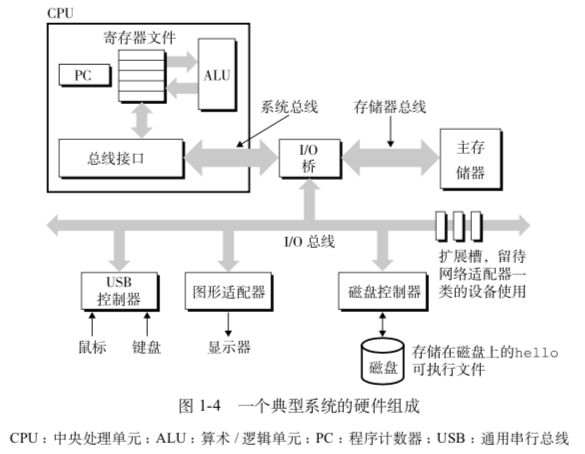
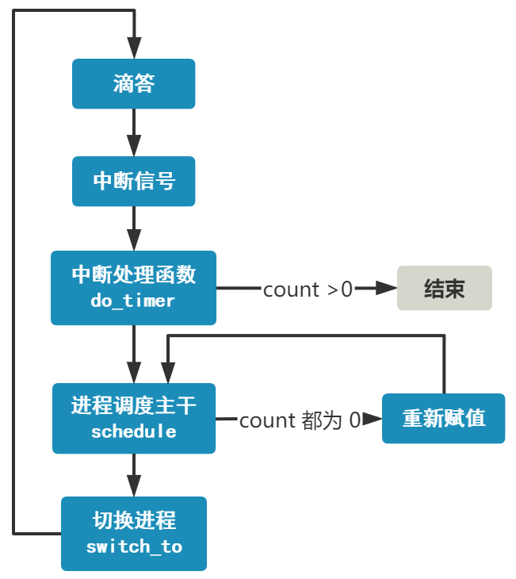
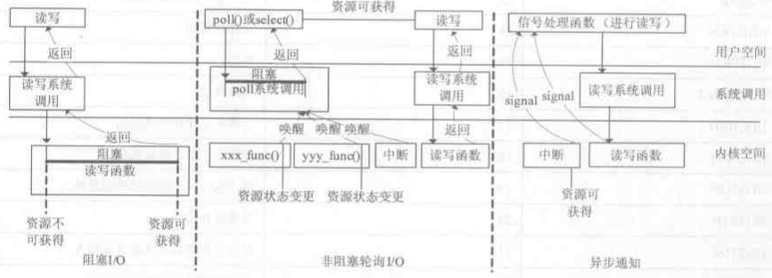
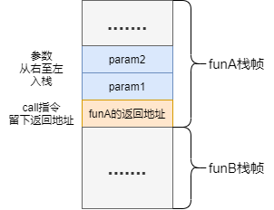
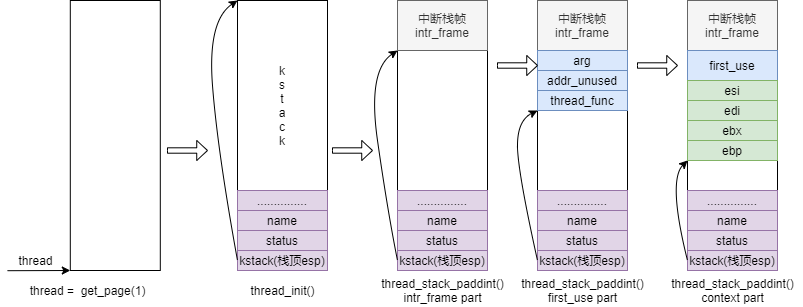
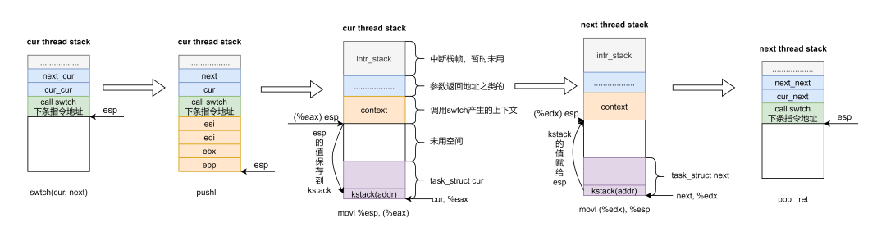
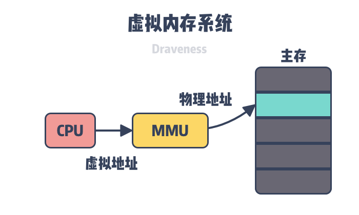
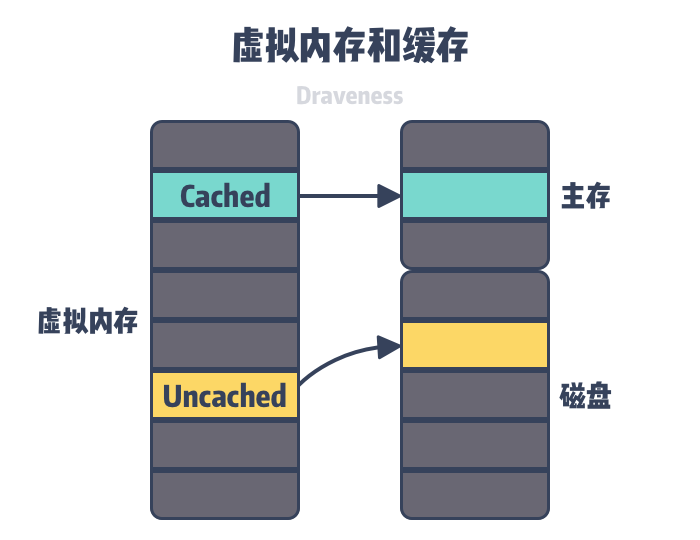
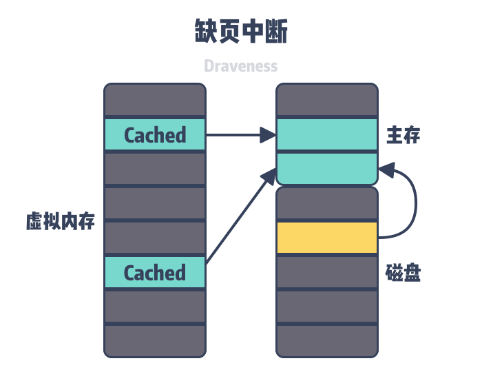

# 操作系统



## 重要组成部分

### 寄存器

- 应用层代码用到的寄存器类型

  - 通用寄存器：rax, rbx, rcx, rdx, rbp, rsp

    **rsp 栈顶寄存器和rbp栈基址寄存器**

    - 函数调用栈：
      - 保存函数的局部变量
      - 向被调用函数传递参数
      - 返回函数的返回值
      - 保存函数的返回地址（被调用函数返回后调用者应该继续执行的指令地址）

  - 程序计数寄存器（PC寄存器或IP寄存器）：rip，存储下一条指令的地址

  - 段寄存器：**fs寄存器**和gs寄存器，实现线程本地存储（TLS）。如go和pthread都使用**fs寄存器**实现系统线程的本地存储

**CPU存储多字节数据的方式**

- **大端存储模式**：数据的高字节保存在内存的低地址中，低字节保存在内存的高地址中。
- **小端存储模式**：数据的高字节保存在内存的高地址中，低字节保存在内存的低地址中。

### 定时器tick

- 每隔一段时间就会向 CPU 发起一个中断信号，成为时钟中断。间隔定义为 10 ms 即100Hz

#### 时钟中断(进程调度)

##### 相关数据结构

```c
#define TASK_RUNNING  0
#define TASK_INTERRUPTIBLE  1
#define TASK_UNINTERRUPTIBLE  2
#define TASK_ZOMBIE  3
#define TASK_STOPPED  4

struct task_struct * task[64] = {};

struct task_struct {
    long state;		// 进程状态
    long counter;		// 剩余时间片
    long priority;	// 优先级
    struct tss_struct tss;
};
struct tss_struct {
    ...
    long    eip;
    long    eflags;
    long    eax,ecx,edx,ebx;
    long    esp;
    long    ebp;
    ...
};
```

##### 响应流程

- 当CPU接收到中断信号查找中断向量表中中断处理函数**`timer_interrupt`**的函数地址并跳转过去执行
  - 将系统滴答数加一
  - 调用另一个函数 **`do_timer`**
    - 将当前进程时间片减一，然后判断
    - 如果仍大于0，表示需要继续执行，直接返回
    - 如果时间片已经为0，则调用**`schedule`**进行调度
      - 获取剩余时间片最大且处于runnable状态的进程号
      - 如果所有runnable进程时间片都是0，则将所有进程不只是runnable进程的剩余时间片计数重新赋值
      - 获取到一个进程号，调用**`switch_to()`**
        - jmp跳转指令跳转到新的进程的偏移地址处
        - 产生副作用是保存当前各个寄存器的值到当前进程 TSS 中，并将新进程的 TSS 信息加载到各个寄存器（硬件实现）



### cache和buffer

都属于两个层面之间的中建城，`cache`解决时间问题，`buffer`解决空间问题

- ### cache缓存区

  CPU的高速缓存用于cpu和主内存之间进行快速数据交换的存储器，保存cpu刚刚使用过的数据，减少cpu等待时间，提高向系统的性能，提高读写速度。两端处理速度不是同一级别

- ### buffer缓冲区

  用于存储速度不同步的设备或优先级不同的设备之间的传输数据，提高进程间的通信速度，信息的暂存空间。两端处理速度属于同一级别，如生产者消费者模式中将数据存放在缓冲区当中

  

## 网络IO模型

网络数据的读取read（系统调用）需要在内核态执行，数据的使用需要将数据从内核态拷贝到用户缓冲区才能使用

### 5种IO模型

- 阻塞IO
- 非阻塞IO
- 信号驱动IO
- IO复用/多路转接IO：系统调用有：select、poll、epoll
- 异步IO

### 阻塞和非阻塞I/O区别？

- 阻塞I/O，调用I/O函数则必须等待函数执行完成，如果内核缓冲没有数据可读时，read()系统调用会一直等待有数据到来后才从阻塞态中返回。
- 非阻塞I/O在遇到上述情况时会立即返回给用户态进程一个返回值，并设置errno为EAGAIN。
- 对于往缓冲区写的操作同理。

### 同步和异步区别？

- 同步I/O：阻塞/非阻塞以及多路复用都是同步IO模型，需要用户进程主动询问系统内核
- 异步I/O：内核执行完IO操作后主动通知用户进程

### Reactor和Proactor区别？

- Reactor模式是同步I/O，处理I/O操作的依旧是产生I/O的程序；Proactor是异步I/O，产生I/O调用的用户进程不会等待I/O发生，具体I/O操作由操作系统完成。
- 异步I/O需要操作系统支持，Linux异步I/O为AIO，Windows为IOCP。通过**函数回调或信号机制**实现



### IO复用

- 基本原理就是select，poll，epoll这个function会不断的轮询所负责的所有socket，当某个socket有数据到达了，就通知用户进程。

#### epoll、select/poll

- **select**：
  - 当用户进程调用了select，那么整个进程会被block，内核会“监视”所有select负责的socket，当任何一个socket中的数据准备好了，select就会返回。这个时候用户进程再调用read操作，将数据从kernel拷贝到用户进程。
  - 每次调用select前都要重新初始化描述符集，将fd从用户态拷贝到内核态，每次调用select后，都需要将fd从内核态拷贝到用户态；
  - 采用轮训的方式，有点可移植性好，连接数少且连接都十分活跃的情况下效率高；可监听的最大文件描述符数量为1024(内核写死)。fd_set作为文件描述符集。
- **poll**：
  - 与select相同，但是poll没有最大数量限制，可变长度的数组解决了select文件描述符受限的问题。
  - 使用pollfd作为文件描述符集，pollfd该结构体保存描述符的信息，每增加一个文件描述符就向数组中加入一个结构体，结构体只需要拷贝一次到内核态。
- **epoll**：
  - 事件驱动，只返回状态发生变化的文件描述符，它可以监视的文件描述符数量突破了1024的限制，epoll则每次返回后只对活跃的文件描述符队列进行操作（每个描述符都通过回调函数实现，只有活跃的描述符会调用回调函数并添加至队列中）。
  - 具体是通过**红黑树和就绪链表**实现的，红黑树存储所有的文件描述符，就绪链表存储有事件发生的文件描述符；epoll_create、epoll_ctl、epoll_wait；

#### 三种方式的对比

- 操作方式及效率：

  select是遍历，需要遍历fd_set每一个比特位（= MAX_CONN），O(n)；poll是遍历，但只遍历到pollfd数组当前已使用的最大下标（≠ MAX_CONN），O(n)；epoll是回调，O(1)。

- 最大连接数：

  select为1024/2048（一个进程打开的文件数是有限制的）；poll无上限；epoll无上限。

- fd拷贝：

  select每次都需要把fd集合从用户态拷贝到内核态；poll每次都需要把fd集合从用户态拷贝到内核态；epoll调用epoll_ctl时拷贝进内核并放到事件表中，但**用户进程和内核通过mmap映射共享同一块存储**，避免了fd从内核赋值到用户空间。

- 其他：

  select每次内核仅仅是通知有消息到了需要处理，具体是哪一个需要遍历所有的描述符才能找到。epoll不仅通知有I/O到来还可通过callback函数具体定位到活跃的socket，实现伪AIO

- **epoll的高效**
  - epoll_create调用时，内核除了帮我们在epoll文件系统里建了个file结点，在内核cache里建了个红黑树用于存储以后epoll_ctl传来的socket外，还会再建立一个list链表，用于存储准备就绪的事件
  - epoll_wait调用时，仅仅观察这个list链表里有没有数据即可。**有数据就返回，没有数据就sleep，等到timeout时间到后即使链表没数据也返回**。通常情况下即使我们要监控百万计的句柄，大多一次也只返回很少量的准备就绪句柄而已，所以，epoll_wait**仅需要从内核态copy少量的句柄到用户态**
  
- **过程**：
  - **epoll_ctl**可以对文件描述符结点进行增、删、改、查，并且**告知内核注册回调函数（事件）**；
  - 一旦**文件描述符上有事件发生时，那么内核将该文件描述符节点插入到就绪链表里面**；
  - 这时候epoll_wait将会接收到消息，并且**将数据拷贝到用户空间**。

#### epoll中ET和LT模式的区别与实现原理

- LT：默认工作方式，同时支持阻塞I/O和非阻塞I/O，LT模式下，内核告知某一文件描述符读、写是否就绪了，然后你可以对这个就绪的文件描述符进行I/O操作。如果不作任何操作，内核还是会继续通知。这种模式编程出错误可能性较小但由于重复提醒，效率相对较低。传统的select、poll都是这种模型的代表。
- ET：边缘触发，高速工作方式（因为减少了epoll_wait触发次数），适合高并发，只支持非阻塞I/O，ET模式下，内核告知某一文件描述符读、写是否就绪了，然后他假设已经知道该文件描述符是否已经就绪，内核不会再为这个文件描述符发更多的就绪通知（epoll_wait不会返回），直到某些操作导致文件描述符状态不再就绪。

#### ET模式下要注意什么（如何使用ET模式）？

- 必须使用非阻塞套接口，以避免由于一个文件句柄的阻塞读/阻塞写操作把处理多个文件描述符的任务饿死。

- 对于读操作，如果read没有一次读完buff数据，下一次将得不到就绪通知（ET特性），造成buff中数据无法读出，除非有新数据到达。
  - 解决方法：将套接字设置为非阻塞，用while循环包住read，只要buff中有数据，就一直读。一直读到产生EAGIN错误。
- 对于写操作主要因为ET模式下非阻塞需要我们考虑如何将用户要求写的数据写完。
  - 解决方法：只要buff还有空间且用户请求写的数据还未写完，就一直写。

#### epoll读到一半又有新事件来了怎么办？

- 避免在主进程epoll再次监听到同一个可读事件，可以把对应的描述符设置为**EPOLL_ONESHOT**，效果是监听到一次事件后就将对应的描述符从监听集合中移除，也就不会再被追踪到。读完之后可以再把对应的描述符重新手动加上。

## 进程、线程

**进程依据线程实现（PCB）线程依赖于进程存在（有无自己的地址空间）**

### 进程

- linux系统进程树

  上帝进程（0号进程） -> 1号内核进程 -> 1号用户进程(init进程) -> getty注册进程 -> shell进程 -> 命令行执行进程

- 资源分配的单位，**拥有自己的虚拟地址空间而线程没有**（堆栈、数据代码段等），五个状态：初始态，执行态，等待状态，就绪状态，终止状态。创建或撤销进程时，系统都要为之分配或回收资源，如内存空间，i/o设备等。在进行进程切换时，涉及到整个当前进程CPU环境的保存以及新被调用运行的进程的CPU环境的设置

- 在3特权级用户态下工作

  - **进程的另一特点就是运行在 3 特权级**，进程的创建在内核态下实现，如果调度的是进程，需要从内核态返回用户态，高特权级转成低特权级。而CPU一般不会允许从高特权级转回低特权级，只有中断返回例外。
  - **内核支持的用户线程——轻量级进程与内核线程是单射关系，每个轻量级进程都有一个内核线程与之相对应，这就是一对一模型。而普通用户线程的CPU调度实体还是进程，整个进程只对应的一个内核线程，即进程里面的多个用户线程也只对应一个内核线程，这多对一模型。**

- 进程的创建：

  - 进程建立在线程之上会创建主线程，但是PCB中保存进程的虚拟地址空间页地址所以在`thread_init`中初始化`pgdir`。**创建线程，线程函数用来填充中断栈帧**，**创建进程需要的页表，调度时需要切换页表**

- 相关函数

```c++
// 创建进程：
pid_t fork(void);
//结束进程：exit()是对_exit()的封装，都会终止进程并做相关收尾工作，最主要的区别是_exit()函数关闭全部描述符和清理函数后不会刷新流，但是exit()会在调用_exit()函数前刷新数据流
void exit(int status);
//获得PID：
pid_t getpid(void);
//获得父进程PID：
pid_t getppid(void);
// 回收进程（1）：一旦调用wait()，就会立即阻塞自己，wait()自动分析某个子进程是否已经退出，如果找到僵尸进程就会负责收集和销毁，如果没有找到就一直阻塞在这里。
pid_t wait(int *status);
// 回收进程（2）：
pid_t waitpid(pid_t pid, int *status, int options);
/*
	pid < -1，等待进程组识别码为pid绝对值的任何进程。
	pid = -1，等待任何子进程。
	pid = 0，等待进程组识别码与目前进程相同的任何子进程。
	pid > 0，等待任何子进程识别码为pid的子进程。
	options：选项决定父进程调用waitpid后的状态。
	options = WNOHANG，即使没有子进程退出也会立即返回。
	options = WUNYRACED，子进程进入暂停马上返回，但结束状态不予理会。
*/
```

- #### 僵尸进程、孤儿进程：

  - 父进程在调用fork接口之后和子进程已经可以独立开，之后父进程和子进程就以未知的顺序向下执行（异步过程）。当父进程先结束，子进程此时就会变成**孤儿进程**，不过这种情况问题不大，孤儿进程会自动向上被init进程收养，init进程完成对状态收集工作。而且这种过继的方式也是守护进程能够实现的因素。

  - 子进程先结束，父进程并未调用wait或者waitpid获取进程状态信息，那么子进程描述符就会一直保存在系统中，这种进程称为僵尸进程。

### PCB（task_struct）

- **PCB里面集合了一个进程/线程运行过程当中所有必要的信息，所以PCB就是进程/线程的标志，他们之间是一一对应的关系**
- **栈的地址为结构体中的第一个成员变量**
  - 标识符：与进程相关的唯一标识符，用来区别正在执行的进程和其他进程。
  - 状态：描述进程的状态，因为进程有挂起，阻塞，运行等好几个状态，所以都有个标识符来记录进程的执行状态。
  - 优先级：如果有好几个进程正在执行，就涉及到进程被执行的先后顺序的问题，这和进程优先级这个标识符有关。
  - 程序计数器：程序中即将被执行的下一条指令的地址。
  - 内存指针：程序代码和进程相关数据的指针。
  - 上下文数据：进程执行时处理器的寄存器中的数据。
  - I/O状态信息：包括显示的I/O请求，分配给进程的I/O设备和被进程使用的文件列表等。
  - 记账信息：包括处理器的时间总和，记账号等等。

### 线程

- **线程的定义**：系统运行调度的单位，两者都可以并发执行，进程是拥有资源的一个独立单位进程之间的边界。一般地说，线程自己不拥有系统资源（**一个线程必不可少的资源：线程标识符，程序计数器，一组寄存器的值，和堆栈**），但是它可以访问其**隶属于进程的资源：代码段，数据段，以打开的文件，I/O设备等如文件读取的指针**；而线程切换只需保存和设置少量寄存器的内容，并不涉及存储器管理方面的操作。

- **线程的栈数据**：中断栈帧（保存一些必要的通用寄存器、段寄存器）、参数和地址、调度程序上下文（被调用函数需要将寄存器保存下来）

  - 函数的调用中的栈帧：函数调用时要先从右至左压入被调用函数需要的参数，再留下主调函数的返回地址(**call指令下一条指令的地址**)，然后跳转去执行被调函数。函数执行完后返回，由**主调函数来清理参数占用的栈空间**。正是由于调用**约定**，**返回地址前就是参数**，被调函数运行时就会去相应地方拿取参数然后执行。
  - 线程的第一次运行的栈帧：栈中放好线程函数的参数，然后留下一个哑地址只做占位符用（线程函数的返回值为 void * 类型），最后放置一个函数指针作为RET指令时的执行，线程被调度运行起来

  

- **线程的创建流程**，

  

- **线程之间的调度，schedule()**

  - PCB结构中设置线程每次能运行的时钟数以及记录剩余的时钟数。
  - 操作系统在切换线程时先把前一个线程的寄存器上的内容全部保存到内存中再把下一个线程在内存中的值取出放到CPU寄存器中。
  - 线程调度时操作系统需要保存和恢复的寄存器除了通用寄存器外还有rip指令指针寄存器以及与栈相关的rsp栈顶寄存器和rbp栈基址寄存器。rip决定线程下一条需要执行的指令，栈寄存器确定线程执行需要使用的栈内存。
  - 恢复CPU寄存器的值相当于改变CPU下一条执行的指令同时切换函数调用栈

  

- **线程本地存储（TLS）**：通俗意义上是**线程私有的全局变量**（C语言中通过 __thread 关键词声明，每个线程都有它的一个副本）。普通全局变量是多线程共享。在线程库和内核的支持下gcc编译器使用CPU的fs段寄存器实现线程本地存储

- 相关函数

```c++
// 创建线程：
int pthread_create(pthread_t pthread, const pthread_attr_t attr, void (start_routine)(void ), void agr);
/*
参数说明：
第一个参数：thread，用来储存线程的id
第二个参数：attr，表示创建线程的类型，一般默认设为NULL就好
第三个参数：start_routine，是一个函数指针
第四个参数：arg，函数参数，传给上述函数指针指向的函数。因为只有这一个形参作为start_routine的参数，所以一般将参数封装成一个结构体再传过去。
*/
// 线程属性设置
pthread_attr_get()
pthread_attr_set()
// 获得线程ID：
pthread_t pthread_self();
// 等待线程结束：
int pthread_join(pthread_t tid, void** retval);
// 结束线程：
pthread_exit(void *retval);
//分离线程：
int pthread_detach(pthread_t tid);
```

- 线程挂起join、同步mutex互斥锁、cond条件变量、validate修饰变量、初始化代码片段只执行一次once

### 进程间通信

- 管道、消息队列、共享内存(最快)、信号量、socket、信号。(**ipcs命令用于报告共享内存、信号量和消息队列的信息**)

- 消息队列：

  消息队列是由**消息的链表**结构实现，存放在内核中并由消息队列标识符标识。有足够权限的进程可以向队列中添加消息，被赋予读权限的进程则可以读走队列中的消息。消息队列克服了信号传递信息少、管道只能承载无格式字节流以及缓冲区大小受限等缺点。

- 信号量：

  信号量是一个计数器，可以用来控制多个进程对**共享资源**的访问。它常作为一种**锁机制**，防止某进程正在访问共享资源时，其他进程也访问该资源。因此，主要作为进程间以及同一进程内不同线程之间的同步手段。

- 管道：

  - 无名管道

    - 无名管道特点：

      - 无名管道是一种特殊的文件，这种文件只存在于内存中。

      - 无名管道只能用于父子进程或兄弟进程之间，必须用于具有亲缘关系的进程间的通信。

      - 无名管道只能由一端向另一端发送数据，是半双工方式，如果双方需要同时收发数据需要两个管道。

      - 相关接口：

      - `int pipe(int fd[2])`

        fd[2]：管道两端用fd[0]和fd[1]来描述，读的一端用fd[0]表示，写的一端用fd[1]表示

        通信双方的进程中写数据的一方需要把fd[0]先close掉，读的一方需要先把fd[1]给close掉。

  - 有名管道：

    - 有名管道特点：

      - 有名管道是FIFO文件，存在于文件系统中，可以通过文件路径名来指出。

      - 有名管道可以在不具有亲缘关系的进程间进行通信。

      - 相关接口：

      - `int mkfifo(const char *pathname, mode_t mode)`

        pathname：即将创建的FIFO文件路径，如果文件存在需要先删除。

        mode：和open()中的参数相同。

- 共享内存+信号量

  进程可以将同一段共享内存连接到它们自己的地址空间，所有进程都可以访问共享内存中的地址，如果某个进程向共享内存内写入数据，所做的改动将立即影响到可以访问该共享内存的其他所有进程。

  进程共享内存和多线程共享全局变量相似。所以在使用内存共享的方式是也需要通过信号量来完成进程间同步。多线程同步的信号量是POSIX信号量，
  而在进程里使用SYSTEM V信号量。

  - 共享内存相关接口

    - 创建共享内存：`int shmget(key_t key, int size, int flag)`

      成功时返回一个和key相关的共享内存标识符，失败范湖范围-1。

      key：为共享内存段命名，多个共享同一片内存的进程使用同一个key。

      size：共享内存容量。

      flag：权限标志位，和open的mode参数一样。

    - 连接到共享内存地址空间：`void *shmat(int shmid, void* addr, int flag)`

      返回值即共享内存实际地址。

      shmid：shmget()返回的标识。

      addr：决定以什么方式连接地址。

      flag：访问模式。

    - 从共享内存分离：`int shmdt(const void *shmaddr)`

      调用成功返回0，失败返回-1。

      shmaddr：是shmat()返回的地址指针。

  - 信号量相关接口

    - 创建信号量：`int semget(key_t key, int nsems, int semflag)`

      创建成功返回信号量标识符，失败返回-1。

      key：进程pid。

      nsems：创建信号量的个数。

      semflag：指定信号量读写权限。

    - 改变信号量值：`int semop(int semid, struct sembuf *sops, unsigned nsops)`

      struct sembuf结构体定义如下：

    ```c++
      struct sembuf{      
      short sem_num;      
      short sem_op;      
      short sem_flg;  
      };
    ```

    ​		成功返回信号量标识符，失败返回-1。

    ​		semid：信号量集标识符，由semget()函数返回。

    ​		sops：指向struct sembuf结构的指针，先设置好sembuf值再通过指针传递。

    ​		nsops：进行操作信号量的个数，即sops结构变量的个数，需大于或等于1。

    - 直接控制信号量信息：`int semctl(int semid, int semnum, int cmd, union semun arg)`

      semid：信号量集标识符。

      semnum：信号量集数组上的下标，表示某一个信号量。

      arg：union semun类型。

- **辅助命令**

  ipcs命令用于报告共享内存、信号量和消息队列信息。

  - ipcs -a：列出共享内存、信号量和消息队列信息。
  - ipcs -l：列出系统限额。
  - ipcs -u：列出当前使用情况。

### 进程的调度算法

#### FCFS

- 先来先服务，队列实现，非抢占的：先请求CPU的进程先分配到CPU

#### SJF

- 最短作业优先调度算法：平均等待时间最短，但难以知道下一个CPU区间长度

#### 优先级调度算法

- 可以是抢占的，也可以是非抢占的：优先级越高越先分配到CPU，相同优先级先到先服务，存在的主要问题是：低优先级进程无穷等待CPU，会导致无穷阻塞或饥饿；
- 解决方案：老化

#### 时间片轮转调度算法

- 可抢占的：队列中没有进程被分配超过一个时间片的CPU时间，除非它是唯一可运行的进程。如果进程的CPU区间超过了一个时间片，那么该进程就被抢占并放回就绪队列。

#### 多级队列调度算法：

- 将就绪队列分成多个独立的队列，每个队列都有自己的调度算法，队列之间采用固定优先级抢占调度。其中，一个进程根据自身属性被永久地分配到一个队列中。

#### 多级反馈队列调度算法：

- 与多级队列调度算法相比，其允许进程在队列之间移动：若进程使用过多CPU时间，那么它会被转移到更低的优先级队列；在较低优先级队列等待时间过长的进程会被转移到更高优先级队列，以防止饥饿发生。

### 多线程模型

#### Future模型

- 该模型通常在使用的时候需要结合Callable接口配合使用。
- Future是把结果放在将来获取，当前主线程并不急于获取处理结果。允许子线程先进行处理一段时间，处理结束之后就把结果保存下来，当主线程需要使用的时候再向子线程索取。
- Callable是类似于Runnable的接口，其中call方法类似于run方法，所不同的是run方法不能抛出受检异常没有返回值，而call方法则可以抛出受检异常并可设置返回值。两者的方法体都是线程执行体。

#### fork和join模型

- 该模型包含递归思想和回溯思想，递归用来拆分任务，回溯用合并结果。
- 可以用来处理一些可以进行拆分的大任务。其主要是把一个大任务逐级拆分为多个子任务，然后分别在子线程中执行，当每个子线程执行结束之后逐级回溯，返回结果进行汇总合并，最终得出想要的结果。

#### actor模型(Qt的信号槽机制)

- actor模型属于一种基于消息传递机制并行任务处理思想，它以消息的形式来进行线程间数据传输，避免了全局变量的使用，进而避免了数据同步错误的隐患。
- actor在接受到消息之后可以自己进行处理，也可以继续传递（分发）给其它actor进行处理。在使用actor模型的时候需要使用第三方Akka提供的框架。

#### CSP模型

- CSP模型中，worker之间不直接彼此联系，而是通过不同channel进行消息发布和侦听。
- 消息的发送者和接收者之间通过Channel松耦合，发送者不知道自己消息被哪个接收者消费了，接收者也不知道是哪个发送者发送的消息。

#### 生产者消费者模式

- 生产者消费者模型都比较熟悉，其核心是使用一个缓存来保存任务。开启一个/多个线程来生产任务，然后再开启一个/多个来从缓存中取出任务进行处理。
- 这样的好处是任务的生成和处理分隔开，生产者不需要处理任务，只负责向生成任务然后保存到缓存。而消费者只需要从缓存中取出任务进行处理。
- 使用的时候可以根据任务的生成情况和处理情况开启不同的线程来处理。

#### master-worker模型

- master-worker模型类似于任务分发策略，开启一个master线程接收任务，然后在master中根据任务的具体情况进行分发给其它worker子线程，然后由子线程处理任务。
- 如需返回结果，则worker处理结束之后把处理结果返回给master。

### 多线程和多进程的使用场景

- 多线程模型主要优势为线程间切换代价较小，因此适用于I/O密集型的工作场景，因此I/O密集型的工作场景经常会由于I/O阻塞导致频繁的切换线程。同时，多线程模型也适用于单机多核分布式场景。
- 多进程模型，适用于CPU密集型。同时，多进程模型也适用于多机分布式场景中，易于多机扩展。

### 操作系统的同步机制

- 信号量用于进程和线程同步，互斥锁和条件变量只能用于线程同步
- 与进程控制有关的内容：进程地址空间、进程控制块(处理机)、上下文切换

### 死锁

两个或两个以上进程在执行过程中因争夺资源而互相等待

#### 必要条件

- 互斥条件：一个资源每次只能被一个进程使用
- 不可剥夺条件：进程已获得资源在未使用完之前不可剥夺
- 请求和保持条件：某进程占有一定资源后又对其他资源请求但是阻塞而不释放自己占有的资源
- 循环等待：进程之间形成一种头尾相接的循环等待资源的关系

#### 死锁预防

- 某些**资源不可被同时访问**
- **可剥夺资源**，当进程新的资源得不到完成，即释放已占有的资源
- **资源一次性分配**，从而**破坏请求和保持条件**
- **资源有序分配**，为每一类资源赋予一个序号，每个进程按照序号递增请求资源释放则递减

#### 死锁解除

- **资源剥夺**：挂起死锁进程，抢占其资源分配给其他死锁进程。同时要避免被挂起的进程长时间得不到资源
- **撤销进程**：强制撤销部分、甚至全部死锁进程并剥夺这些进程的资源。撤销的原则可以按进程优先级和撤销进程代价的高低进行。
- **进程回退**：让一（多）个进程回退到足以回避死锁的地步，进程回退时自愿释放资源而不是被剥夺。要求系统保持进程的历史信息，设置还原点。

### 进程和线程的API对比

- fork()和pthread_create()

  负责创建。调用fork()后返回两次，一次标识主进程(主进程中返回子进程PID)一次标识子进程(子进程中返回0)；调用pthread_create()后得到一个可以独立执行的线程。

  - vfork( )会挂起父进程直到子进程终止或者运行了一个新的可执行文件的映像，父进程和子进程共享相同的地址空间和页表项不会进行页表项的赋值，vfork( )保证子进程先运行，在调用exec或exit之前与父进程数据是共享的，在它调用exec或exit之后父进程才可能被调度运行。当需要修改共享数据段时则拷贝父进程

- wait()和pthread_join()

  负责回收。调用wait()后父进程阻塞；调用pthread_join()后主线程阻塞。

- exit()和pthread_exit()

  负责退出。调用exit()后调用进程退出，控制权交给系统；调用pthread_exit()后线程退出，控制权交给主线程。

## 内存管理


### 程序的加载过程

- 从磁盘上把可执行程序读入内存
- 创建进程和主线程
- 为主线程分配栈空间
- 由用户命令行输入的参数拷贝到主线程的栈
- 把主线程放入到操作系统运行队列等待被调度起执行

### 程序的内存结构


### 虚拟内存

- 作为进程和物理内存的中间层，每个进程只把自己目前需要的虚拟内存空间映射并存储到物理内存上，每个进程创建加载时，内核只是为进程“创建”了虚拟内存的布局，只是建立好虚拟内存和磁盘文件之间的映射就好（叫做存储器映射），要动态分配内存，比如malloc时，也只是分配了虚拟内存，即为这块虚拟内存对应的页表项做相应设置
- 物理内存：比磁盘的读写速度快，随机读取远远块于顺序读取



#### 虚拟内存的作用

- **扩大地址空间**
- **内存保护**：
  - **独立的内存空间**
    - 每个进程运行在各自的虚拟内存地址空间，互相不能干扰对方
    - 隔离不同进程的访问权限，提高系统的安全性
    - 虚存还对特定的内存地址提供写保护，可以防止代码或数据被恶意篡改。
    - 共享
      - 当不同的进程使用同样的代码时，比如库文件中的代码，物理内存中可以只存储一份这样的代码，不同的进程只需要把自己的虚拟内存映射过去就可以了，节省内存
- **公平内存分配**。采用了虚存之后，每个进程都相当于有同样大小的虚存空间。
- 当**进程通信**
  - 可采用**虚存共享**的方式实现
  - 写时复制机制即是子进程复制的父进程在虚拟内存中的页表
- **缓存作用**
  - 提高磁盘的访问速度，发生缺页中断时，从磁盘读取数据，然后再虚拟内存页表中建立到物理内存之间的映射关系
  - 对于使用频发的数据会长时间保留在虚拟内存中，当物理内存满时会触发页的调度，置换物理内存和硬盘中的数据
  
  
- 虚拟内存很适合在多道程序设计系统中使用，许多程序的片段同时保存在内存中。当一个程序等待它的一部分读入内存时，可以把CPU交给另一个进程使用。在内存中可以保留多个进程，**系统并发**度提高
- 在程序需要分配连续的内存空间的时候，只需要在虚拟内存空间分配连续空间，而不需要实际物理内存的连续空间，可以**利用碎片**

#### 虚拟内存的代价

- 虚存的管理需要建立很多数据结构，这些数据结构要占用额外的内存
- 虚拟地址到物理地址的转换，增加了指令的执行时间。
- 页面的换入换出需要磁盘I/O，这是很耗时的
- 如果一页中只有一部分数据，会浪费内存。

### 段式存储管理。

- 在段式存储管理中，将程序的地址空间划分为若干段（segment），如代码段，数据段，堆栈段；这样每个进程有一个二维地址空间，相互独立，互不干扰。

- 段式管理的优点是：没有内碎片（因为段大小可变，改变段大小来消除内碎片）。但段换入换出时，会产生外碎片（比如4k的段换5k的段，会产生1k的外碎片）

### 页式存储管理。

- 页表的内容就是该进程的虚拟地址到物理地址的一个映射，页表中的每一项都记录了这个页的基地址。通过页表，由逻辑地址的高位部分先找到逻辑地址对应的页基地址，再由页基地址偏移一定长度就得到最后的物理地址
- 在页式存储管理中，将程序的逻辑地址划分为固定大小的页（page），而物理内存划分为同样大小的帧，程序加载时，可以将任意一页放入内存中任意一个帧，这些帧不必连续，从而实现了离散分离。
- 页式存储管理的优点是：没有外碎片（因为页的大小固定），但会产生内碎片（一个页可能填充不满）。

#### 两者的不同点：

- 目的不同：

  分页是由于系统管理的需要而不是用户的需要，它是信息的物理单位；

  分段的目的是为了能更好地满足用户的需要，它是信息的逻辑单位，它含有一组其意义相对完整的信息；

- 大小不同：页的大小固定且由系统决定，而段的长度却不固定，由其所完成的功能决定；

- 地址空间不同： 段向用户提供二维地址空间；页向用户提供的是一维地址空间；

- 信息共享：段是信息的逻辑单位，便于存储保护和信息的共享，页的保护和共享受到限制；

- 内存碎片：

  页式存储管理的优点是没有外碎片（因为页的大小固定），但会产生内碎片（一个页可能填充不满）；

  而段式管理的优点是没有内碎片（因为段大小可变，改变段大小来消除内碎片）。但段换入换出时，会产生外碎片（比如4k的段换5k的段，会产生1k的外碎片）。

#### 缺页中断

- malloc()和mmap()等内存分配函数，在分配时只是建立了进程虚拟地址空间，并没有分配虚拟内存对应的物理内存。当进程访问这些没有建立映射关系的虚拟内存时，处理器自动触发一个缺页异常。
- 缺页中断：在请求分页系统中，可以通过查询页表中的状态位来确定所要访问的页面是否存在于内存中。每当所要访问的页面不在内存是，会产生一次缺页中断，此时操作系统会根据页表中的外存地址在外存中找到所缺的一页，将其调入内存。



#### 页的调度

- 当访问一个内存中不存在的页，并且内存已满，则需要从内存中调出一个页或将数据送至磁盘对换区，替换一个页，这种现象叫做缺页置换。
- 先进先出(FIFO)算法：置换最先调入内存的页面，即置换在内存中驻留时间最久的页面。按照进入内存的先后次序排列成队列，从队尾进入，从队首删除。
- 最近最少使用（LRU）算法: 置换最近一段时间以来最长时间未访问过的页面。根据程序局部性原理，刚被访问的页面，可能马上又要被访问；而较长时间内没有被访问的页面，可能最近不会被访问。

## 软硬连接

- 若1个inode号对应多个文件名，则为硬链接，即硬链接就是同一个文件使用了不同的别名,使用ln创建。
- 若文件用户数据块中存放的内容是另一个文件的路径名指向，则该文件是软连接。软连接是一个普通文件，有自己独立的inode,但是其数据块内容比较特殊。

## 内核态和用户态

- 用户态拥有最低的特权级，内核态拥有较高的特权级。
- 运行在用户态的程序不能直接访问操作系统内核数据结构和程序。
- 内核态和用户态之间的转换方式主要包括：系统调用，异常和中断。

#### 用户态到内核态的三种方式

- 系统调用
- 异常
- 外围设备的中断

## 系统调用

- 指运行在使用者空间的程序向操作系统内核请求需要更高权限运行的服务。系统调用提供了用户程序与操作系统之间的接口（即系统调用是用户程序和内核交互的接口）。

- 操作系统中的状态分为核心态和用户态。大多数系统交互式操作需求在内核态执行。如设备IO操作或者进程间通信。
- 特权指令：一类只能在核心态下运行而不能在用户态下运行的特殊指令。不同的操作系统特权指令会有所差异，但是一般来说主要是和硬件相关的一些指令。
- 用户程序只在用户态下运行，有时需要访问系统核心功能，这时通过系统调用接口使用系统调用。
- 危险的指令被包装成系统调用，用户程序只能调用而无权自己运行那些危险的指令。
- 计算机硬件的资源是有限的，为了更好的管理这些资源，所有的资源都由操作系统控制，进程只能向操作系统请求这些资源。操作系统是这些资源的唯一入口，这个入口就是系统调用。
  - open、write、close、fork、vfork
