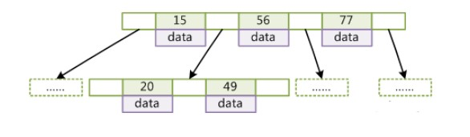
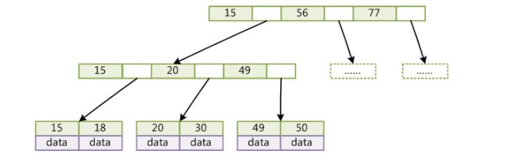

# 数据库

## 三大范式

- 第一范式：属性不可分，原子性
- 第二范式：满足第一范式，每一列都与主键相关，并且所有非主属性都完全依赖于每一个主属性，称R满足第二范式
- 第三范式：满足第二范式，每一列都与主键列直接相关，非主属性不传递依赖于主键

## 事务

### 事务及其四大特性

- 满足ACID的 一系列操作 commit之后可以回滚。A原子性(全部执行成功或全部撤销失败)、C(一致性状态转换)、I(隔离性，事务的修改未提交前其他事务不可见)、D(持久性，所有修改记录多会被记录)

### 事务隔离级别

|               未提交读取               |              提交读取              |               可重复读               |   可串行化   |
| :------------------------------------: | :--------------------------------: | :----------------------------------: | :----------: |
| 事务的修改即使没有提交也对其他事务可见 | 事务的修改在提交之前其他事务不可见 | 保证同一事务中多次读取的数据结果相同 | 强制串行执行 |
|     可能发生脏读、不可重复读和幻读     |      可能发生不可重复读和幻读      |             可能发生幻读             |      \       |

- 脏读：一个事务读到了另一个未提交事务修改过的数据**（排它锁，select for update）**
- 不可重复读：同一条件下，两次读取的值不相同**（读用共享锁，写用排它锁）**
- 幻读：幻读强调的是一个事务在按照某个相同的搜索条件下多次读取纪录时，读到了之前没有读到的数据**（间隙锁）**

## MVCC（多版本并发控制）

**隐藏列**

**trx_id**：存储每次对聚簇索引中某一条记录进行修改的事务ID

**roll_pointer**：对聚簇索引中某一条记录的修改都会记录到undo日志，`roll_pointer`存储一个指针指向这条聚簇索引的某一条记录的修改的老版本信息在undo日志中的位置。

- 多版本并发控制，在提交读和可重复读两个隔离级别下，执行select操作会产生`readview`快照，根据`readview`快照来进行数据读取的过程，生成事务id，对活动的（未提交的）事务的事务id进行排序，如果小于当前`readview`的事务id则可访问，如果大于`readview`的事务id则不可访问。
- `readview`快照访问数据的原理，`readview`中存储的是最小事务id，最大事务id，当前正在运行的事务id，生成该`readview`的事务id，根据这些id号去访问数据，只有**数据的事务id号**小于**最小事务id**或者是**事务id是生成该Readview的事务id**才能被访问到
- 这两个隔离级别下，产生快照的时机不同：
  - 在提交读下，每进行一次一次select操作都会产生一个新的快照，在这个隔离级别下，每查一次就拍一次照，那么获取的数据都是新的，所以有不可重复读和幻读的情况发生；
  - 可重复读隔离级别下，只在第一次查询的时候拍一张照，每次再查询都要看最开始生成的这样照片，那么它就避免了不可重复读的情况，也在一定程度上避免了幻读
    - 如果现在在A事务中执行了一次查询，那么它已经有了readview快照，那么事务B插入一条数据进来，事务A在进行查询的话，还是看不到这条数据的（在匹配条件符合的情况下），但是**A事务是能够对这条数据进行修改**，对这条数据修改之后，该行数据的隐藏列的事务id就会变成A事务的事务id，这时，A事务在进行查询，就能看见这条新增的数据，所以是不能完全避免幻读，避免幻读需要使用gapLock间隙锁，它能防止其他事务插入数据

## MySQL存储引擎

| 存储引擎 |                             特性                             |
| :------: | :----------------------------------------------------------: |
|  MyISAM  | 不支持外键，表锁，插入数据时，锁定整个表，查表总行数时，不需要全表扫描，性能更快，MyISAM支持全文索引（FULLTEXT）、压缩索引 |
|  InnoDB  | 支持外键，行锁，事务，savePoint；查表总行数时，全表扫描，不支持全文索引 |

- **InnoDB**

  是一个事务型的存储引擎，使用数据库事务时首选引擎，设计目标处理大容量数据库系统

  - 采用MVCC支持高并发，默认隔离界别是可重复读，通过间隙锁防止幻读出现
  
  - Innodb引擎提供了对数据库ACID事务的支持
  
  - 实现了SQL标准的四种隔离级别，该引擎还提供了行级锁和外键约束
  
  - MySQL运行时Innodb会在内存中建立缓冲池，用于缓冲数据和索引
  
  - 没有保存表的行数，当SELECT COUNT(*) FROM TABLE时需要扫描全表
  
  - 锁的粒度小，写操作不会锁定全表，所以在并发较高时，使用Innodb引擎会提升效率
  
    <!--PS：使用行级锁也不是绝对的，如果在执行一个SQL语句时MySQL不能确定要扫描的范围，InnoDB表同样会锁全表。-->
  
  - 适用场景：
    - 经常更新的表，适合处理多重并发的更新请求。
    - 支持事务。
    - 可以从灾难中恢复（通过bin-log日志等）。
    - 外键约束。只有他支持外键。
    - 支持自动增加列属性auto_increment。
  
  - 索引结构
    - InnoDB是B+Treee索引结构
    - Innodb的索引文件本身就是数据文件，即B+Tree的数据域存储的就是实际的数据，这种索引就是**聚集索引**
    - 这个索引的key就是数据表的主键，因此InnoDB表数据文件本身就是主索引。
    - InnoDB的辅助索引数据域存储的也是相应记录主键的值而不是地址，所以当以辅助索引查找时，会先根据辅助索引找到主键，再根据主键索引找到实际的数据。
      - Innodb不建议使用过长的主键，否则会使辅助索引变得过大
      - 建议使用自增的字段作为主键，这样B+Tree的每一个结点都会被顺序的填满，而不会频繁的分裂调整，会有效的提升插入数据的效率
  
- **Mylsam**

  MyIASM没有提供对数据库事务的支持，MyIsam 存储引擎独立于操作系统，跨平台。

  - 适用场景：
    - 不支持事务的设计，可以在service层进行根据业务需求进行相应的控制。
    - 不支持外键的表设计。
    - 读取操作远远多于写入操作，查询速度很块。
    - 整天对表进行加锁的场景。
  - 缺点：就是不能在表损坏后主动恢复数据
  - 索引结构
    - MyISAM索引用的B+ tree来储存数据，MyISAM索引的指针指向的是键值的地址，地址存储的是数据。
    - 索引和实际的数据是分开的，只不过是用索引指向了实际的数据，这种索引就是所谓的**非聚集索引**。

### InnoDB和MyISAM的区别

- 存储文件：InnoDB每个表只有一个文件，`.idb`，MyISAM每个表有两个文件MYD数据文件和MYISAM索引文件。
- 索引存储：对于AUTO_INCREMENT类型的字段，InnoDB中必须包含只有该字段的索引，但是在MyISAM表中，可以和其他字段一起建立联合索引。MyISAM支持全文索引（FULLTEXT）、压缩索引，InnoDB不支持。
- MyISAM的索引和数据是分开的，并且索引是有压缩的，内存使用率就对应提高了不少。能加载更多索引，而Innodb是索引和数据是紧密捆绑的，没有使用压缩从而会造成Innodb比MyISAM体积庞大不小。
- InnoDB存储引擎被完全与MySQL服务器整合，InnoDB存储引擎为在主内存中缓存数据和索引而维持它自己的缓冲池。InnoDB存储它的表和索引在一个表空间中，表空间可以包含数个文件（或原始磁盘分区）。这与MyISAM表不同，比如在MyISAM表中每个表被存在分离的文件中。InnoDB 表可以是任何尺寸，即使在文件尺寸被限制为2GB的操作系统上。
- 服务器数据备份：InnoDB必须导出SQL来备份，LOAD TABLE FROM MASTER操作对InnoDB是不起作用的，解决方法是首先把InnoDB表改成MyISAM表，导入数据后再改成InnoDB表，但是对于使用的额外的InnoDB特性(例如外键)的表不适用。
- MyISAM应对错误编码导致的数据恢复速度快。MyISAM的数据是以文件的形式存储，所以在跨平台的数据转移中会很方便。在备份和恢复时可单独针对某个表进行操作。
- InnoDB是拷贝数据文件、备份 binlog，或者用 mysqldump
- 锁的支持：MyISAM只支持表锁。InnoDB支持表锁、行锁，行锁大幅度提高了多用户并发操作的新能。但是InnoDB的行锁，只是在WHERE的主键是有效的，非主键的WHERE都会锁全表的。

## 聚簇索引和非聚簇索引

- 聚簇索引

  以主键值的大小作为页和记录的排序规则，在叶子节点处存储的记录包含了表中所有的列

- 非聚簇索引（二级索引）

  以索引列的大小作为页和记录的排序规则，在叶子节点处存储的记录内容是索引列 + 主键值，若要获取完整的用户记录需要进行回表查询

## 索引

- #### 将无序数据变成有序的数据（排序->生成倒序表->倒序表拼接数据地址链->先查倒排表再查数据地址链）

  - 索引是在存储引擎层实现的。
  - 
  - 索引能够轻易将查询性能提升几个数量级。
  - 对于非常小的表、大部分情况下简单的全表扫描比建立索引更高效。
  - 对于中到大型的表，索引就非常有效。
  - 对于特大型的表，建立和使用索引的代价将会随之增长。

### 索引的使用注意事项

- 使用where子句或连接子句的列要建立索引。
- 建立段索引，对长字符串进行索引应该指定前缀长度。
- 更新频繁的列不建议使用索引。
- 扩展索引代替新建索引。
- 重复值多的列不要建立索引。
- 只为用于搜索、排序或分组的列创建索引
- 索引列的类型应尽量小
- 可以只为索引列前缀创建索引，以减小索引占用的存储空间
- 尽可能的让主键拥有AUTO_INCREMENT属性，避免发生页分裂的情况
- 查询时尽量使用覆盖索引，避免回表操作带来的性能损耗

### 查询不会用到索引的情况（最左匹配原则）

- 使用索引比全表扫描慢，不用索引
- 联合索引没使用到第一部分
- 模糊查询以通配符%开头
- 若为字符串索引，与数值进行匹配的时候，数值没用引号，不走索引
- 在搜索条件中，索引列不以单独的列名存在，而使用表达式或函数进行操作的时候，不走索引

### 索引的底层实现

**红黑树等数据结构也可以用来实现索引，但是文件系统及数据库系统普遍采用 B-/+Tree 作为索引结构。**

|                           **B+树**                           | **B树**                                                    | **红黑树**                                                   | **哈希表**                                                   |
| :----------------------------------------------------------: | ---------------------------------------------------------- | ------------------------------------------------------------ | ------------------------------------------------------------ |
| 更好的利用局部性原理和磁盘预读，相比较于其他两种树结构查询层次浅，更矮更宽，更适合外存索引，由于 B+Tree 内节点去掉了 data 域，因此可以拥有更大的出度，拥有更好的性能。 | 查询不稳定，B-Tree可以进行顺序存储利用局部性，而且层次较浅 | 需要频繁的调整，层数明显要深。并且于逻辑上很近的节点（父子）物理上可能很远，无法利用局部性，效率明显比 B-Tree 差很多。 | **存储关系上没有任何顺序关系**，对于区间查询无法通过索引查询得到需要全表扫描，适用于等值查询的场景 |

- B-Tree 是满足下列条件的数据结构：所有叶节点具有相同的深度，也就是说 B-Tree 是平衡的；一个节点中的 key 从左到右非递减排列；如果某个指针的左右相邻 key 分别是 keyi 和 keyi+1，且不为 null，则该指针指向节点的所有 key 大于 keyi 且小于 keyi+1。在 B-Tree 中按 key 检索数据的算法非常直观：首先从根节点进行二分查找，如果找到则返回对应节点的 data，否则对相应区间的指针指向的节点递归进行查找，直到找到节点或找到 null 指针，前者查找成功，后者查找失败。由于插入删除新的数据记录会破坏 B-Tree 的性质，因此在插入删除时，需要对树进行一个分裂、合并、转移等操作以保持 B-Tree 性质。

- B+Tree 有以下不同点：每个节点的指针上限为 2d 而不是 2d+1；内节点不存储 data，只存储 key，叶子节点不存储指针。

## 主从同步原理

mysql主从复制默认采用异步实现，通过三个主要线程：master(binlog dump thread)、slave(I/O thread 和 SQL thread)

- 主节点binlog线程：主库记录数据库的所有变更记录到binlog。
- 主节点log dump线程：当binlog有变动，log dump读取文件内容发送到从节点
- 从节点I/O线程接收binlog内容，并将其写到relay log文件中
- 从节点从SQL线程读取relay log文件内容对数据更新进行重放，最终保证主从数据库一致性

<!--主节点使用binlog文件和position偏移量来定位主从同步的位置，从节点保存已接收的偏移量，如果从节点宕机重启，则会从position位置发起同步-->

- **全同步复制**主库写入binlog后强制同步日志到从库

- **半同步复制**从库写入日志成功后返回ACK给主库，主库收到至少一个从库的确认即认为操作完成

## InnoDB如何实现事务

**InnoDB通过Buffer Pool，LogBuffer，Read Log，Undo Log来实现事务**

update的过程为例：

1. innodb收到一个update语句后，会先根据条件好到数据所在的页，并将该页缓存到Buffer Pool中
2. 执行update语句，修改Buffer Pool中的数据，也就是内存中的数据
3. 针对update语句生成一个ReadLog对象存到LogBuffer中
4. 针对update语句生成一个UndoLog日志，用于事务回滚
5. 如果事务提交，则把ReadLog对象持久化，后续还有其他机制将Buffer中所修改的数据持久化到磁盘中
6. 如果事务回滚，则利用undolog日志进行回滚

## 分库分表

水平切分：数据分散到多张表，涉及分区键

- 分库：每个库结构一样，数据不一样，没有交集。环节io和cpu压力
- 分表：每个表结构一样，数据不一样。表数量减少可以提高sql执行效率、减轻cpu压力

垂直切分：将字段拆分为多个表，需要一定重构

- 分库：每个库结构、数据都不一样，所有库的并集为全量数据。
- 分表：每个表的结构、据不一样，至少有一列交集，用于关联数据，将所有的表的并集为全量数据

## mysql执行计划

**explain关键字**输出结果：`id|select_type|table|partitions|type|possible_keys|key|key_len|ref|rows|filtered|extra`

**type**：

- const：通过索引一次命中匹配一行数据
- system：表中只有一行数据，相当于系统表
- eq_red：唯一索引扫描，对于每个索引键，表中只有一条记录与之匹配，可能会回表
- ref：非唯一索引扫描，返回匹配某个值得所有，可能会回表查询
- range：只检索给定范围的行，使用一个索引来选择行，一般用于between，<，>，多个索引
- Index：只遍历索引书，遍历所有索引
- all：全表扫描

**extra**：

- using filesort：表示mysql对结果集进行外部排序，不能通过索引顺序达到排序效果。
- using index：覆盖索引扫描，表示查询在索引树中就可查找所需数据，不用扫描表数据文件
- using temporary：查询使用临时表，出现在排序徐，分组，多表join
- using where：sql使用了where过滤

## 内连接、外连接、全连接区别

- 内连接:只连接匹配的行 select A.c1,B.c2 from A join B on A.c3 = B.c3;
- 左外连接:包含左边表的全部行（不管右边的表中是否存在与它们匹配的行）以及右边表中全部匹配的行 select A.c1,B.c2 from A left join B on A.c3 = B.c3;
- 右外连接:包含右边表的全部行（不管左边的表中是否存在与它们匹配的行）以及左边表中全部匹配的行 select A.c1,B.c2 from A right join B on A.c3 = B.c3;
- 全外连接:包含左、右两个表的全部行，不管在另一边的表中是否存在与它们匹配的行 select A.c1,B.c2 from A full join B on A.c3 = B.c3;
- 交叉连接:生成笛卡尔积——它不使用任何匹配或者选取条件，而是直接将一个数据源中的每个行与另一个数据源的每个行一一匹配 select A.c1,B.c2 from A,B;

## 数据库锁

- 乐观锁（通过数据特征MVCC多版本并发控制，来保证并发安全，包括版本号和时间戳）：适合读操作频繁的场景
- 悲观锁（通过数据库本身锁机制，包括共享锁、排它锁）：读共享`lock in share mode(共享锁) `、写排他`select…for update(排他锁)` ，适合写操作频繁的场景

#### 锁的粒度

- 锁定的数据量越少，并发程度越高
- 获得锁、锁检查、释放锁会增加系统开销，管理大量锁，系统性能也会受到影响
- 锁策略：在锁的开销和数据安全性之间寻求平衡，一般使用行级锁
  - 表锁：MySQL 中最基本的锁策略，开销最小的策略。存储引擎可以管理自己的锁，但是 MySQL 会在 ALTER TABLE 等的语句时使用服务层实现的表锁忽略存储引擎的锁机制，以达到一定目的
  - 行级锁：可以最大程度的支持并发处理，行级锁只在存储引擎层实现，MySQL 服务层没有实现。
  - 间隙锁：锁定查询涉及的行以及索引中的间隙防止幻影行插入

## SQL语言包括哪些类型

数据定义：Create Table,Alter Table,Drop Table, Craete/Drop Index

数据操纵：Select ,insert,update,delete

数据控制：grant,revoke

# 非关系型数据库

## Redis五种对象类型

| 类型                 | 简介                                                   | 特性                                                         | 场景                                                         |
| :------------------- | :----------------------------------------------------- | :----------------------------------------------------------- | :----------------------------------------------------------- |
| String(字符串)       | 二进制安全                                             | 可以包含任何数据,比如jpg图片或者序列化的对象,一个键最大能存储512M | ---                                                          |
| Hash(字典)           | 键值对集合,即编程语言中的Map类型                       | 适合存储对象,并且可以像数据库中update一个属性一样只修改某一项属性值(Memcached中需要取出整个字符串反序列化成对象修改完再序列化存回去) | 存储、读取、修改用户属性                                     |
| List(列表)           | 链表(双向链表)                                         | 增删快,提供了操作某一段元素的API                             | 1,最新消息排行等功能(比如朋友圈的时间线) 2,消息队列          |
| Set(集合)            | 哈希表实现,元素不重复                                  | 1、添加、删除,查找的复杂度都是O(1) 2、为集合提供了求交集、并集、差集等操作 | 1、共同好友 2、利用唯一性,统计访问网站的所有独立ip 3、好友推荐时,根据tag求交集,大于某个阈值就可以推荐 |
| Sorted Set(有序集合) | 将Set中的元素增加一个权重参数score,元素按score有序排列 | 数据插入集合时,已经进行天然排序                              | 1、排行榜 2、带权重的消息队列                                |

- String类型
  - 编码格式：int，embstr，raw
    - int保存的是可以用long类型保存的整数
      - long和double类型也作为字符串类型保存，对其进行操作时会转换为浮点数，再转为字符串存起来
    - embstr保存的是字符串长度小于等于39字节的短字符串
    - raw保存字符串大于39字节
      - embstr和raw使用的都是SDS（简单动态字符串类型），它的底层是一个字符数组，其中存有字符串长度和字符数组中未使用的长度

- list类型
  - 编码格式：ziplist（压缩列表），linkedlist（双端链表）
    - ziplist是在节点数小于512个且每个字符长度小于64字节时使用，它是一种连续内存的顺序型数据结构
    - linkedlist，具有双端列表的特性

- hash类型
  - 编码格式：ziplist，hashtable
    - ziplist要求数量小于512个，键和值长度小于64字节，键和值紧挨着连续存储，用两个节点
    - hashtable，使用map作为底层实现

- set类型
  - 编码格式：intset，hashtable
    - intset要求元素都是整数，且小于512个
    - hashtable只使用字典的key，而value值为null

- zset类型
  - 编码格式：ziplist和skiplist
    - ziplist要求数量小于512，元素大小小于64字节，每个元素用两个紧挨着的压缩列表节点，第一个保存元素的成员，第二个保存分值，并会从小到大的顺序排序，分值较小的放置在靠近表头的位置
    - skpilist使用的是map和跳表两种数据结构，它们共享zset中的对象，不会复制元素而造成浪费。map的作用是能够以O(1)的时间复杂度来获取对象的score，键时元素成员，值是元素的分值（ZSCORE命令）。跳表是有序的数据结构，对象不可重，分值可重，分值重的按对象大小排序，每个节点都有一个随机的层高，每层保留前往下一个节点的指针和跨度，能够进行快速匹配，调用zrank和zrange进行范围操作
- 位图bitmaps、hyperloglogs、带半径查询和流的地理空间索引（geospatial indexes）

## Redis 与 Memcached 的区别

- 数据类型

  Memcached 仅支持字符串类型，而 Redis 支持五种(字符串、链表、集合、有序集合、散列)不同种类的数据类型，使得它可以更灵活地解决问题。

- 数据持久化

  Redis 支持两种持久化策略：RDB 快照和 AOF 日志，而 Memcached 不支持持久化。

- 分布式

  Memcached 不支持分布式，只能通过在客户端使用像一致性哈希这样的分布式算法来实现分布式存储，这种方式在存储和查询时都需要先在客户端计算一次数据所在的节点。Redis Cluster 实现了分布式的支持。

- 内存管理机制

  在 Redis 中，并不是所有数据都一直存储在内存中，可以将一些很久没用的 value 交换到磁盘。而 Memcached 的数据则会一直在内存中。Memcached 将内存分割成特定长度的块来存储数据，以完全解决内存碎片的问题，但是这种方式会使得内存的利用率不高，例如块的大小为 128 bytes，只存储 100 bytes 的数据，那么剩下的 28 bytes 就浪费掉了。

## Redis缓存穿透、击穿、雪崩

- **缓存穿透**
  - 指查询一个不存在的数据（缓存中没有，数据库中也没有），如果从存储层查询不到，也不写入缓存，这将导致这个不存在的数据每次请求都会DB查询，可能导致DB挂掉；
    **解决方案**：
    - 查询的数据为空时，仍把这个空结果进行缓存，设定一个比较短的过期时间
    - 采用布隆过滤器，不存在的数据会被布隆过滤器拦截，从而避免了对DB的查询
    - 接口增加校验，对不合法的参数直接return
- **缓存击穿**
  - 指缓存中没有，但是数据库中有的数据，有大量的请求过来，引起数据库压力过大
    **解决方案**：
    - 设置热点数据永不过期
- **缓存雪崩**
  - 大量的key设置了相同的过期时间，导致缓存在某一时刻的失败，使得请求全部到DB上，导致DB压力过大
    **解决方案**：
    - 将缓存失效时间分散开，为key的过期时间加上一个随机值

## 数据持久化

### RDB

- 对应的命令SAVE和BGSAVE，BGSAVE会fork出一条子进程，由子进程创建RDB文件，父进程继续处理命令请求
  - 当redis**从服务器**向**主服务器**发送复制请求时，主服务器会使用BGSAVE生成RDB文件发送给从服务器
  - 当执行debug reload 命令时使用SAVE命令生成RDB文件
  - 当使用shutdown命令关掉服务时，如果没有启用AOF实现持久化则会使用BGSAVE持久化
- 若有AOF文件的时候，不会选择RDB文件进行数据恢复
- 在配置文件中，可以配置执行RDB持久化的频率，在多少秒内进行了多少次修改就进行一次持久化
- 原理：
  - 底层会用一个数组保存上边的信息，还会维护一个dirty计数器来保存修改次数和lastsave属性来存储上一次执行BGSAVE的时间，redis调用周期函数检查是否符合RDB持久化的条件
- 实现过程：
  - BGSAVE命令，父进程判断当前是否存在正在执行的子进程，如果存在则直接返回
  - 父进程fork一个子进程（fork过程中会造成阻塞），这个过程可以使用info stats查看最近一次fork操作消耗的时间
  - 父进程fork完之后，会返回**Background saving started**提示信息，fork阻塞解除
  - 子进程根据父进程内存数据生成临时的快照文件，然后进行原子操作替换原文件
  - 当备份完毕后向父进程发送完成信息，此时父进程会更新最新的持久化信息
- 优势
  - 件实现的数据快照，全量备份，便于数据的传输。
  - 文件采用压缩的二进制文件，当重启服务时加载数据文件，比AOF方式更快 (AOF是重新去执行一次命令)。
- 劣势
  - RDB采用加密的二进制格式存储文件，存在各个版本之间的兼容性问题
  - 实时性差，并不是完全的实时同步，容易造成数据的不完整性
  - 可读性差，由于文件内容采用二进制加密处理，我们无法直接读取，不能修改文件内容

### AOF

- 通过保存Redis服务器的写命令来记录数据库的状态，载入时将命令全执行一遍，配置文件中有3种同步机制

  - always，将AOF缓冲区中的内容写入AOF文件并立即同步到磁盘中
  - everysecond，将AOF缓冲区中的内容写入aof文件，并检查上次操作是否超过一秒，超过则进行同步
  - no，不进行同步，具体时机由系统来决定
- 实现过程：
  - 命令写入，此时会把命令存入缓冲区
  - 缓冲区中数据根据备份策略实现写入日志文件
  - 当AOF文件越来越大，根据配置策略实现AOF重写，文件压缩 减少体积
  - redis启动时重新加载AOF文件
- AOF重写
  - 解决aof文件体积太大的问题，创建一个新的AOF文件来替换原文件，对应的命令是BGREWRITEAOF
  - 重写原理：先读出所有的键值，之后用一条命令去记录，代替之前的多条命令。子进程在进行aof文件重写时，服务器还会对数据进行修改，这就会产生数据不一致的问题，为了解决该问题，会使用aof重写缓冲区，执行的命令会在重写过程中向缓冲区中追加，当子进程完成重写操作时，它会向父进程发送信号，此时父进程会将aof重写缓冲区中的所有内容写入到aof文件中，并将原aof文件进行覆盖，完成重写操作

## 主从复制

- 主从复制的实现包括同步和命令传播两步，主从服务器都会维护一个复制偏移量，主服务器每执行一条命令都会使偏移量增加，从服务器也一样，数据相同时，偏移量也相同
- 初次同步，从服务器向主服务器发送PSYNC命令，主服务器执行BGSAVE，在后台生成一个RDB文件，并使用缓冲区记录从现在开始执行的所有写命令，之后会将RDB文件发送给从服务器，从服务器载入这个RDB文件，并执行从主服务器缓冲区中传过来的写命令，使主从服务器状态一致
- 命令传播，主服务器会将之后执行的写操作命令发送给从服务器执行
- 断线重连后，可能会执行部分重同步或者全同步，如果在复制积压缓冲区中，仍然记录有从服务器偏移量之后的数据，那么便可以执行部分重同步，将这些命令发送给从服务器，相反的话，就执行全同步；从服务器还会存有主服务的ID，如果重连的一致，那么将进行重同步或部分重同步，如果不一致，直接全同步
- 心跳检测：检测主从服务器的网络连接状态，如果超过一秒没有收到心跳检测命令，那主服务器就知道从服务器出了问题；检测命令丢失，如果主服务器向从服务器传播的命令由于网络原因丢失，那么会根据心跳检测的复制偏移量来进行检测，不同的话会采用命令传播进行部分重同步

## 哨兵模式

- Sentienl实例可以监控一个或多个主服务器和从服务器，当有主服务器下线的时候，自动将下线主服务器属下的某个从服务器升级为新的主服务器
- Sentinel实例中会存有master，slave和其他sentinel的信息
- 检测主观下线：sentinel会以1秒1次的频率向其他服务器（主、从、sentinel）发送PING命令，若超过我们在配置文件中配置的超时时间，在该时间内是无效回复，那么该sentinel会认为它主观下线
- 检测客观下线：sentinel会询问其他监视该服务器的sentinel，当认为该服务器主观下线的数量大于等于我们在配置文件中的客观下线票数时，会认为它客观下线，认为该主服务器客观下线后，监视这个主服务器的sentinel会挑选出一个零头sentinel，并由该sentinel进行故障转移操作
- 故障转移
  - 在已经下线的主服务器的从服务器里边，挑选一个作为主服务器
  - 让其他的从服务器复制新的主服务器
  - s将已下线的主服务器设置为新主服务器的从服务器，它上线后直接成从服务器