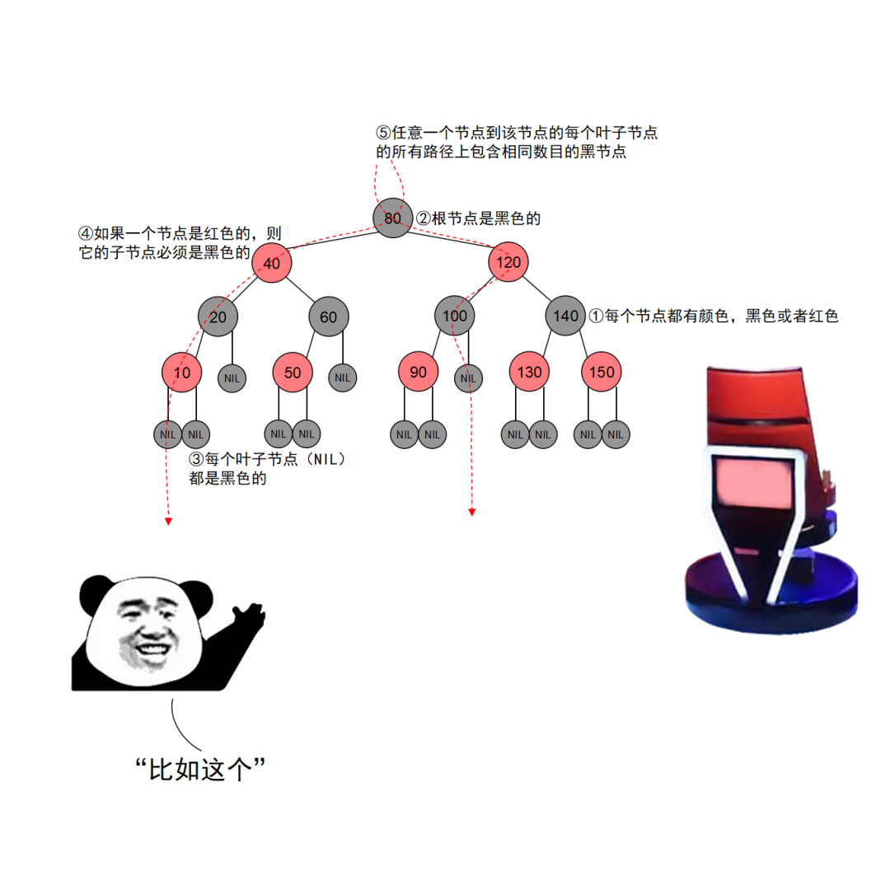
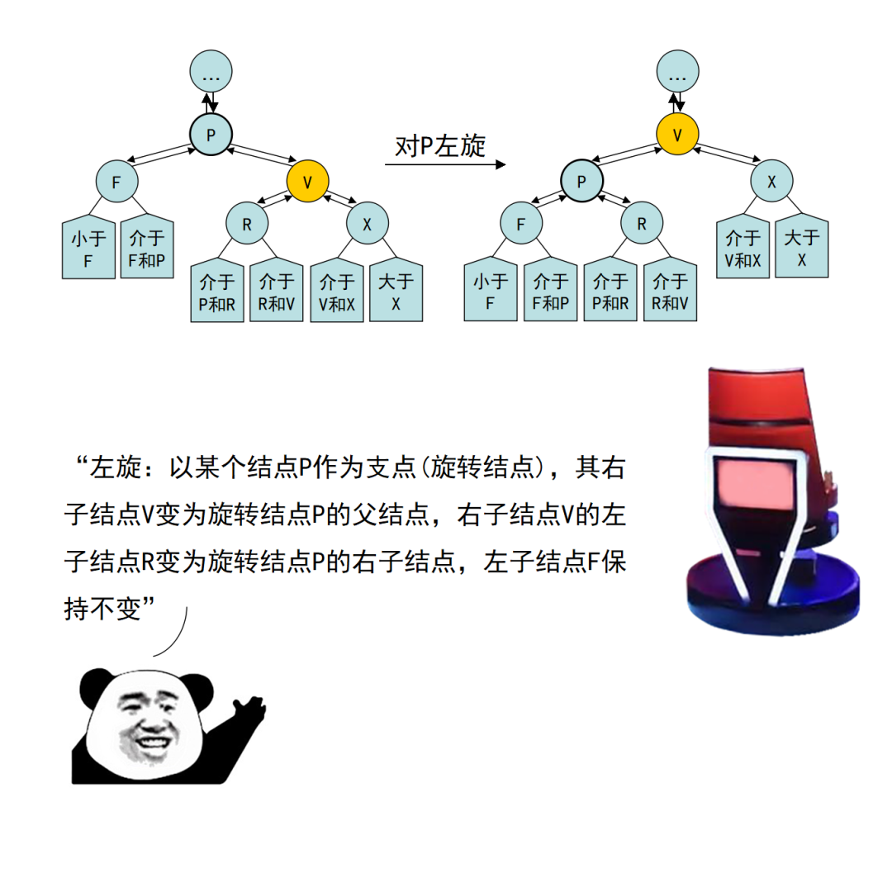
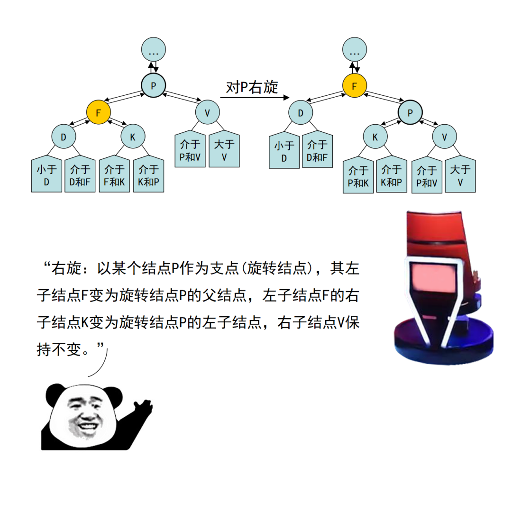

# 数据结构

## 排序算法


## 树

### BST二叉搜索树

- 左枝都比父节点小，右枝都比父节点大，进行查找是一个二分查找的过程
- 中序遍历得到有序序列

- **查找过程**

  ```go
  func (node *BinarySearchTreeNode) Find(value int64) *BinarySearchTreeNode {
  	/*
  		// 外层没有值相等的判定，因为在内层已经判定完毕后返回父亲节点。
  	*/
  	if value == node.Value {
  		// 如果是当前节点则返回该节点
  		return node
  	} else if value < node.Value {
  
  		/*
  					// 左子树的根节点的值刚好等于该值，那么父亲就是现在的node，返回
  			        if node.Left.Value == value {
  			            return node
  			        } else {
  			            return node.Left.FindParent(value)
  			        }
  		*/
  
  		// 如果小于当前节点的值则查找下一个
  		if node.Left == nil {
  			return nil
  		}
  		return node.Left.Find(value)
  	} else {
  
  		/*
  					// 右子树的根节点的值刚好等于该值，那么父亲就是现在的node，返回
  			        if node.Right.Value == value {
  			            return node
  			        } else {
  			            return node.Right.FindParent(value)
  			        }
  		*/
  
  		// 如果大于当前节点则查找右子树
  		if node.Right == nil {
  			return nil
  		}
  		return node.Right.Find(value)
  	}
  }
  ```

- 插入过程

  ```go
  func (node *BinarySearchTreeNode) Add(value int64) {
  	if value < node.Value {
  		// 插入左子树
  		// 如果左子树为空直接添加
  		if node.Left == nil {
  			node.Left = &BinarySearchTreeNode{Value: value}
  		} else {
  			// 否则递归添加
  			node.Left.Add(value)
  		}
  	} else if value > node.Value {
  		// 如果插入的值比节点的值大，则插入到右子树
  		if node.Right == nil {
  			node.Right = &BinarySearchTreeNode{Value: value}
  		} else {
  			node.Right.Add(value)
  		}
  	} else {
  		node.Times += 1
      // 记录当前value的插入次数
  	}
  }
  ```

- 删除节点

  ```go
  /*
  要达到删除节点的功能需要一个 父指针 指向父节点，再删除节点时同时要把父节点对自己的引用置为nil
  
  删除元素有四种情况：
  
  第一种情况，删除的是根节点，且根节点没有儿子，直接删除即可。
  第二种情况，删除的节点有父亲节点，但没有子树，也就是删除的是叶子节点，直接删除即可。
  第三种情况，删除的节点下有两个子树，因为右子树的值都比左子树大，那么用右子树中的最小元素来替换删除的节点，这时二叉查找树的性质又满足了。右子树的最小元素，只要一直往右子树的左边一直找一直找就可以找到。
  第四种情况，删除的节点只有一个子树，那么该子树直接替换被删除的节点即可。
  */
  func (tree *BinarySearchTree) Del(value int64) {
  	if tree.Root == nil {
  		return
  	}
  	tree.Root.Del(value)
  }
  func (node *BinarySearchTreeNode) Del(value int64) {
  	if node == nil {
  		return
  	}
  	if value < node.Value {
  		node.Left.Del(value)
  	} else if value > node.Value {
  		node.Right.Del(value)
  	} else {
  		// 第一种情况 和 第二种情况 直接删除
  		if node.Left == nil && node.Right == nil {
  			// 删除父节点对它的引用
  			if node.Parent.Left == node {
  				node.Parent.Left = nil
  			}
  			if node.Parent.Right == node {
  				node.Parent.Right = nil
  			}
  			node = nil
  			return
  		}
  		// 第四种情况
  		// 只有左子树，直接用子树替换
  		if node.Right == nil {
  			if node.Parent.Left == node {
  				node.Parent.Left = node.Left
  			}
  			if node.Parent.Right == node {
  				node.Parent.Right = node.Left
  			}
  			node = nil
  		} else if node.Left == nil {
  			if node.Parent.Left == node {
  				node.Parent.Left = node.Right
  			}
  			if node.Parent.Right == node {
  				node.Parent.Right = node.Right
  			}
  			node = nil
  		} else {
  			// 第三种情况左右子树都不为空
  			// 当前节点的后继节点为右子树中最小的那个
  			rightMin := node.Right.FindMinValue()
  			node.Value = rightMin.Value
  			node.Times = rightMin.Times
  			// 判断自己是父节点的左枝还是右枝
  			if rightMin.Parent.Left == rightMin {
  				rightMin.Parent.Left = nil
  			}
  			if rightMin.Parent.Right == rightMin {
  				rightMin.Parent.Right = nil
  			}
  			rightMin = nil
  		}
  	}
  }
  ```

### AVL平衡二叉树红黑树

- 每个节点的颜色或是红色或是黑色
- 根节点的颜色是黑色
- 每个叶子节点（值为nil）是黑色
- 如果一个节点是红色则子节点必须是黑色
- 任意一个节点到该节点的每个叶子节点的所有路径包含相同数目的黑色节点
  - 这一性质保证了从任意节点出发到叶子节点的所有路径中最长路径长度不会超过最短路径长度的两倍，依次保证其平衡性
  - 保证了红黑树的左右子树的层数也是相等的



- **插入过程**

  1. 按照BFS进行插入

     - 因为红黑树本身就是一个二叉查找树节点插入后键值仍然是有序的
     - 执行任何旋转变色操作都不会改变二叉查找树的性质

  2. 将插入的节点着色为红色

     - 着色为红色不会违背性质5

  3. 旋转或变色重新调整红黑树

     - 插入的节点可能违背性质4

     - 如果插入的节点是**根节点**则直接着色为黑色

     - 如果被**插入的节点**的父节点是**黑色**，**直接插入**着色为红色

     - 如果被**插入的节点**的父节点是**红色**

       一定存在非空祖父节点，从祖父节点查找叔叔节点（叔叔节点为空视为黑色），根据叔叔节点的情况

       - **叔叔节点为红色，父节点也是红色**：
         - 将父节点和设为黑色（恢复性质4）
         - 祖父节点设为红色并把叔叔节点设为黑色（恢复性质5），如果祖父节点时根节点则直接设为黑色
         - 如果祖父节点不是根节点，则把祖父节点看做新的当前节点继续递归操作

       **核心：将红色节点移动到根节点然后将其设置为黑色**

       - **叔叔节点为黑色，父节点为红色**，且当前节点是**父节点的右孩子**：
         - 将父节点视为新的当前节点
         - 以新的当前节点为支点进行左旋（父节点为红色，其儿子节点也是红色，破坏了红黑树的性质5，通过对父节点左旋可以让红色的儿子节点向上移动）
         - 根据新的当前节点递归向上操作
       - **叔叔节点为黑色，父节点为红色**，且当前节点是**父节点的左孩子**：
         - 将父节点设为黑色（包含父节点的分支上黑色节点个数都增加了 1 ）
         - 祖父节点设为红色（保证包含父节点的分支上黑色节点的个数再减少 1）
         - 以祖父节点为支点进行右旋（）

- **删除过程**

  - 被删除的节点时红色节点不需要进行修复，待删除的节点时黑色节点时需要进行修复

  1. 按照BFS进行查找找到待删除节点
  2. 待删除的节点有三种情况
     - 是叶节点：直接删除
     - 只有一个儿子：用唯一的文字顶替待删除节点的位置
     - 有两个儿子：找到中序遍历的后继节点然后将内容复制到当前节点然后删除后继节点
  3. 通过 “旋转和变色” 重新修正红黑树
     - 删除节点操作可能会违背性质2、性质4和性质5

- **对红黑树的操作**

  - 变色：红变黑，黑变红

  - **旋转**

    - 左旋

    

    - 右旋

    

### 红黑树和哈希表

- 红黑树：查找删除复杂度 logN ；占用内存少
- 哈希表：查找删除复杂度 O(1)；占用内存大


## 算法常用方法

### 双指针

- 滑动窗口（重复字符问题）
- 快慢指针（链表上的环问题，链表相交，链表中点，倒数n问题）
- 求和问题（4数之和，map保存一个数利用三数之和求解其他数字，最后去重排序）

### 链表

- 逆序，头插法
- 排序，归并排序，递归回溯法
- 链表上的环，环入口，链表的交叉点

### 栈

- 括号匹配问题
- 单调栈，利用栈维护一个单调递减或递增的下标数组

### 回溯

- 全排列问题
- 组合问题
- 排列组合交叉
- N皇后问题
- 迷宫路径问题
- 子集合问题
- BFS优化
- DFS模板