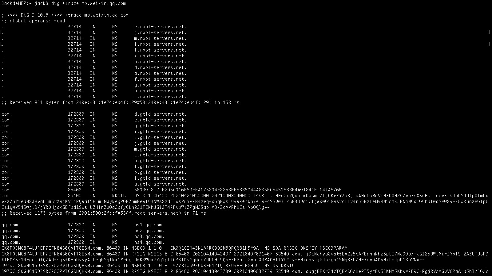
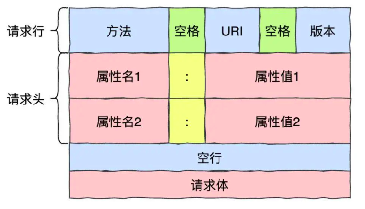
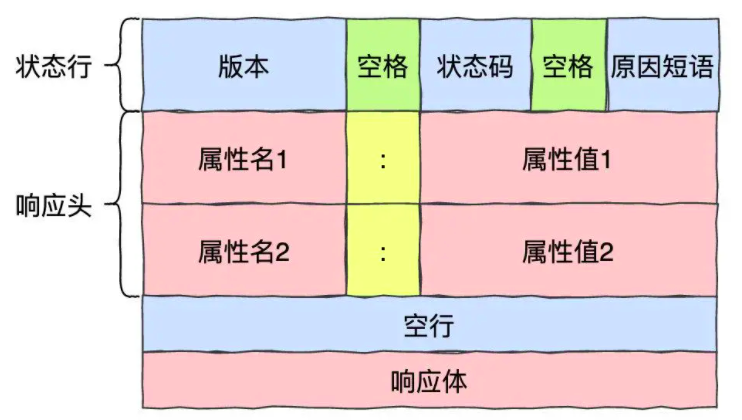
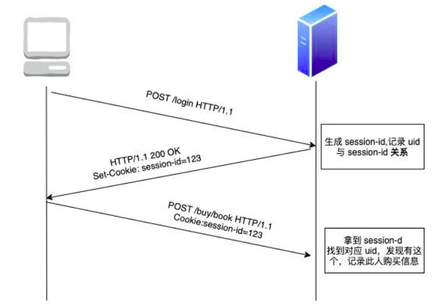
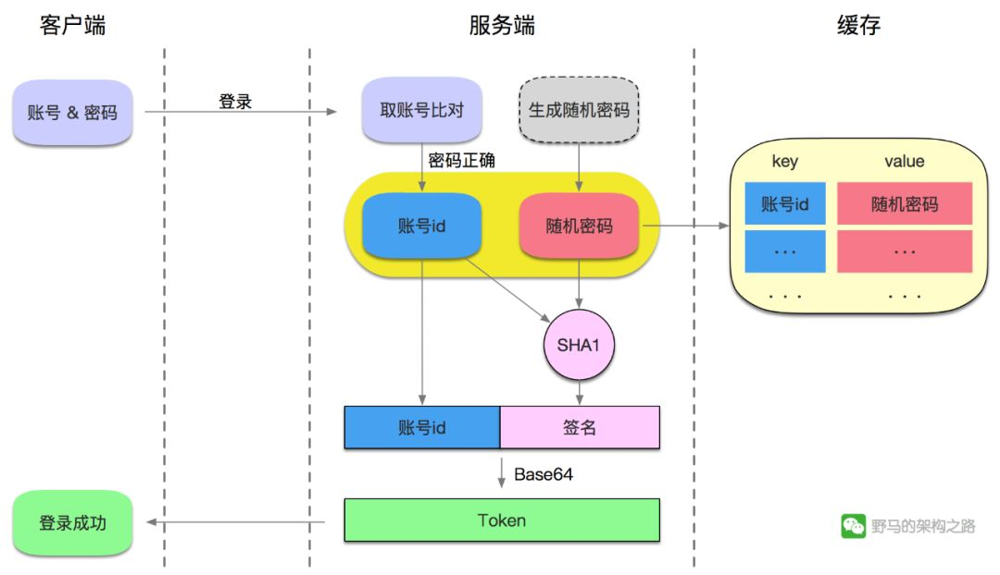
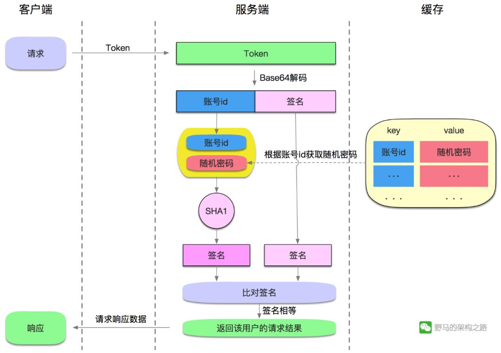

## 计算机网络

### TCP/UDP

- TCP粘包的原因
  - TCP 协议是基于字节流的传输层协议，其中不存在消息和数据包的概念；
  - 应用层协议没有使用基于长度或者基于终结符的消息边界，导致多个消息的粘连；

- 粘包发生在那些情况下？
  - TCP是**端到端**传输的，同时TCP连接是可**复用**的。什么叫复用呢？复用就是一条连接可以供一台主机上的多个进程使用。

  - **1.**由TCP连接复用造成的粘包问题。

    如果没有复用一个连接只提供给端到端的两个进程使用，这是数据的传输方和发送方都是约定好了数据的格式的，但是**多个进程**使用一个TCP连接，此时**多种不同结构**的数据进到TCP的流式传输，边界分割肯定会出这样或者那样的问题。

    如果利用tcp每次发送数据，就与对方建立连接，然后双方发送完一段数据后，就关闭连接，这样就不会出现粘包问题

  - **2.**因为TCP默认会使用Nagle算法，此算法会导致粘包问题。

    而Nagle算法主要做两件事，1）只有上一个分组得到确认，才会发送下一个分组；2）收集多个小分组，在一个确认到来时一起发送。

    多个分组拼装为一个数据段发送出去，如果没有好的边界处理，在解包的时候会发生粘包问题。

  - **3.**数据包过大造成的粘包问题。

    比如应用进程缓冲区的一条消息的字节的大小超过了发送缓冲区的大小，就有可能产生粘包问题。因为消息已经被分割了，有可能一部分已经被发送出去了，对方已经接受了，但是另外一部分可能刚放入套接口发送缓冲区里准备进一步发送，就直接导致接受的后一部分，直接导致了粘包问题的出现。

  - **4.**流量控制，拥塞控制也可能导致粘包。

  - **5.**接收方不及时接收缓冲区的包，造成多个包接收。

- 粘包问题如何处理？
  - 1.**Nagle算法**问题导致的，需要结合应用场景适当关闭该算法。
  - 2.其他几种情况的处理方法主要分两种：
    - 尾部标记序列。通过特殊标识符表示数据包的边界，例如\n\r，\t，或者一些隐藏字符。
    - 头部标记分步接收。在TCP报文的头部加上表示数据长度。
    - 应用层发送数据时定长发送。

- TCP和UDP区别？
  - TCP面向连接（三次握手），通信前需要先建立连接；UDP面向无连接，通信前不需要连接。
  - TCP通过序号、重传、流量控制、拥塞控制实现可靠传输；UDP不保障可靠传输，尽最大努力交付。
  - TCP面向字节流传输，因此可以被分割并在接收端重组；UDP面向数据报传输。
  - TCP全双工，UDP半双工
  - TCP点对点，UDP支持多点，广播等
  - TCP首部20字节，UDP只有8字节开销小

- 应用场景
  - TCP效率要求相对较低，但对准确性要求高(远程登录、文件传输)
  - UDP效率要求高，准确性相对较低(QQ聊天，在线视频，直播即时通讯)

- 对应应用层协议
  - TCP：FTP21、ssh22、telnet23、smtp25、http、https
  - UDP：DNS53、rip520

- 三次握手过程？
  - 主动建立连接方A的TCP向主机B发出连接请求报文段，其首部中的SYN(同步)标志位应置为1，表示想与目标主机B进行通信，并发送一个同步序列号x进行同步，表明在后面传送数据时的第一个数据字节的序号是x + 1。SYN同步报文会指明客户端使用的端口以及TCP连接的初始序号。
  - 接收连接方B的TCP收到连接请求报文段后，如同意则发回确认。在确认报中应将ACK位和SYN位置1，表示客户端的请求被接受。确认号应为x + 1，同时也为自己选择一个序号y。
  - 主动方A的TCP收到目标主机B的确认后要向目标主机B给出确认，其ACK置1，确认号为y + 1，而自己的序号为x + 1。

- 四次挥手过程？
  - 主动关闭主机A的应用进程先向其TCP发出连接释放请求，并且不再发送数据。TCP通知对方要释放从A到B这个方向的连接，将发往主机B的TCP报文段首部的终止比特FIN置1，其序号x等于前面已传送过的数据的最后一个字节的序号加1。
  - 被动关闭主机B的TCP收到释放连接通知后即发出确认，其序号为y，确认号为x + 1，同时通知高层应用进程，这样，从A到B的连接就释放了，连接处于半关闭状态。但若主机B还有一些数据要发送主机A，则可以继续发送。主机A只要正确收到数据，仍应向主机B发送确认。
  - 若主机B不再向主机A发送数据，其应用进程就通知TCP释放连接。主机B发出的连接释放报文段必须将终止比特FIN和确认比特ACK置1，并使其序号仍为y，但还必须重复上次已发送过的ACK = x + 1。
  - 主机A必须对此发出确认，将ACK置1，ACK = y + 1，而自己的序号是x + 1。这样才把从B到A的反方向的连接释放掉。主机A的TCP再向其应用进程报告，整个连接已经全部释放。

  - TCP为什么不是两次握手而是三次？
    - 如果仅两次连接可能出现一种情况：客户端发送完连接报文（第一次握手）后由于网络不好，延时很久后报文到达服务端，服务端接收到报文后向客户端发起连接（第二次握手）。此时客户端会认定此报文为失效报文，但在两次握手情况下服务端会认为已经建立起了连接，服务端会一直等待客户端发送数据，但因为客户端会认为服务端第二次握手的回复是对失效请求的回复，不会去处理。这就造成了服务端一直等待客户端数据的情况，浪费资源。

- TCP为什么挥手是四次而不是三次？
  - TCP是全双工的，它允许两个方向的数据传输被独立关闭。当主动发起关闭的一方关闭连接之后，TCP进入半关闭状态，此时主动方可以只关闭输出流。
  - 之所以不是三次而是四次主要是因为被动关闭方将”对主动关闭报文的确认”和”关闭连接”两个操作分两次进行。
  - “对主动关闭报文的确认”是为了快速告知主动关闭方，此关闭连接报文已经收到。此时被动方不立即关闭连接是为了将缓冲中剩下的数据从输出流发回主动关闭方（主动方接收到数据后同样要进行确认），因此要把”确认关闭”和”关闭连接”分两次进行。
  - **Linux的close实际上是同时关闭输入流和输出流，并不是我们常说的四次握手。半关闭函数为shutdown，它可以用来断开某个具体描述符的TCP输入流或输出流。**

- 为什么要有TIME_WAIT状态，TIME_WAIT状态过多怎么解决？
  - 主动关闭连接一方在发送对被动关闭方关闭连接的确认报文时，有可能因为网络状况不佳，被动关闭方超时未能收到此报文而重发断开连接（FIN）报文，此时如果主动方不等待而是直接进入CLOSED状态，则接收到被动关闭方重发的断开连接的报文会触发RST分组而非ACK分组，当被动关闭一方接收到RST后会认为出错了。所以说处于TIME_WAIT状态就是为了在重新收到断开连接分组情况下进行确认。
  - 解决方法：
    - 可以通过修改sysctl中TIME_WAIT时间来减少此情况（HTTP 1.1也可以减少此状态）。
    - 利用SO_LINGER选项的强制关闭方式，发RST而不是FIN，来越过TIMEWAIT状态，直接进入CLOSED状态。

- TCP建立连接及断开连接是状态转换？
  - 客户端：SYN_SENT -> ESTABLISHED -> FIN_WAIT_1 -> FIN_WAIT_2 -> TIME_WAIT。
  - 服务端：LISTEN -> SYN_RCVD -> ESTABLISHED -> CLOSE_WAIT -> LAST_ACK -> CLOSED。

- TCP流量控制和拥塞控制的实现？
  - 流量控制：TCP采用大小可变的滑动窗口进行流量控制。窗口大小的单位是字节，在TCP报文段首部的窗口字段写入的数值就是当前给对方设置的发送窗口数值的上限，发送窗口在连接建立时由双方商定。但在通信的过程中，接收端可根据自己的资源情况，随时动态地调整对方的发送窗口上限值。
  - 拥塞控制：
    - 慢开始：cwnd拥塞窗口指数增长
    - 拥塞避免：cwnd拥塞窗口大于等于门限线性增长，当有超时时门限设置为当前一半并且cwnd置为1
    - 快重传：收到三个重复ACK重传报文段无需等待计时器
    - 快恢复：慢开始门限减半，cwnd设置为减半后的门限

- TCP重传机制？
  - 滑动窗口机制，确立收发的边界，能让发送方知道已经发送了多少、尚未确认的字节数、尚待发送的字节数；让接收方知道已经确认收到的字节数。
  - 选择重传，用于对传输出错的序列进行重传。

- UDP实现可靠
  
  - 增加确认机制累积确认、重传、序号

### DNS协议

**域名**（网址）的结构是一种层次的结构体，最右边的是顶级域名，**DNS服务器**也是分层次的结构

- 域名服务器：根域名>顶级域名>权威域名服务器>（根据具体的使用情况会配置非权威域名服务器）
- DNS缓存，如 /etc/hosts，浏览器缓存

- 域名解析过程
  - 递归解析：本地域名服务器---根域名服务器---权限域名服务器
  - 迭代解析：本地域名服务器负责转发和调用
- dig工具可以查看域名请求的全过程

### HTTP

- URL和URI

  - URL是URI的一个子集，URI是统一资源标识符只用来标识一个资源而URL可以定位一个资源

- 请求报文

  

  - Cache		if-modified-since 缓存文件的时间标识
  - Client	     Accept-encoding 压缩编码方法
  - Cookie/Login         cookie 存取用户的cookie

- 响应报文

  

  - Cache		Data 消息产生日期
  - Cookie/Login      跨域设置cookie
  - Transport       connection 连接状态 keep-alive

- 返回代码

  - 1xx	提示信息，表示协议正在被处理需要后续的操作
    - 100	continue	表示到目前为止所有内容都是可行，客户端继续请求
  - 2xx    成功
    - 206	partial content	服务器成功处理部分get请求，断点续传或大文件的下载必须包含Range头部信息
  - 3xx    重定向
    - 301	moved permanently	永久重定向，请求的资源已经移动到响应头部Location指定的URL上
    - 302	Found    临时重定向
    - 304    文档已缓存
  - 4xx    客户端错误
    - 400	bad request	语义错误或参数有误
    - 401    unauthorized    当前请求需要用户验证
    - 403    forbidden
    - 404    not found
    - 405    method not allowed
  - 5xx    服务器错误
    - 500    internal server error	服务器错误
    - 502    bad gateway    服务器作为网关处理这个请求的响应时得到错误响应

- HTTP的功能概括

  - **内容协商**：商量响应资源的语言、字符集、编码方式等

    - 请求头部：Accept、Accept-charset、Accept-encoding、Content-Language

  - **缓存管理**

    - 请求头部：Cache-control，其值有max-age设置最大生存时间、no-cache允许使用缓存但需要跟服务器验证是否过期、no-store不使用缓存、must-revalidate资源过期不能再使用必须请求验证
    - 条件缓存  **If-xxx**

  - **实体首部**

    - 请求头部：Content-type，其值有text/plain、text/html、text/css、image/xxx、audio/xxx、application/xxx

  - **连接管理**

    - 1.1版本中支持长连接，请求头部：Connection: keep-alive、Connection: close
    - 队头阻塞问题：1.1仍是按照串行处理请求/响应数据，响应字段：Content-length说明了响应报文的长度只有处理完一个请求才能处理下一个请求

    **HTTP 2.0版本**：

    - 头部压缩

    - 二进制格式：之前一直都是以文本格式进行传输

    - 流：新定义的流的概念，二进制帧的双向传输序列，同一个消息往返的数据帧（包括header帧和data帧）分配一个唯一的流ID，接收端按照流ID先后进行组装。同一时间，请求方可以在流中发送请求应答方也可以在流中发响应。所有的流都在同一连接中传输——多路复用

      - 队头阻塞：因为http 2.0始终基于TCP传输，在传输层仍然是有序传输的，TCP中的重传机制仍然会导致队头阻塞

      **HTTP/3**

      - 传输层采用UDP协议，在UDP的基础上添加连接管理、拥塞窗口、流量控制等机制（可靠UDP），QUIC协议

- #### Cookie和Session作用原理

- Http1.1和Http1.0对比
  - HTTP1.0 是短连接，HTTP1.1是长连接。HTTP 1.1支持持久连接，在一个TCP连接上可以传送多个HTTP请求和响应，减少了建立和关闭连接的消耗和延迟。一个包含有许多图像的网页文件的多个请求和应答可以在一个连接中传输，但每个单独的网页文件的请求和应答仍然需要使用各自的连接.HTTP 1.1采用了流水线的持久连接，即客户端不用等待上一次请求结果返回，就可以发出下一次请求，但服务器端必须按照接收到客户端请求的先后顺序依次回送响应结果，以保证客户端能够区分出每次请求的响应内容，这样也显著地减少了整个下载过程所需要的时间。
- HTTP 1.0不支持Host请求头字段，WEB浏览器无法使用主机头名来明确表示要访问服务器上的哪个WEB站点，这样就无法使用WEB服务器在同一个IP地址和端口号上配置多个虚拟WEB站点。在HTTP 1.1中增加Host请求头字段后，WEB浏览器可以使用主机头名来明确表示要访问服务器上的哪个WEB站点，这才实现了在一台WEB服务器上可以在同一个IP地址和端口号上使用不同的主机名来创建多个虚拟WEB站点。
  - HTTP 1.1提供身份认证、状态管理和Cache缓存等机制相关的请求头和响应头
- 带宽优化。HTTP/1.0中，存在一些浪费带宽的现象，例如客户端只是需要某个对象的一部分，而服务器却将整个对象送过来了。HTTP/1.1中在请求消息中引入了range头域，它允许只请求资源的某个部分，返回码2006。
  - HTTP/1.1增加了OPTIONS方法，它允许客户端获取一个服务器支持的方法列表
- 缓存处理：1.0中主要用header里的If-Modified-Since，Expires来做缓存判断的标准，1.1则引入了更多的缓存控制策略，像Entity tag，If-Unmodified-Since，If-Match，If-None-Match等更多可供选择的缓存头来控制缓存策略
  - 错误通知的管理：1.1中新增了24个错误的状态响应码
- 1.1和2.0对比
  
  - 头部压缩
    - 二进制格式，1.x基于文本而2.0采用二进制解析
  - 多路复用
    - 服务端推送
- HTTP/1.* 一次请求-响应，建立一个连接，用完关闭；每一个请求都要建立一个连接；
  - HTTP/1.1 Pipeling解决方式为，若干个请求排队串行化单线程处理，后面的请求等待前面请求的返回才能获得执行机会，一旦有某请求超时等，后续请求只能被阻塞，毫无办法，也就是人们常说的线头阻塞；
- HTTP/2多个请求可同时在一个连接上并行执行。某个请求任务耗时严重，不会影响到其它连接的正常执行
  

- HTTP如何保证安全登录
  - 满足安全应该有哪些防御
    - 避免窃听
    - 避免篡改
    - 避免中间人攻击
    - 避免重放攻击

- HTTPS过程
  - 客户端和服务器协商好**对称加密算法**、**非对称加密算法**、**MAC算法**、**不重数（nonce）**；(完全明文）
  - 客户端得到了**服务器公钥**；（服务器需要证明这个公钥是服务器的公钥）
  - 客户端生成随机的，仅仅针对这次连接的**主密钥（Master Secret）**，并用**服务器公钥**加密，传输给服务器；
  - 服务器用**服务器私钥**对信息解密，安全地得到了**主密钥（Master Secret）**；（不会被窃听，可能被修改，但被修改了客户端就会无法解密）
  - 双方重新进行一次步骤1的通信，但是用**主密钥（Master Secret）**进行加密。
  - 双方使用**主密钥（Master Secret）**对消息进行对称加密，并传输消息。

- 中间人攻击的抵御方法
  - 认证中心签发数字签名

  - 认证中心自己有一把私钥和一把公钥，每个游览器都会拥有各个认证中心的公钥。开发者需要向认证中心提交自己的域名，认证中心先把服务器的域名、公钥、证书有效期等信息进行Hash，形成**信息摘要**（不可逆向），再用自己的密钥进行加密，形成**数字签名**。因为数字签名是由认证中心私钥生成的，其他人都无法生成数字签名，只能解析数字签名。

  - 服务器发送数字证书

    服务器的域名、公钥、证书有效期等信息+**数字签名**=**数字证书**

  - 客户端验证数字证书
    1 用认证中心的公钥解密**数字签名**得到**信息摘要**
    2 对服务器的域名、公钥、证书有效期等信息进行Hash，形成**信息摘要**
    3 对比两个信息摘要，如果一致，则说明这个公钥确实来自我要访问的服务器。

  - 中间人攻击，可以修改明文的域名、公钥、证书有效期等信息，但是生成不了信息摘要，因此无法伪装目标服务器。

  - 客户端除了验证信息摘要，还要验证数字证书中的域名是否就是访问的域名、域名是否过期等信息。

- 抵御接口被恶意调用重发的方法
  - http协议的无状态特性决定了是无法彻底避免第三方调用你的后台服务
  - 解决方案
    - 对于合法的认证访问，进行访问次数频率的限制
    - 通过认证来解决，如session、token等
      - token登录

​					每次登录都需要生成随机密码然后和账户ID做加密摘要算法运算生成签名签名拼接在账户ID之后进行BASE64编码作为token

​					摘要算法：MD5，SHA256，SHA系列的加密算法，可以将不通长度的数据加密运算成指定长度的数据且结果不可逆

### ISO七层模型中表示层和会话层功能是什么？

- 表示层：图像、视频编码解，数据加密。
- 会话层：建立会话，如session认证、断点续传。

### ICMP协议

-  ICMP允许主机或路由报告差错情况和提供有关异常情况。一些ICMP报文把差错报文返回给用户进程。
-  ICMP报文作为IP层数据报的数据，加上数据报的首部，组成数据报发送出去。
-  ICMP报文的种类有两种，即ICMP差错报告报文和ICMP询问报文。
-  询问报文：回送请求和回答(必须响应)8/0、时间戳请求和回答(毫秒级)13/14、掩码请求和回答、路由询问和通过
-  差错报文：终点不可达3、参数抑制12、时间超时11、改变路由5

- ### Ping的整个过程
  - 传输层给数据段加上UDP报头给网络层
  - 网络层根据ICMP协议封装给网络接口层
  - 网络接口层进行封装，查询ARP缓存得到对方MAC地址如果没有就广播ARP报文
  - 对方收到ARP广播后将我的IP存入缓存表然后单播应答
  - 我收到应答之后存入ARP缓存然后继续封装ICMP数据包填入对方IP地址
  - 对方收到ping报文做出应答